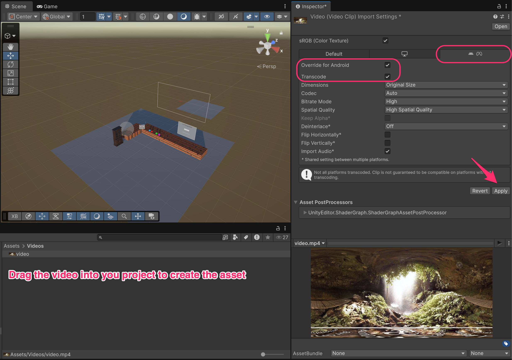
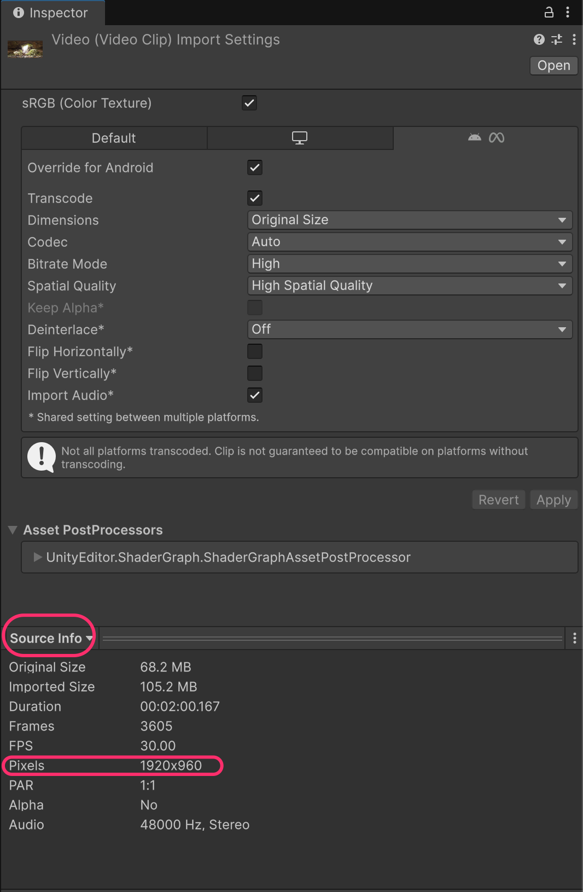
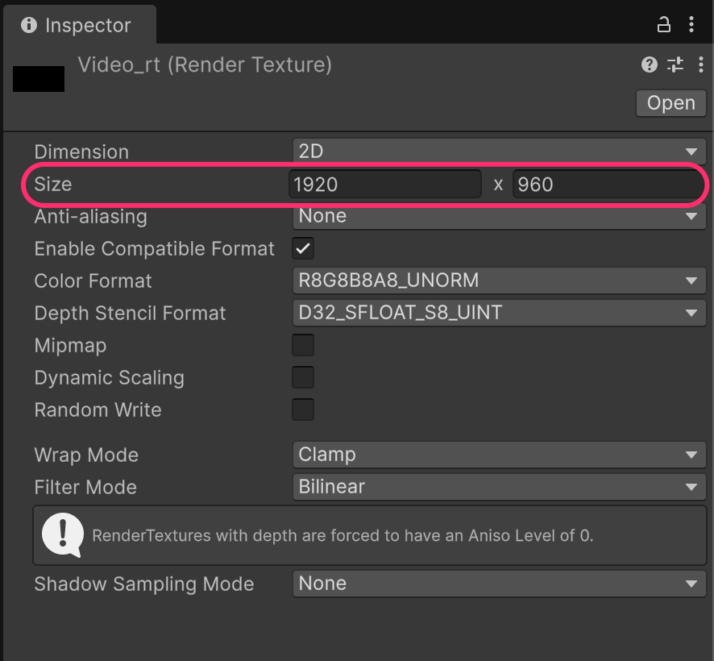
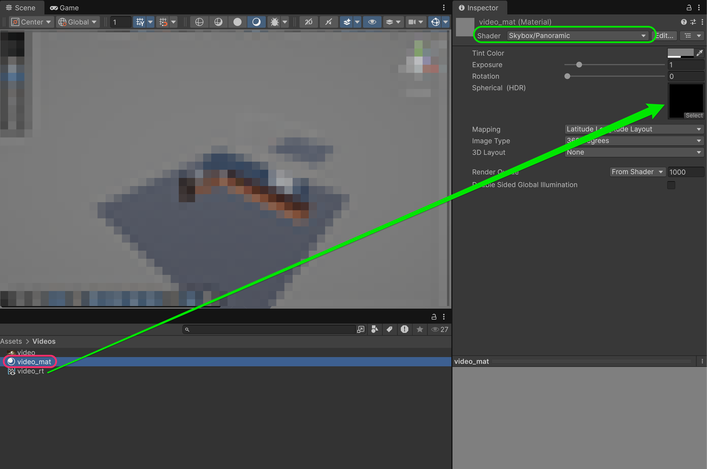
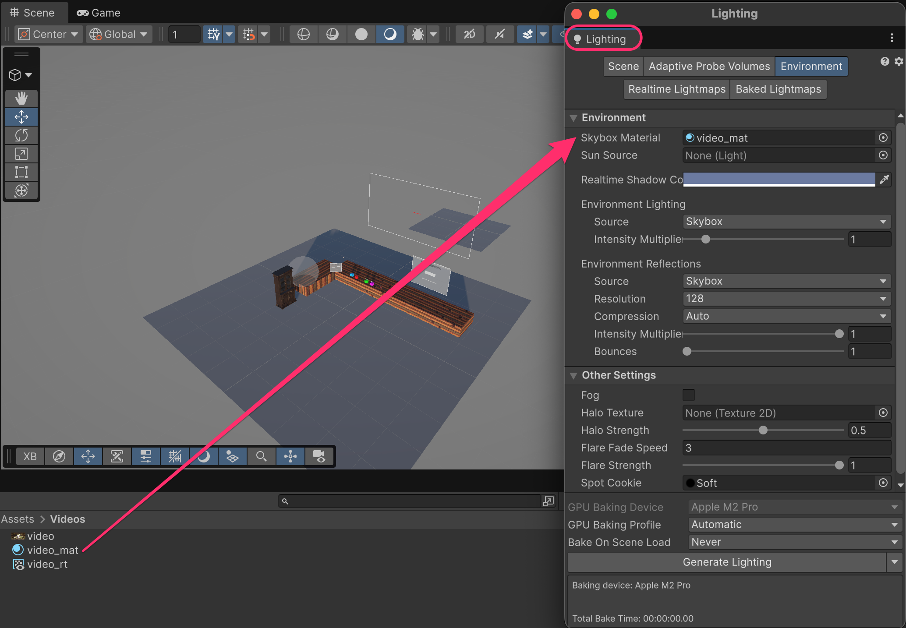
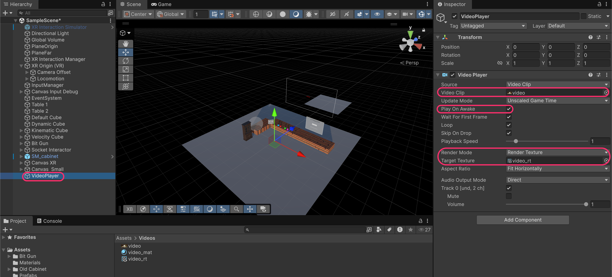

# 360º Videos

360º videos create fully immersive environments that surround the user. Instead of displaying video on a flat screen, the video is projected onto a sphere around the viewer, allowing them to look in any direction and feel present in the recorded location.

<figure><figcaption></figcaption></figure>

***

## 360º Videos in Unity

A 360º video is recorded using special cameras that capture all directions simultaneously. The resulting video is stored in an **equirectangular projection**, that is, a flat, wide image that maps the entire sphere onto a ±2:1 aspect ratio rectangle (like a world map).

<figure><figcaption></figcaption></figure>

In Unity, we display this video by:

1. Rendering the video to a **Render Texture** asset
2. Applying that texture to a **Skybox/Panoramic material**
3. Setting that material as the scene's **Skybox**

The panoramic shader handles the math to "unwrap" the flat video back onto a sphere around the camera.

### Download a sample 360º Video

To follow this tutorial, you'll need a 360º video file. You can download one here:

* [Sample 360º Video (Google Drive)](https://drive.google.com/file/d/1TpFtT7ZL3F-3rvJW3-drjhjD_J53s813/view?usp=sharing)

For more free 360º videos, visit:

* [Vecteezy - Free 360 Panorama Videos](https://www.vecteezy.com/free-videos/360-panorama)

### Import the video

Drag your 360º video file into your Unity project's **Assets** folder (e.g., `Assets/Videos/`).

Select the video asset and configure the import settings:

* Select the **Android tab** (Quest platform)
* **Override for Android**: Enabled
* **Transcode**: Enabled

Click **Apply** to save the settings.




**Why Transcode?**&#x20;

The Meta Quest uses Android, which has specific video codec requirements.&#x20;

Transcoding ensures the video is converted to a compatible format (usually H.264). Without this, the video may not play on the headset.


### Check the video resolution

Scroll down in the Inspector to find the **Source Info** section (click on the name of the video, it's a dropdown button). Note the video's pixel dimensions because you'll need this for the Render Texture.




**Resolution example**:&#x20;

In this case, the video is **1920×960** pixels. This 2:1 ratio confirms it's an equirectangular 360º video.&#x20;


### Create a Render Texture

The Video Player needs somewhere to render its output. We'll create a **Render Texture** that acts as a dynamic texture updated every frame with the video content.

Right-click in the Project window and select **Create > Rendering > Render Texture**.

Name it something descriptive like `video_rt`.



**What is a Render Texture?**&#x20;

A Render Texture is a texture that can be written to at runtime. Cameras can render to them, and Video Players can output to them. They're commonly used for mirrors, security cameras, portals, and video playback.




### Configure the Render Texture size

Select the Render Texture and set its **Size** to match your video's resolution:

* **Size**: 1920 × 960 (or whatever your video's resolution is)



### Create a panoramic material

Create a new Material (Right-click in the Project window > **Create > Rendering > Material**) and name it `video_mat`.

Configure the material:

* **Shader**: Skybox/Panoramic
* **Spherical (HDR)**: Drag your **Render Texture** (`video_rt`) into this slot




**Skybox/Panoramic Shader**:&#x20;

This built-in Unity shader takes an equirectangular texture and projects it onto a sphere surrounding the camera. It's specifically designed for 360º content.


<table><thead><tr><th width="248.27734375">Property</th><th>Description</th></tr></thead><tbody><tr><td><strong>Mapping</strong></td><td>Latitude Longitude Layout (for equirectangular)</td></tr><tr><td><strong>Image Type</strong></td><td>360 Degrees (full sphere) or 180 Degrees (half sphere)</td></tr><tr><td><strong>Rotation</strong></td><td>Rotate the panorama horizontally</td></tr><tr><td><strong>Exposure</strong></td><td>Brightness adjustment</td></tr></tbody></table>

### Set as the scene Skybox

Open the **Lighting** window (**Window > Rendering > Lighting**).

Go to the **Environment** tab and set:

* **Skybox Material**: Drag your `video_mat` material here




**Skybox**:&#x20;

The skybox is what renders behind everything else in the scene. By setting our video material as the skybox, the 360º video will surround the entire environment.


### Create the Video Player

Create an empty GameObject in your scene and name it `VideoPlayer`.

Add the **`VideoPlayer`** component and configure:

* **Source**: Video Clip
* **Video Clip**: Drag your imported video asset here
* **Play On Awake**: Enabled (video starts automatically)
* **Loop**: Enabled (optional, for continuous playback)
* **Render Mode**: Render Texture
* **Target Texture**: Drag your `video_rt` Render Texture here



<table><thead><tr><th width="242.69140625">Property</th><th>Description</th></tr></thead><tbody><tr><td><strong>Play On Awake</strong></td><td>Start playing when the scene loads</td></tr><tr><td><strong>Loop</strong></td><td>Restart video when it ends</td></tr><tr><td><strong>Playback Speed</strong></td><td>1 = normal speed, 0.5 = half speed, 2 = double speed</td></tr><tr><td><strong>Render Mode</strong></td><td>Where to output the video (we use Render Texture)</td></tr><tr><td><strong>Audio Output Mode</strong></td><td>How to play audio (Direct = through Unity's audio system)</td></tr></tbody></table>



Press **Play** to test your 360º video. The video should now surround your entire scene as the skybox.


> 💡 **In VR**: When you run this on the Quest, you'll be able to look around in any direction and see the 360º video surrounding you. This creates a powerful sense of presence in the recorded location.

***

## Assets Created

After following this tutorial, your project should have:

```
Assets/
└── Videos/
    ├── video.mp4           (your 360º video)
    ├── video_rt            (Render Texture)
    └── video_mat           (Skybox/Panoramic Material)
```

***

## Optional: Video playback controls

To add play/pause/seek controls, you can access the Video Player via script:

```csharp
using UnityEngine;
using UnityEngine.Video;

public class VideoController : MonoBehaviour
{
    private VideoPlayer videoPlayer;

    private void Start()
    {
        videoPlayer = GetComponent<VideoPlayer>();
    }

    public void Play() => videoPlayer.Play();
    public void Pause() => videoPlayer.Pause();
    public void Stop() => videoPlayer.Stop();
    
    public void Seek(float normalizedTime)
    {
        videoPlayer.time = normalizedTime * videoPlayer.length;
    }
}
```


**UI Integration**:&#x20;

Combine this script with the Ray and Poke UI interactions from previous sections to create VR video player controls.


***

## Troubleshooting

<table><thead><tr><th width="280.47265625">Problem</th><th>Solution</th></tr></thead><tbody><tr><td>Video doesn't play on Quest</td><td>Enable <strong>Transcode</strong> in video import settings for Android</td></tr><tr><td>Video looks stretched</td><td>Render Texture size doesn't match video resolution</td></tr><tr><td>Video is upside down</td><td>Enable <strong>Flip Vertically</strong> in video import settings</td></tr><tr><td>No audio</td><td>Check <strong>Audio Output Mode</strong> is set to <strong>Direct</strong> and volume is up</td></tr><tr><td>Low quality / pixelated</td><td>Use higher resolution video and matching Render Texture size</td></tr></tbody></table>

***

## Documentation

* [Unity Video Player Documentation](https://docs.unity3d.com/Manual/VideoPlayer.html)
* [Unity Render Textures](https://docs.unity3d.com/Manual/class-RenderTexture.html)
* [Unity Skybox](https://docs.unity3d.com/Manual/skyboxes.html)
