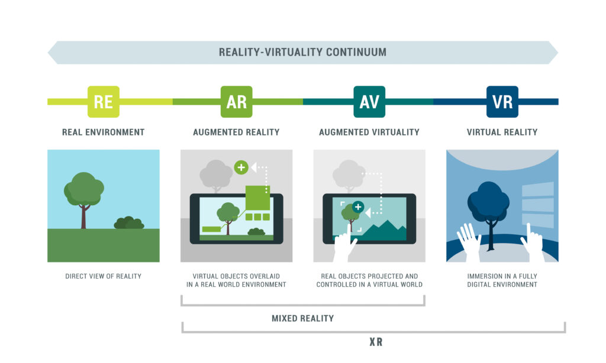

# Introduction

<figure><figcaption></figcaption></figure>

## What makes VR different?

While **AR overlays** digital content onto the real world, **VR replaces it entirely**.

<figure><figcaption></figcaption></figure>

### Key concepts

* **Presence**: The feeling of "being there" in the virtual environment
* **Immersion**: Achieved by replacing visual, auditory, and sometimes haptic input
* **Isolation**: The user is cut off from the physical world

## The challenge

To achieve convincing immersion, VR must solve several technical problems:

| Challenge       | Question                                |
| --------------- | --------------------------------------- |
| **Vision**      | How do we create depth perception?      |
| **Movement**    | How do we move without getting sick?    |
| **Interface**   | Where do we place UI in 3D space?       |
| **Interaction** | How do we let users manipulate objects? |
