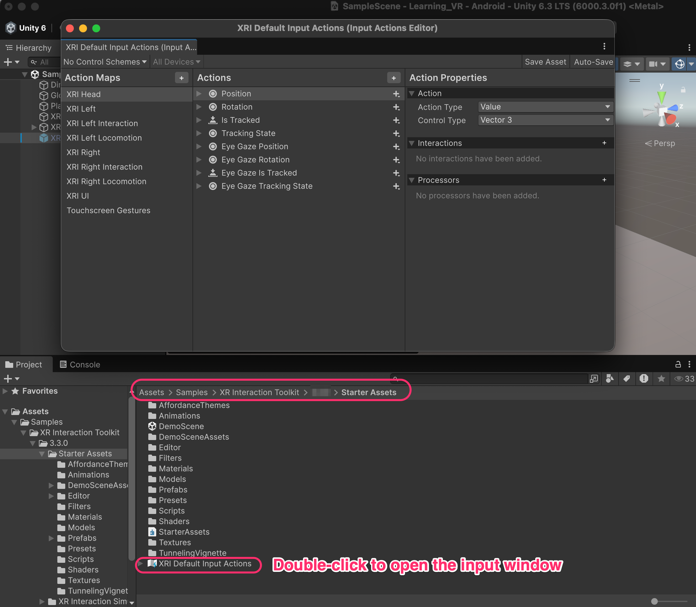
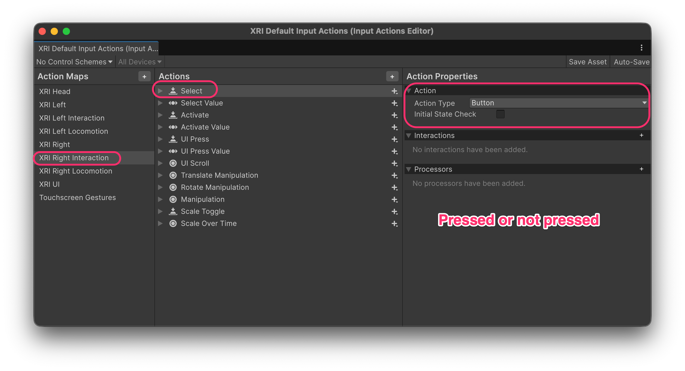
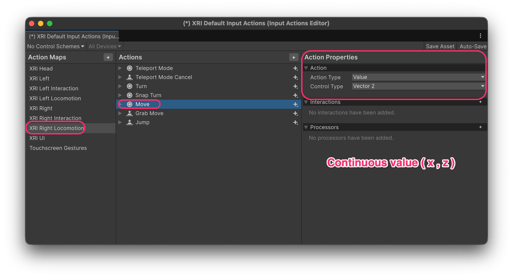
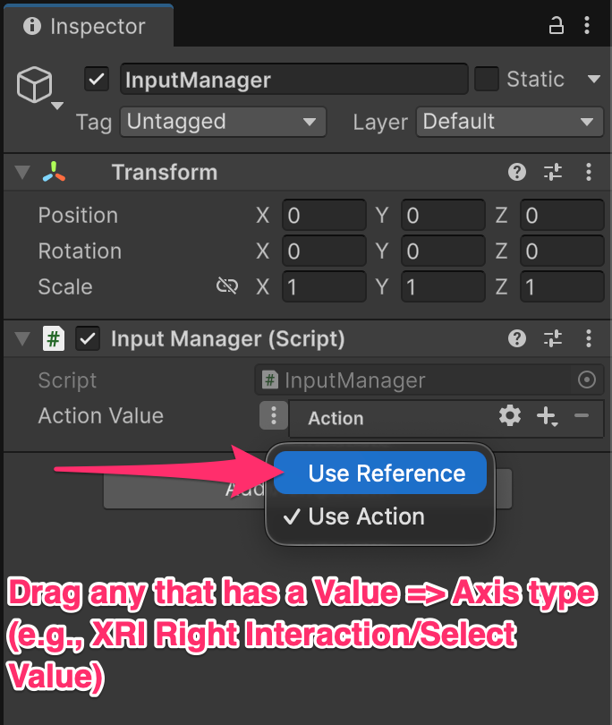
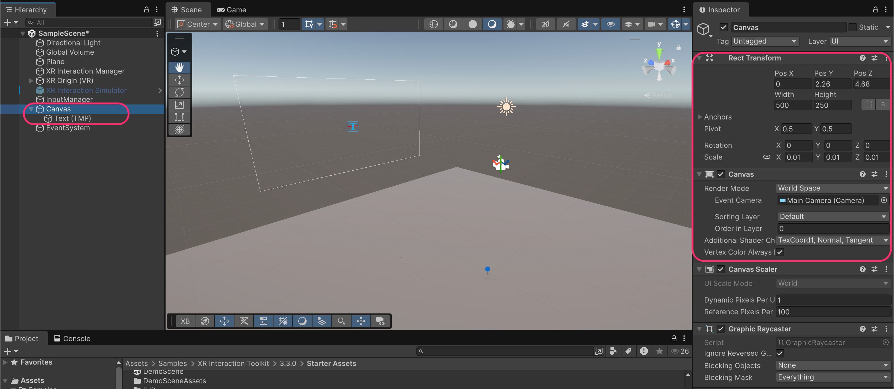
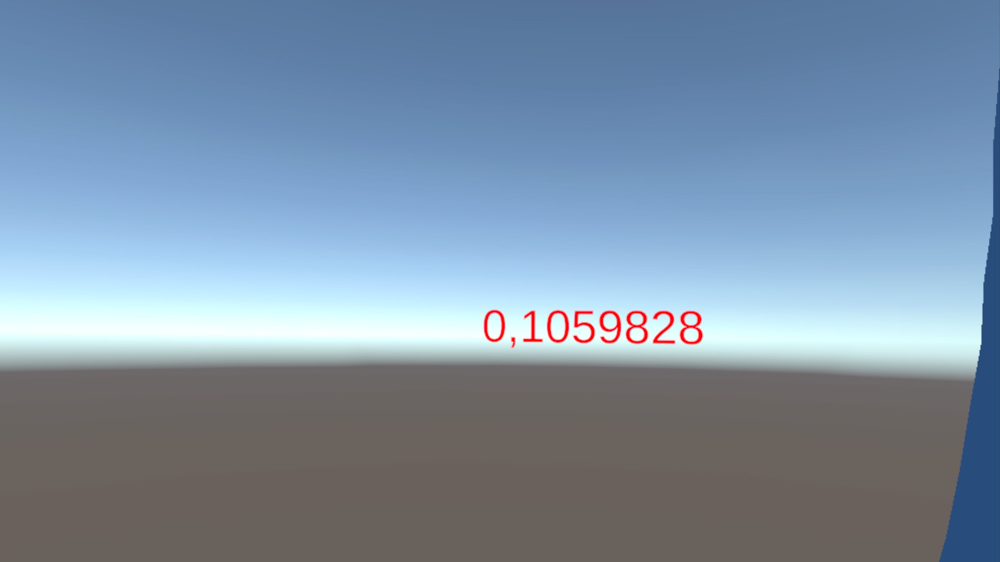
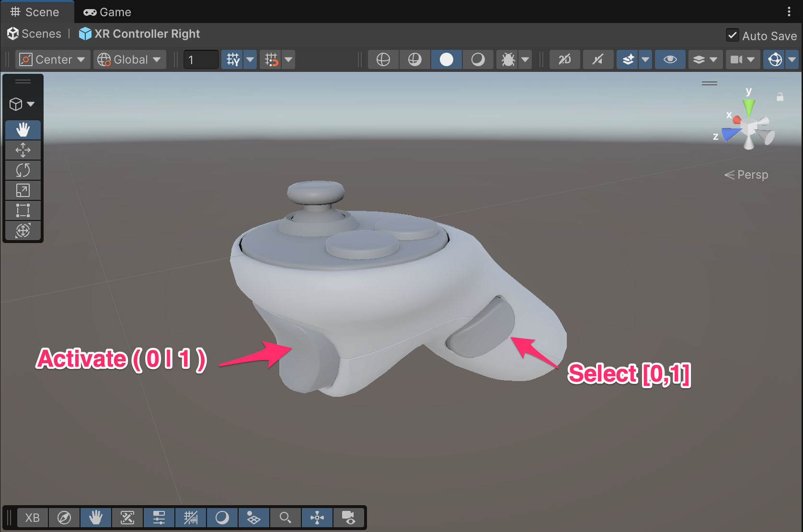
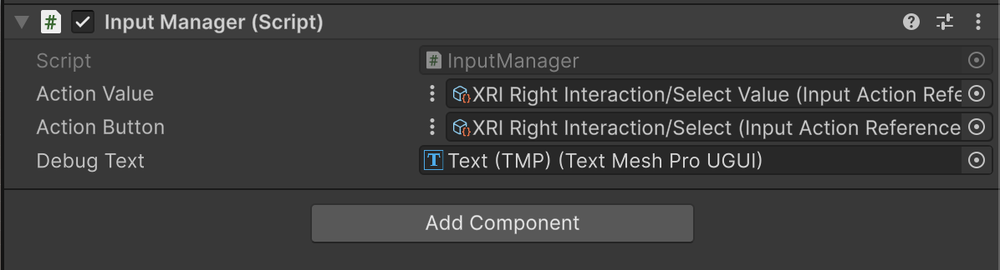
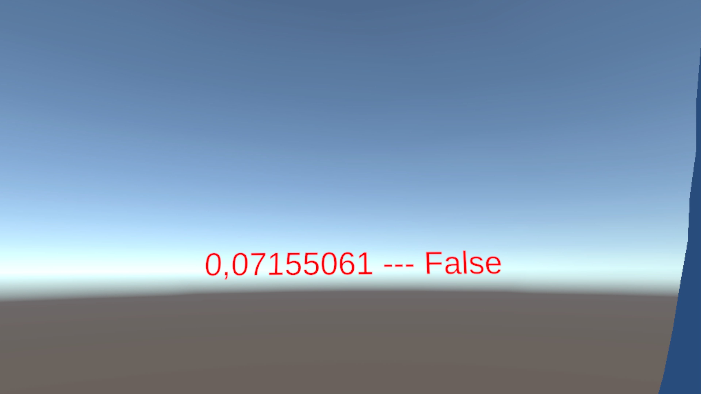
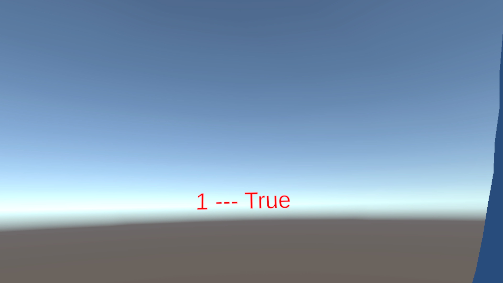

# Button input

## The XRI Default Input Actions

The **Starter Assets** include a pre-configured Input Action Asset called **XRI Default Input Actions**.

Double-click it to open the Input Actions Editor.

Location: `Assets/Samples/XR Interaction Toolkit/[version]/Starter Assets/`&#x20;

<figure><figcaption></figcaption></figure>

**Structure of Input Actions:**

* **Action Maps** (left column): Groups of related actions, organized by device or purpose (XRI Head, XRI Left, XRI Right, XRI Left Interaction, XRI Right Locomotion, etc.)
* **Actions** (middle column): Individual inputs within a map (Position, Rotation, Select, Activate, Move, Turn, etc.)
* **Action Properties** (right column): Configuration for the selected action (Action Type, Control Type, Bindings)


**Why are there separate maps for "XRI Left" and "XRI Left Interaction"?**

* **XRI Left / XRI Right**: Raw tracking data (position, rotation, tracking state)
* **XRI Left Interaction / XRI Right Interaction**: Interaction actions (select, activate, UI press)
* **XRI Left Locomotion / XRI Right Locomotion**: Movement actions (teleport, move, turn)

This separation allows you to enable/disable groups of actions independently and keeps the asset organized.


***

## Action Types: Button vs Value

Actions can have different **Action Types** depending on what kind of data they provide.

### Button Type

A **Button** action represents a binary state: **pressed** or **not pressed**.

<figure><figcaption></figcaption></figure>

**Button actions** return `true` or `false`. Examples:

* **Select**: Grip button pressed
* **Activate**: Trigger fully pressed
* **UI Press**: Button pressed for UI interaction

### Value Type

A **Value** action represents **continuous data** that can change over time. **Value actions** return numeric data.

<figure><figcaption></figcaption></figure>

The **Control Type** specifies the data format:

<table><thead><tr><th width="154.81640625">Control Type</th><th width="167.55859375">C# Type</th><th>Example Actions</th></tr></thead><tbody><tr><td><code>Axis</code></td><td><code>float</code></td><td>Trigger pressure (0.0 to 1.0)</td></tr><tr><td><code>Vector 2</code></td><td><code>Vector2</code></td><td>Thumbstick position (x, y from -1 to 1)</td></tr><tr><td><code>Vector 3</code></td><td><code>Vector3</code></td><td>Controller position in 3D space</td></tr><tr><td><code>Quaternion</code></td><td><code>Quaternion</code></td><td>Controller rotation</td></tr></tbody></table>


**Select vs Select Value**: Notice that some actions come in pairs:

* **Select** (Button): Returns `true` when grip is pressed past the threshold
* **Select Value** (Value/Axis): Returns the grip pressure as a float from 0.0 to 1.0


***

## Reading input in code

To read input values in your scripts, use `InputActionProperty` from the Unity Input System.

### Step 1: Create the Script

Create a new C# script called `InputManager`:

```csharp
using UnityEngine;
using UnityEngine.InputSystem;

public class InputManager : MonoBehaviour
{
    [SerializeField] private InputActionProperty actionValue;
}
```


**What is `InputActionProperty`?**&#x20;

It's a serializable wrapper that can hold either:

* A direct **Input Action** (defined inline in the Inspector), OR
* A **Reference** to an action in an Input Action Asset

This flexibility lets you either create quick one-off actions or reference your centralized XRI Default Input Actions.


### Step 2: Configure as Reference

Attach the script to a GameObject. In the Inspector, click the dropdown next to **Action Value** and select **Use Reference**.

<figure><figcaption></figcaption></figure>

Then drag any **Value-type action** from the Input Actions window (e.g., `XRI Right Interaction/Select Value`).

### Step 3: Create Debug UI

Create a **World Space Canvas** with a **Text (TMP)** element to display the input value in VR.

**World Space Canvas for VR:**

* Set _**Render Mode**_ to **World Space**
* Scale down the Canvas (e.g., 0.01, 0.01, 0.01) since UI units are in pixels
* Position it in front of the player (e.g., Z = 4-5 meters)
* _Optional_: Assign the **Main Camera** to **Event Camera** if you need UI interaction (not necessary for this example)

<figure><figcaption></figcaption></figure>

### Step 4: Read and Display the Value

Update the script to read the action value every frame:

```csharp
using TMPro;
using UnityEngine;
using UnityEngine.InputSystem;

public class InputManager : MonoBehaviour
{
    [SerializeField] private InputActionProperty actionValue;
    [SerializeField] private TextMeshProUGUI debugText;

    private void Update()
    {
        float value = actionValue.action.ReadValue<float>();

        debugText.text = $"{value}";
    }
}
```


**Key method:** [**`ReadValue<T>()`**](https://docs.unity3d.com/Packages/com.unity.inputsystem@1.0/api/UnityEngine.InputSystem.InputAction.html)

* Call this on `actionValue.action` to get the current value
* The generic type `<T>` must match the action's Control Type:
  * `float` for Axis
  * `Vector2` for Vector 2
  * `Vector3` for Vector 3
  * `Quaternion` for Quaternion


Assign the _Debug Text_ reference in the Inspector:

<figure><figcaption></figcaption></figure>

### Step 5: Test the Value Input

Run the project and press the trigger. You'll see the analog value change in real-time.

<figure><figcaption></figcaption></figure>


The value ranges from `0.0` (not pressed) to `1.0` (fully pressed).&#x20;

Intermediate values represent partial presses, which is the **analog nature** of VR triggers.


***

## Controller button mapping

Understanding which physical buttons map to which actions:

<figure><figcaption></figcaption></figure>

| Physical Button            | XRI Action                | Type          | Value Range      |
| -------------------------- | ------------------------- | ------------- | ---------------- |
| **Grip** (side button)     | Select / Select Value     | Button / Axis | 0 to 1           |
| **Trigger** (index finger) | Activate / Activate Value | Button / Axis | 0 to 1           |
| **Thumbstick**             | Move / Turn               | Vector2       | -1 to 1 per axis |
| **A/B/X/Y Buttons**        | Various UI actions        | Button        | 0 or 1           |


**Select vs Activate in XRI terminology:**

* **Select** = Grip button = Used for grabbing objects
* **Activate** = Trigger button = Used for "using" grabbed objects (e.g., firing a gun, spraying a can)

This naming convention is consistent throughout the XR Interaction Toolkit.


***

## Reading Both Value and Button

You can read multiple inputs simultaneously. Update the script to read both an analog value and a button state:

```csharp
using TMPro;
using UnityEngine;
using UnityEngine.InputSystem;

public class InputManager : MonoBehaviour
{
    [SerializeField] private InputActionProperty actionValue;
    [SerializeField] private InputActionProperty actionButton;
    
    [SerializeField] private TextMeshProUGUI debugText;

    private void Update()
    {
        float value = actionValue.action.ReadValue<float>();
        bool isPressed = actionButton.action.IsPressed();
        
        debugText.text = $"{value} --- {isPressed}";
    }
}
```


**Key method: `IsPressed()`**

* Returns `true` if the button is currently held down
* Only works with **Button-type** actions
* Alternative methods:
  * `WasPressedThisFrame()`: Returns `true` only on the frame the button was pressed
  * `WasReleasedThisFrame()`: Returns `true` only on the frame the button was released


Assign both actions in the Inspector:

<figure><figcaption></figcaption></figure>

***

## Testing Value and Button

Run the project and observe the difference between analog values and button states:

**Trigger partially pressed, button not pressed:**

<figure><figcaption></figcaption></figure>

**Trigger fully pressed, button pressed:**

<figure><figcaption></figcaption></figure>


**Notice the relationship:**

* The **Value** (left number) shows the continuous analog pressure
* The **Button** (right boolean) only becomes `True` when the trigger passes a threshold (typically around 0.5-0.8)


***

### Documentation

* [Unity Input System Documentation](https://docs.unity3d.com/Packages/com.unity.inputsystem@1.17/manual/index.html)
* [XR Interaction Toolkit Input](https://docs.unity3d.com/Packages/com.unity.xr.interaction.toolkit@3.3/manual/general-setup.html)
* [Input Action Assets](https://docs.unity3d.com/Packages/com.unity.inputsystem@1.17/manual/ActionAssets.html)
