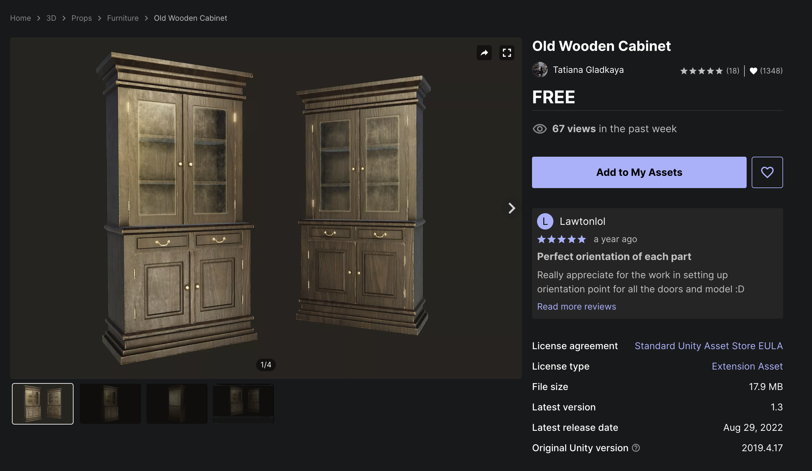
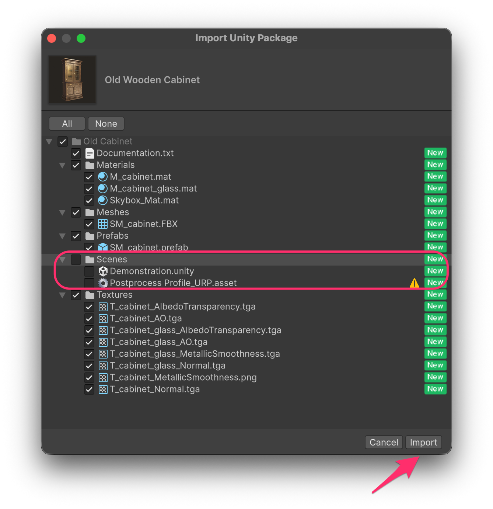
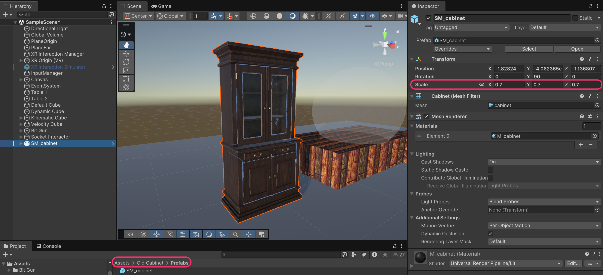
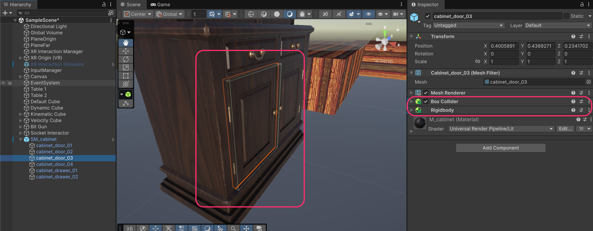
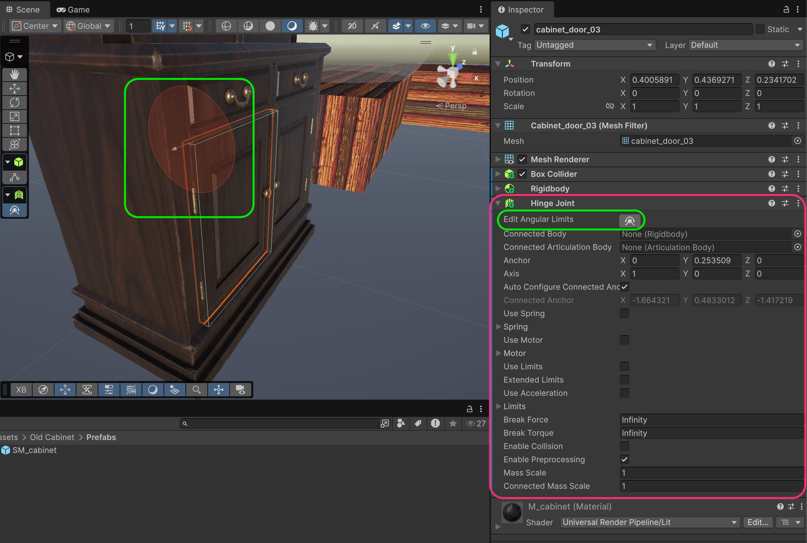
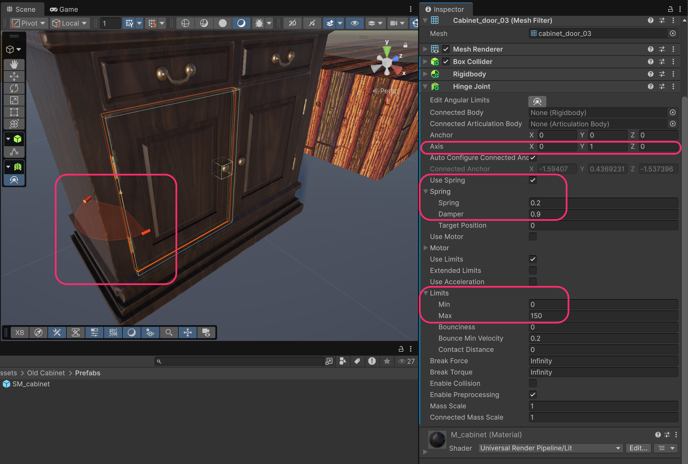
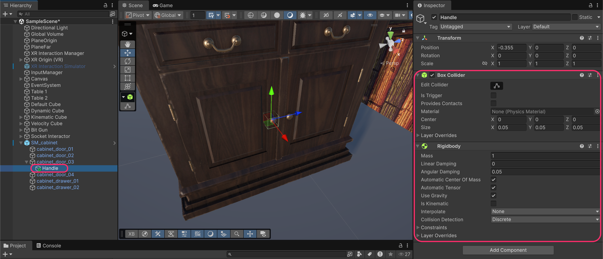
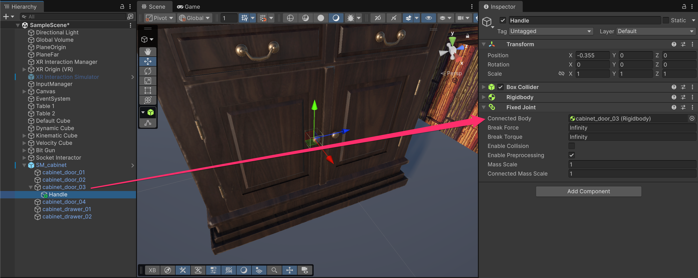
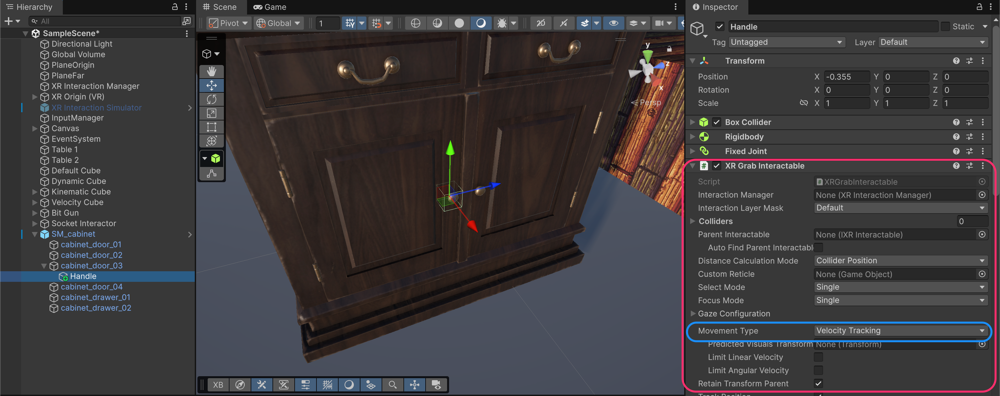

# Doors

<figure><figcaption></figcaption></figure>

Doors require **constrained movement** because they rotate on hinges. Unity's physics joints combined with `XRGrabInteractable` create interactive doors.

The key concept: **grab the handle, move the door**. We'll use physics joints to connect everything.

## Creating the door

### Import the model

For this example, we'll use the free **Old Wooden Cabinet** asset from the Unity Asset Store.

<figure><figcaption></figcaption></figure>



Import the package. You can uncheck the Scenes folder if you don't need the demo scene.

<figure><figcaption></figcaption></figure>

### Add SM\_Cabinet prefab to the scene

Drag the **SM\_cabinet** prefab into your scene. Scale it appropriately (e.g., 0.7) to fit your environment.

<figure><figcaption></figcaption></figure>


**Prefab structure:**&#x20;

This cabinet has separate child objects for each door and drawer, which is essential for making them interactive. If your model has doors as part of the main mesh, you'll need to separate them in a 3D modeling tool first.


### Add physics to the door

Select one of the door child objects (e.g., **cabinet\_door\_03**) and add:

* **`BoxCollider`** (fit it to the door shape)
* **`Rigidbody`**

<figure><figcaption></figcaption></figure>


**Why Rigidbody on the door?**&#x20;

Physics joints connect Rigidbodies. The door needs a `Rigidbody` so the `HingeJoint` can control its rotation.



**Important:** Don't add `XRGrabInteractable` directly to the door, since we want players to grab the handle, not the door surface. The door will move indirectly through physics.


### Add Hinge Joint

Add a **`HingeJoint`** component to the door. This constrains the door to rotate around a single axis (like a real hinge).

To **edit angular limits**, click the button next to "Edit Angular Limits" to visually adjust the hinge in the Scene view. This shows an arc indicating the rotation range.

<figure><figcaption></figcaption></figure>

<table><thead><tr><th width="247.3828125">Property</th><th>Description</th></tr></thead><tbody><tr><td><strong>Anchor</strong></td><td>Position of the hinge point in local space</td></tr><tr><td><strong>Axis</strong></td><td>The axis of rotation (which way the door swings)</td></tr><tr><td><strong>Use Limits</strong></td><td>Constrain how far the door can open</td></tr></tbody></table>

### Configure the Hinge Joint

Configure the `HingeJoint` for the door behavior:

* **Axis**: (0, 1, 0) ⇒ rotate around Y axis (vertical hinge)
* **Use Spring**: Enabled
  * **Spring**: 0.2 (gentle closing force)
  * **Damper**: 0.9 (prevents oscillation)
  * **Target Position**: 0 (closed)
* **Use Limits**: Enabled
  * **Min**: 0 (closed)
  * **Max**: 150 (maximum opening angle in degrees)

<figure><figcaption></figcaption></figure>

<table><thead><tr><th width="186.7421875">Property</th><th>Effect</th></tr></thead><tbody><tr><td><strong>Spring</strong></td><td>Force pulling door toward Target Position (higher = snappier close)</td></tr><tr><td><strong>Damper</strong></td><td>Resistance to movement (higher = slower, no bouncing)</td></tr><tr><td><strong>Target Position</strong></td><td>Angle the spring pulls toward (0 = closed)</td></tr></tbody></table>


**Why use Spring?**&#x20;

The spring gently closes the door when released, simulating a real cabinet door. Without it, the door would stay wherever you leave it (which might also be desirable for some doors).


**Axis direction:** The axis determines which way the door swings:

* **(0, 1, 0)**: Vertical hinge (typical cabinet/room door)
* **(1, 0, 0)**: Horizontal hinge (like a chest lid)
* **(0, 0, 1)**: Horizontal hinge (alternative orientation)

### Create the Handle

The handle is what the player actually grabs. Create an empty GameObject as a child of the door called **Handle**.

Position it where the door handle/knob is, and add:

* **`BoxCollider`** (small, around the handle area)
* **`Rigidbody`**

<figure><figcaption></figcaption></figure>


**Why a separate Handle object?**&#x20;

We need something grabbable that moves the door. By making the handle a physics object connected to the door, grabbing the handle pulls the door via physics.


### Connect Handle to Door with Fixed Joint

Add a **`FixedJoint`** to the Handle and connect it to the door:

* **Connected Body**: Drag the door's `Rigidbody` (cabinet\_door\_03)

**Physics chain:** Hand → grabs Handle → `FixedJoint` → Door → `HingeJoint` → rotates around hinge

<figure><figcaption></figcaption></figure>


**What does Fixed Joint do?**&#x20;

It locks two Rigidbodies together so they move as one.&#x20;

When you move the handle, the door moves with it. But the door is constrained by its `HingeJoint`, so it can only rotate, thus creating the door-opening motion.


### Make the Handle grabbable

Add **`XRGrabInteractable`** to the Handle:

* **Movement Type**: **Velocity Tracking**

<figure><figcaption></figcaption></figure>


**Critical:** Use **Velocity Tracking** movement type!


<table><thead><tr><th width="247.3671875">Movement Type</th><th>Result with Joints</th></tr></thead><tbody><tr><td><strong>Instantaneous</strong></td><td>Breaks the physics chain, handle teleports, door doesn't move</td></tr><tr><td><strong>Kinematic</strong></td><td>May work but can feel rigid</td></tr><tr><td><strong>Velocity Tracking</strong></td><td>Correct. Applies forces that propagate through the joints</td></tr></tbody></table>

### Test the Door

Run the project, grab the handle, and pull to open the door!

<figure><figcaption></figcaption></figure>

**Expected behavior:**

1. Grab the handle with the grip button
2. Pull your hand ⇒ the door swings open
3. Release ⇒ the spring gently closes the door
4. The door stops at min/max limits

***

## Door hierarchy

```
SM_cabinet
├── cabinet_door_03              [Box Collider, Rigidbody, Hinge Joint]
│   └── Handle                   [Box Collider, Rigidbody, Fixed Joint, XR Grab Interactable]
├── cabinet_door_04              [Box Collider, Rigidbody, Hinge Joint]
│   └── Handle                   [Box Collider, Rigidbody, Fixed Joint, XR Grab Interactable]
└── ...
```

***

## Troubleshooting doors

| Problem                                | Cause                               | Solution                                    |
| -------------------------------------- | ----------------------------------- | ------------------------------------------- |
| Door doesn't move when grabbing handle | Movement Type not Velocity Tracking | Change to Velocity Tracking                 |
| Handle separates from door             | `FixedJoint` not connected          | Assign door's `Rigidbody` to Connected Body |
| Door swings wrong direction            | Axis configured incorrectly         | Adjust `HingeJoint` Axis values             |
| Door passes through cabinet            | Colliders not set up properly       | Add colliders to cabinet frame              |
| Door flies away                        | `Rigidbody` settings wrong          | Check Use Gravity, constraints              |
| Door won't close                       | Spring not enabled or too weak      | Enable Use Spring, increase Spring value    |

***

## Documentation

* [Physics Joints Overview](https://docs.unity3d.com/Manual/Joints.html)
* [Hinge Joint Documentation](https://docs.unity3d.com/Manual/class-HingeJoint.html)
* [Fixed Joint Documentation](https://docs.unity3d.com/Manual/class-FixedJoint.html)
