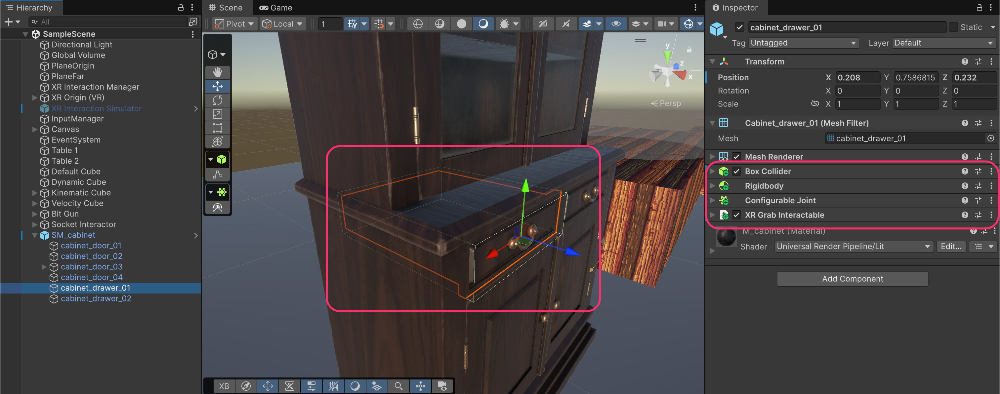
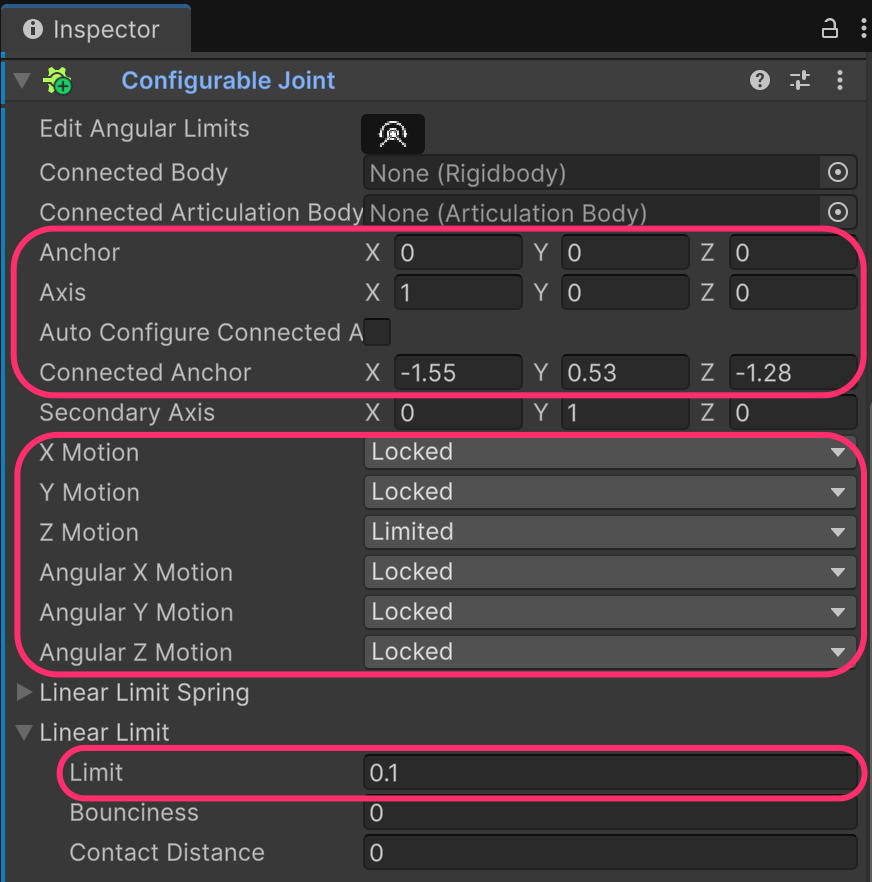
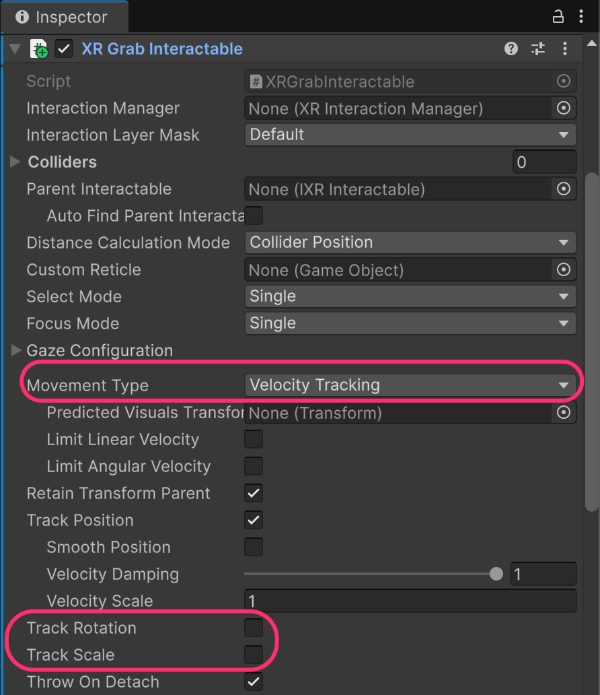

# Drawers

<figure><figcaption></figcaption></figure>

Drawers work similarly to doors but use a **`ConfigurableJoint`** instead of a `HingeJoint`, since drawers slide linearly rather than rotate.

Unlike doors where we grab a handle, drawers can often be **grabbed directly** since the entire drawer face acts as the interaction point.

## Creating the drawer

Select the drawer child object (e.g., **cabinet\_drawer\_01**) and add:

* **`BoxCollider`** (fit it to the drawer shape)
* **`Rigidbody`**
* **`ConfigurableJoint`**
* **`XRGrabInteractable`**

<figure><figcaption></figcaption></figure>

### Configure the Configurable Joint

The `ConfigurableJoint` allows precise control over which axes can move and how far.

Configure it for linear sliding motion:

**Anchor Settings:**

* **Anchor**: (0, 0, 0) ⇒ the joint's pivot point in local space
* **Axis**: (1, 0, 0) ⇒  the primary axis direction
* **Auto Configure Connected Anchor**: Disabled
* **Connected Anchor**: Set to the drawer's world position (e.g., -1.55, 0.53, -1.28)

**Motion Settings:**

* **X Motion**: Locked
* **Y Motion**: Locked
* **Z Motion**: Limited (the sliding direction)
* **Angular X Motion**: Locked
* **Angular Y Motion**: Locked
* **Angular Z Motion**: Locked

**Limits:**

* **Linear Limit**: 0.1 (how far the drawer can slide, in meters ⇒ 10 Cm)

<figure><figcaption></figcaption></figure>

<table><thead><tr><th width="316.6015625">Setting</th><th>Description</th></tr></thead><tbody><tr><td><strong>Anchor</strong></td><td>The joint's pivot point in the object's local space. (0,0,0) means the joint is at the object's origin.</td></tr><tr><td><strong>Axis</strong></td><td>The primary axis of the joint. Determines the "forward" direction for the joint's calculations.</td></tr><tr><td><strong>Auto Configure Connected Anchor</strong></td><td>When enabled, Unity automatically calculates the Connected Anchor. <strong>Disable this</strong> for more control.</td></tr><tr><td><strong>Connected Anchor</strong></td><td>The point in world space (or the connected body's space) where the joint attaches. This defines where the drawer "wants to return to."</td></tr></tbody></table>


**Why disable Auto Configure Connected Anchor?**&#x20;

Auto-configuration can cause unexpected behavior, especially when the drawer's starting position doesn't match what Unity calculates. By manually setting the Connected Anchor to the drawer's actual world position, you ensure the joint knows exactly where the drawer's "home" position is.



**Finding the correct Connected Anchor values:**

1. Select your drawer and note its **Transform Position** values in the Inspector
2. Use these same values (or close to them) for the **Connected Anchor**
3. This tells the joint "this is where the drawer starts, constrain movement from here"


| Setting     | Meaning                                          |
| ----------- | ------------------------------------------------ |
| **Locked**  | No movement allowed on this axis                 |
| **Limited** | Movement allowed within the Linear Limit         |
| **Free**    | Unlimited movement (not recommended for drawers) |

### Configure XR Grab Interactable

Configure the `XRGrabInteractable` for constrained physics movement:

* **Movement Type**: **Velocity Tracking**
* **Track Rotation**: Disabled
* **Track Scale**: Disabled

<figure><figcaption></figcaption></figure>

<table><thead><tr><th width="183.515625">Setting</th><th width="197.23828125">Value</th><th>Why</th></tr></thead><tbody><tr><td><strong>Movement Type</strong></td><td>Velocity Tracking</td><td>Required for physics joints to work</td></tr><tr><td><strong>Track Rotation</strong></td><td>Disabled</td><td>Drawer shouldn't rotate with hand</td></tr><tr><td><strong>Track Scale</strong></td><td>Disabled</td><td>Drawer shouldn't scale</td></tr></tbody></table>

### Try out the drawer!

Run the project, grab the drawer, and pull to open it!

<figure><figcaption></figcaption></figure>

**Expected behavior:**

1. Grab the drawer front with the grip button
2. Pull your hand back ⇒ the drawer slides open
3. Push forward ⇒ the drawer slides closed
4. The drawer stops at the Linear Limit (fully open) and at its starting position (fully closed)

***

## Cabinet hierarchy

```
SM_cabinet
├── cabinet_door_01              [Box Collider, Rigidbody, Hinge Joint]
│   └── Handle                   [Box Collider, Rigidbody, Fixed Joint, XR Grab Interactable]
├── cabinet_door_02              [Box Collider, Rigidbody, Hinge Joint]
│   └── Handle                   [Box Collider, Rigidbody, Fixed Joint, XR Grab Interactable]
├── cabinet_door_03              [Box Collider, Rigidbody, Hinge Joint]
│   └── Handle                   [Box Collider, Rigidbody, Fixed Joint, XR Grab Interactable]
├── cabinet_door_04              [Box Collider, Rigidbody, Hinge Joint]
│   └── Handle                   [Box Collider, Rigidbody, Fixed Joint, XR Grab Interactable]
├── cabinet_drawer_01            [Box Collider, Rigidbody, Configurable Joint, XR Grab Interactable]
└── cabinet_drawer_02            [Box Collider, Rigidbody, Configurable Joint, XR Grab Interactable]
```

***

## Troubleshooting drawers

| Problem                          | Cause                               | Solution                              |
| -------------------------------- | ----------------------------------- | ------------------------------------- |
| Drawer doesn't move              | Movement Type not Velocity Tracking | Change to Velocity Tracking           |
| Drawer rotates when grabbed      | Track Rotation enabled              | Disable Track Rotation                |
| Drawer slides wrong direction    | Wrong axis set to Limited           | Change which Motion axis is Limited   |
| Drawer slides too far/not enough | Linear Limit incorrect              | Adjust Linear Limit value             |
| Drawer jiggles or shakes         | Physics conflict                    | Check Rigidbody settings, add damping |
| Drawer falls through cabinet     | Missing colliders                   | Add colliders to cabinet interior     |

***

## Physics joint summary

| Joint Type             | Use Case                  | Movement                                |
| ---------------------- | ------------------------- | --------------------------------------- |
| **Hinge Joint**        | Doors, lids, levers       | Rotation around single axis             |
| **Fixed Joint**        | Connecting handle to door | No relative movement (locked together)  |
| **Configurable Joint** | Drawers, sliders          | Customizable linear/angular constraints |

***

## Documentation

* [Configurable Joint Documentation](https://docs.unity3d.com/Manual/class-ConfigurableJoint.html)
* [Hinge Joint Documentation](https://docs.unity3d.com/Manual/class-HingeJoint.html)
* [Physics Joints Overview](https://docs.unity3d.com/Manual/Joints.html)
