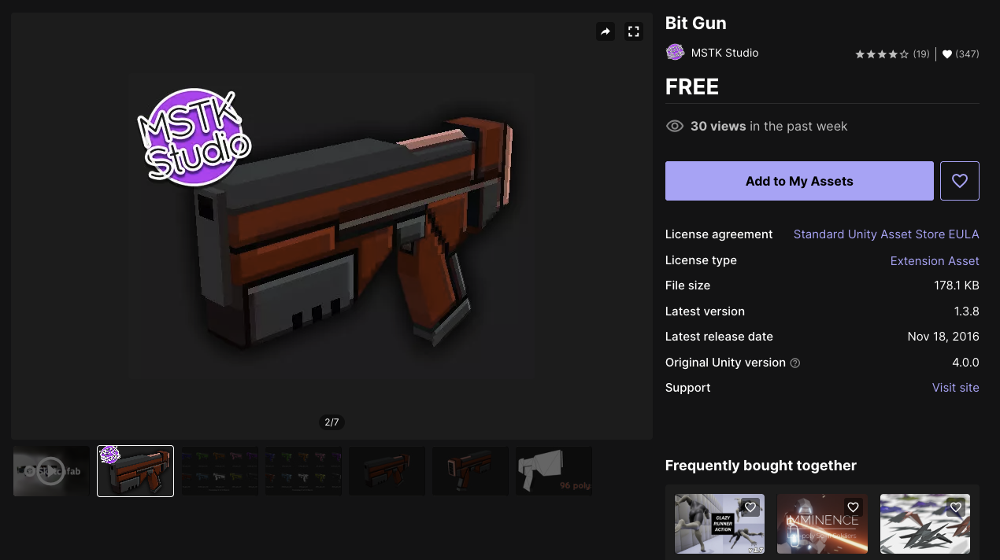
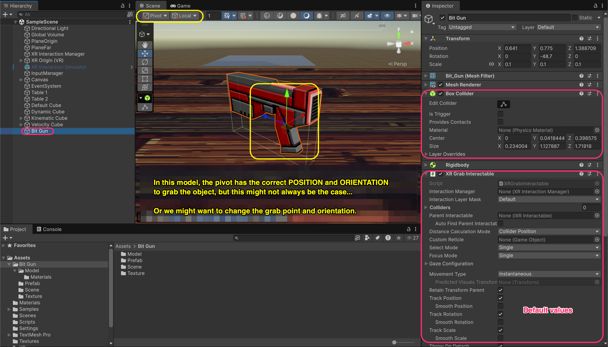
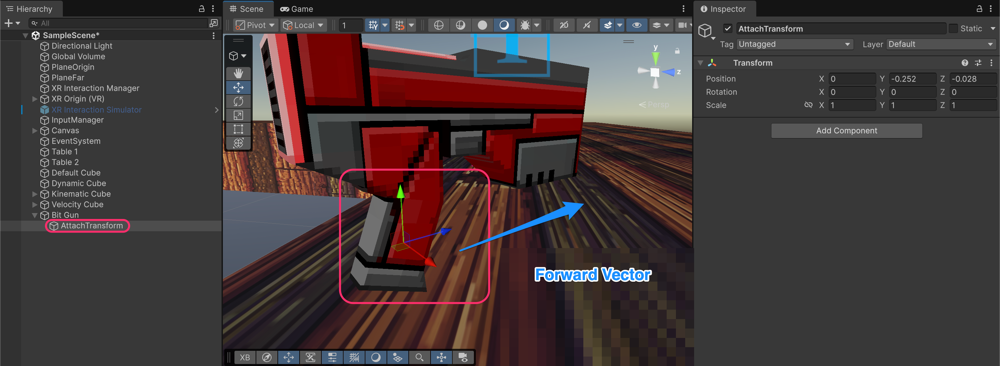
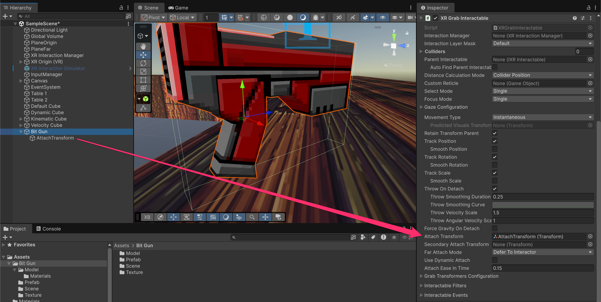
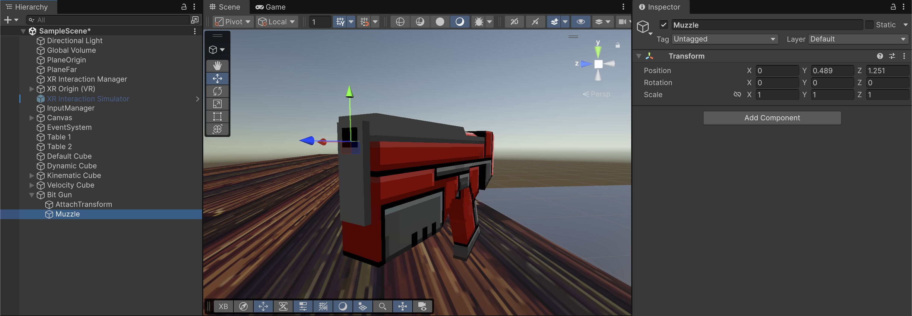
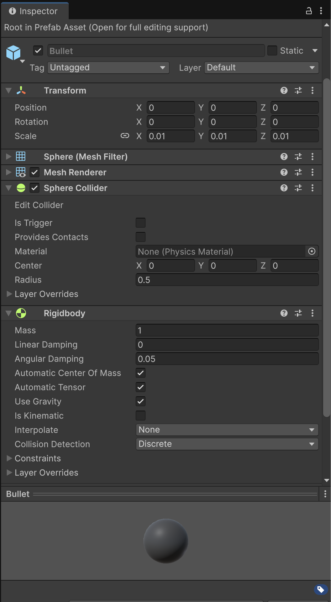
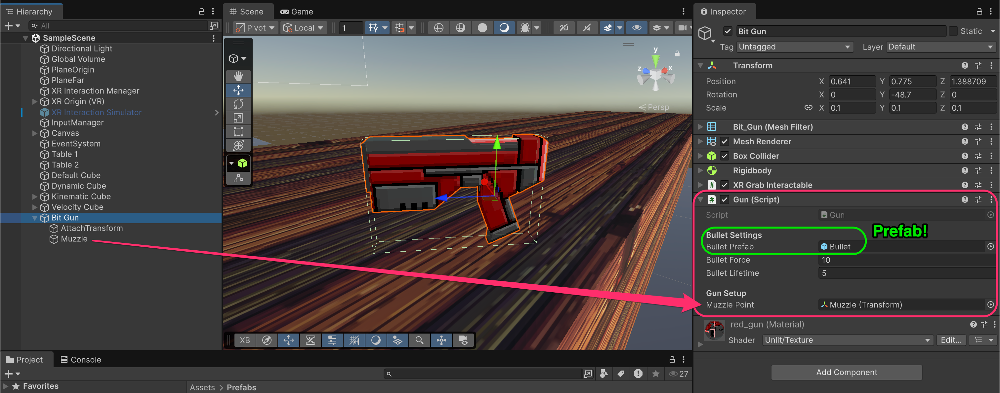
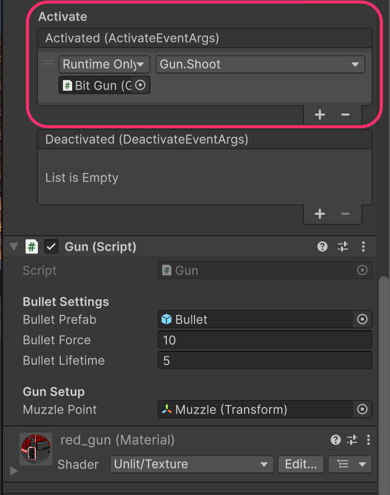

# Shooting

A common use case for grabbed objects is **using** them with the trigger button. In XRI terminology, this is called **Activate**. Let's create a gun that shoots bullets when activated.

## Preparing the model

For this example, we'll use the free **Bit Gun** asset from the Unity Asset Store.



<figure><figcaption></figcaption></figure>


You can use any gun model, or even a simple cube.


### Set up the gun as grabbable

Add the required components to the gun model:

* **`BoxCollider`** (or appropriate collider for your model)
* **`Rigidbody`**
* **`XRGrabInteractable`**

<figure><figcaption></figcaption></figure>


**Check the model's pivot:**&#x20;

Switch to **Pivot** mode (not Center) in the Scene view toolbar to see where the model's origin is. This affects how the object is grabbed by default.



In the Bit Gun model, the pivot happens to be at the handle, but this isn't always the case. Many models have their pivot at the center or bottom, which would make the gun grab awkwardly.


### Create an Attach Transform

To control exactly **where and how** the gun is held, create an **Attach Transform** GameObject.

1. Create an empty GameObject as a child of the gun called **AttachTransform**
2. Position it at the **handle** where the hand should grip
3. Rotate it so the **blue Z-axis (forward)** points in the direction the gun fires

<figure><figcaption></figcaption></figure>


**Why the forward vector matters:**&#x20;

When the interactor grabs the object, it aligns the Attach Transform's forward direction with the controller's forward direction. If the Z-axis points sideways, the gun will be held sideways.


### Assign the attach Transform

In the **`XRGrabInteractable`** component, assign your **AttachTransform** to the **Attach Transform** field.

<figure><figcaption></figcaption></figure>


**What does Attach Transform do?**&#x20;

It defines the point on the object that aligns with the interactor's attach point. Without it, the object's origin (pivot) is used, which may not be where you want to hold it.


Run the project and grab the gun. It should now be held correctly at the handle with the barrel pointing forward.

<figure><figcaption></figcaption></figure>

***

## Create a muzzle point

The muzzle point defines **where bullets spawn** and **which direction they travel**.

1. Create an empty GameObject as a child of the gun called **Muzzle**
2. Position it at the **tip of the barrel**
3. Rotate it so the **blue Z-axis (forward)** points in the shooting direction

<figure><figcaption></figcaption></figure>


**Why a separate transform?**&#x20;

The bullet needs to spawn at a specific position (barrel tip) and travel in a specific direction (forward from barrel). The muzzle transform provides both.


### Create the gun script

Create a new script called `Gun`:

```csharp
using UnityEngine;

public class Gun : MonoBehaviour
{
    [Header("Bullet Settings")]
    [SerializeField] private GameObject bulletPrefab;
    [SerializeField] private float bulletForce = 10f;
    [SerializeField] private float bulletLifetime = 5f;

    [Header("Gun Setup")]
    [SerializeField] private Transform muzzlePoint;
    
    public void Shoot()
    {
        if (bulletPrefab == null || muzzlePoint == null)
        {
            Debug.LogError("Gun is missing bulletPrefab or muzzlePoint reference.");
            return;
        }

        // Instantiate bullet at muzzle position and rotation
        GameObject bullet = Instantiate(
            bulletPrefab,
            muzzlePoint.position,
            muzzlePoint.rotation
        );

        Rigidbody rb = bullet.GetComponent<Rigidbody>();
        if (rb == null)
        {
            Debug.LogError("Bullet prefab must have a Rigidbody.");
            return;
        }

        // Apply force forward
        rb.AddForce(muzzlePoint.forward * bulletForce, ForceMode.Impulse);

        // Destroy bullet after lifetime expires
        Destroy(bullet, bulletLifetime);
    }
}
```

**How the script works:**

1. `Shoot()` is a public method that will be called by the XRI Activate event
2. It instantiates a bullet at the muzzle position with the muzzle rotation
3. It applies an impulse force in the muzzle's forward direction
4. The bullet is automatically destroyed after `bulletLifetime` seconds to prevent memory buildup

### Create the bullet prefab

Create a simple bullet prefab:

1. Create a **Sphere** in the scene
2. Scale it down (e.g., 0.01, 0.01, 0.01)
3. Add a **Rigidbody** component
4. Drag it to the Project window to create a prefab
5. Delete the instance from the scene

<figure><figcaption></figcaption></figure>

<table><thead><tr><th width="206.625">Property</th><th>Value</th><th>Reason</th></tr></thead><tbody><tr><td><strong>Mass</strong></td><td>1</td><td>Affects collision impact</td></tr><tr><td><strong>Use Gravity</strong></td><td>✓</td><td>Bullets should arc over distance</td></tr><tr><td><strong>Is Kinematic</strong></td><td>✗</td><td>Needs physics for movement</td></tr><tr><td><strong>Collision Detection</strong></td><td>Discrete (or Continuous for fast bullets)</td><td>Prevents tunneling through thin objects</td></tr></tbody></table>


**Optional improvements:**

* Add a **`TrailRenderer`** for bullet trails
* Add a script to detect hits and apply damage
* Use **Continuous Collision Detection** for fast-moving bullets


### Configure the gun script

Add the **Gun** script to your gun GameObject and assign:

* **Bullet Prefab**: Your bullet prefab
* **Bullet Force**: 10 (adjust for desired speed)
* **Bullet Lifetime**: 5 seconds
* **Muzzle Point**: The Muzzle transform

<figure><figcaption></figcaption></figure>

### Connect the Activate Event

The `XRGrabInteractable` has an **Activated** event that fires when the player presses the trigger while holding the object.

1. On the **`XRGrabInteractable`** component, expand **Interactable Events**
2. Find the **Activated** event
3. Click **+** to add a listener
4. Drag the gun GameObject to the object field
5. Select **Gun → Shoot()** from the dropdown

<figure><figcaption></figcaption></figure>

**Other interesting events on `XRGrabInteractables`:**

<table><thead><tr><th width="192.0078125">Event</th><th>Trigger</th><th>Use Case</th></tr></thead><tbody><tr><td><strong>Select Entered</strong></td><td>Grip pressed (grab)</td><td>Start holding object</td></tr><tr><td><strong>Select Exited</strong></td><td>Grip released (drop)</td><td>Release object</td></tr><tr><td><strong>Activated</strong></td><td>Trigger pressed while held</td><td>Use object (shoot, spray, etc.)</td></tr><tr><td><strong>Deactivated</strong></td><td>Trigger released while held</td><td>Stop using object</td></tr></tbody></table>

Run the project, grab the gun, and press the trigger to shoot!

<figure><figcaption></figcaption></figure>

***

## Gun hierarchy

```
Bit Gun                           [Box Collider, Rigidbody, XR Grab Interactable, Gun]
├── AttachTransform               (grab point at handle)
└── Muzzle                        (bullet spawn point at barrel)
```

## Troubleshooting

<table><thead><tr><th width="392.84375">Problem</th><th>Likely Cause</th></tr></thead><tbody><tr><td>Gun held at wrong angle</td><td>AttachTransform rotation incorrect</td></tr><tr><td>Bullets spawn inside gun</td><td>Muzzle position too close to gun</td></tr><tr><td>Bullets go wrong direction</td><td>Muzzle rotation incorrect</td></tr><tr><td>Bullets don't move</td><td>Missing <code>Rigidbody</code> on bullet</td></tr><tr><td>Shooting doesn't trigger</td><td>Event not connected</td></tr><tr><td>Multiple bullets per shot</td><td>Event firing multiple times</td></tr></tbody></table>

***

### Documentation

* [XR Grab Interactable Events](https://docs.unity3d.com/Packages/com.unity.xr.interaction.toolkit@3.3/manual/interactable-events.html)
