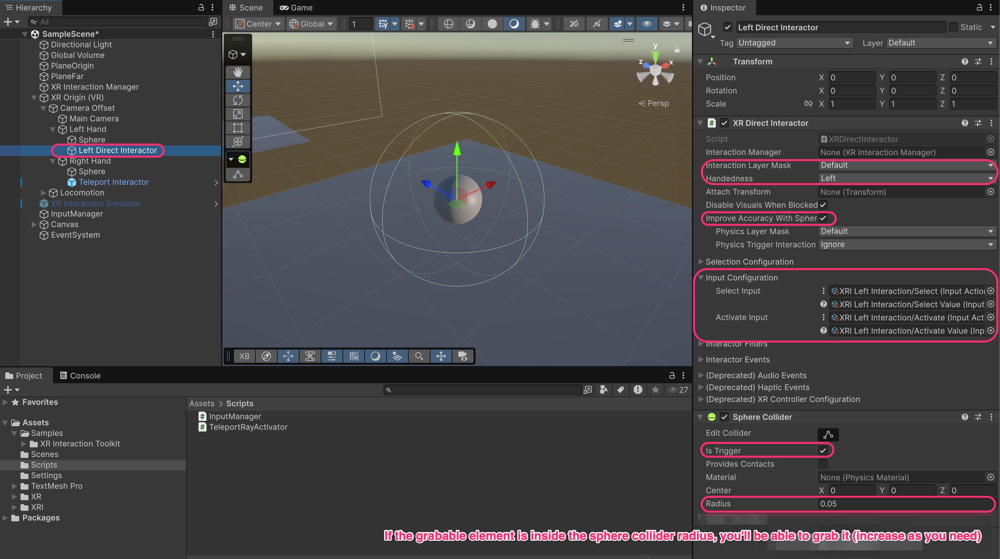
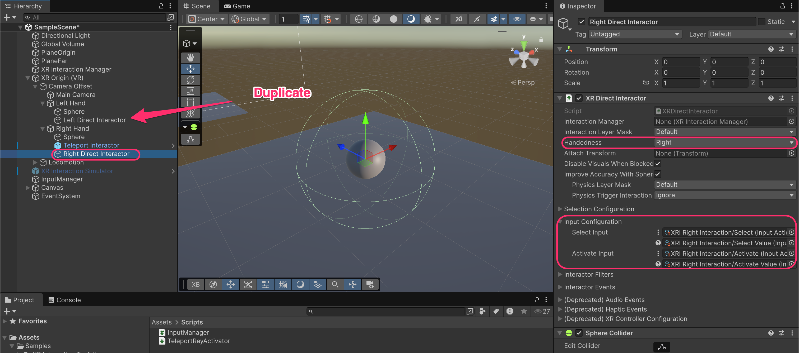
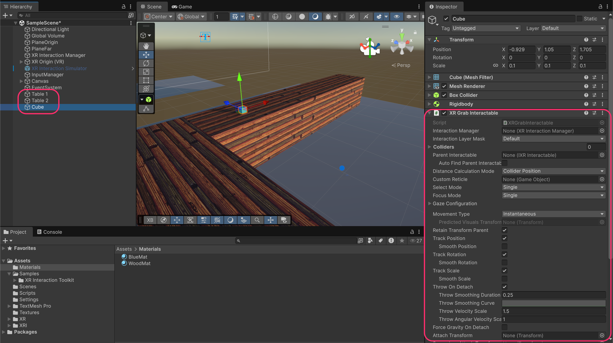
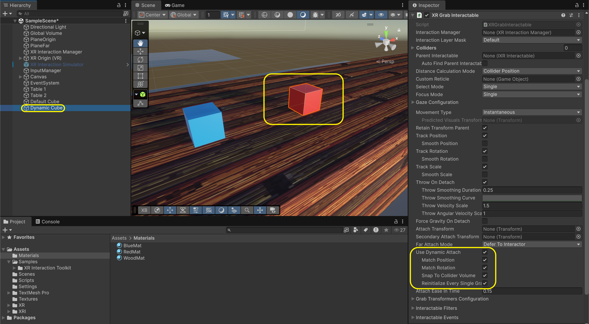
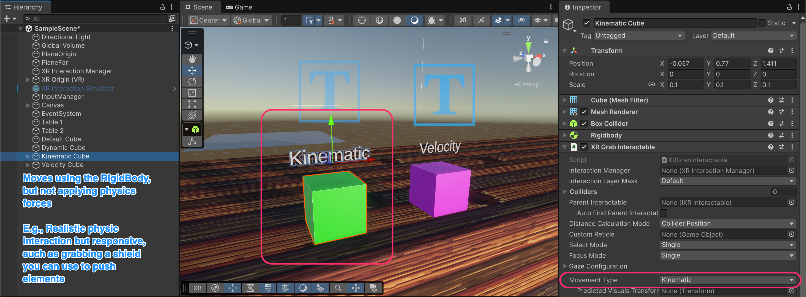

# Simple grab

## Default grab

To grab objects, you need:

1. **`XRDirectInteractor`** on the hands (the "grabbers")
2. **`XRGrabInteractable`** on objects (the "grabbables")





### Add Direct Interactor to Left Hand

Create a new GameObject as a child of **Left Hand** called **Left Direct Interactor**. Add these components:

* **`XRDirectInteractor`**
* **`SphereCollider`**

Configure the **`XRDirectInteractor`**:

* **Interaction Layer Mask**: Default
* **Handedness**: Left
* **Improve Accuracy With Sphere**: Enabled

Configure the **`SphereCollider`**:

* **Is Trigger**: Enabled so you don't push things by mistake
* **Radius**: 0.05 ⇒ 5 cm (the smaller it is, the closer your hand should be to the object)

Configure the **Input Configuration**:

* **Select Input**: `XRI Left Interaction/Select` and `XRI Left Interaction/Select Value`
* **Activate Input**: `XRI Left Interaction/Activate` and `XRI Left Interaction/Activate Value`&#x20;

<figure><figcaption></figcaption></figure>


**What is a Direct Interactor?**&#x20;

It's an interactor that detects objects within a physical volume (the trigger collider). When the player's hand enters an object's collider and presses the grab button, the object is grabbed.



**Select vs Activate:**

* **Select** (Grip button): Pick up / grab the object
* **Activate** (Trigger button): Use / activate the grabbed object (e.g., fire a gun, spray a can)


### Add Direct Interactor to Right Hand

Duplicate the **Left Direct Interactor** and move it under **Right Hand**. Rename it to **Right Direct Interactor**.

Update the configuration:

* **Handedness**: Right
* **Select Input**: `XRI Right Interaction/Select` and `XRI Right Interaction/Select Value`
* **Activate Input**: `XRI Right Interaction/Activate` and `XRI Right Interaction/Activate Value`&#x20;

<figure><figcaption></figcaption></figure>

### Create a grabbable object

To make any object grabbable, it needs:

1. A **`Collider`** (any type)
2. A **`Rigidbody`**
3. An **`XRGrabInteractable`** component

Create a Cube in your scene and add those components:

<figure><figcaption></figcaption></figure>

<table><thead><tr><th width="269.74609375">Property</th><th>Description</th></tr></thead><tbody><tr><td><strong>Interaction Layer Mask</strong></td><td>Must match the interactor's layer (Default)</td></tr><tr><td><strong>Movement Type</strong></td><td>How the object moves when grabbed (explained below)</td></tr><tr><td><strong>Track Position/Rotation</strong></td><td>Whether the object follows hand position/rotation</td></tr><tr><td><strong>Throw On Detach</strong></td><td>Enable throwing when released</td></tr><tr><td><strong>Throw Velocity Scale</strong></td><td>Multiplier for throw force</td></tr></tbody></table>


**Why does it need a `Rigidbody`?**&#x20;

The `Rigidbody` enables physics simulation, such as gravity, collisions, throwing... Without it, the object couldn't fall, be thrown, or interact physically with the environment.


### Test Basic Grabbing

Run the project, move your hand near the cube, and press the grip button to grab it.

<figure><figcaption></figcaption></figure>


**Default grab behavior:**&#x20;

Notice that when you grab the object, it **snaps to the hand's position**. The object's center aligns with the interactor's attach point. This can feel unnatural for some objects.


***

## Dynamic Attach

By default, grabbed objects snap to a fixed position relative to the hand. **Dynamic Attach** preserves the grab point, or in other words, the object stays where you grabbed it.

### Enable Dynamic Attach

On the **`XRGrabInteractable`**, enable:

* **Use Dynamic Attach**: Enabled
* **Match Position**: Enabled
* **Match Rotation**: Enabled
* **Snap To Collider Volume**: Enabled

<figure><figcaption></figcaption></figure>

<table><thead><tr><th width="260.83203125">Property</th><th>Description</th></tr></thead><tbody><tr><td><strong>Use Dynamic Attach</strong></td><td>Enable grab point preservation</td></tr><tr><td><strong>Match Position</strong></td><td>Object maintains relative position to hand</td></tr><tr><td><strong>Match Rotation</strong></td><td>Object maintains relative rotation to hand</td></tr><tr><td><strong>Snap To Collider Volume</strong></td><td>Attach point snaps to the collider surface</td></tr></tbody></table>

<figure><figcaption></figcaption></figure>

#### **When to use each?**

<table><thead><tr><th width="186.2578125">Mode</th><th>Best For</th></tr></thead><tbody><tr><td><strong>Default</strong></td><td>Tools with specific grip points, weapons, objects that should always be held the same way</td></tr><tr><td><strong>Dynamic Attach</strong></td><td>Natural objects like boxes, balls, books, or anything you'd grab wherever your hand lands</td></tr></tbody></table>

***

## Movement Types

The **Movement Type** determines how the grabbed object follows the hand. This significantly affects physics behavior.

### Instantaneous (Default)

The object **teleports** to the hand position each frame. No physics forces are applied.

**Characteristics**:

* Object moves instantly to hand position
* Ignores physics collisions while grabbed
* Can clip through walls and objects
* Most responsive feeling
* Best for: UI tools, non-physical interactions

### Kinematic

The object moves using **`Rigidbody`.MovePosition/MoveRotation**. It respects collisions but doesn't apply forces.

<figure><figcaption></figcaption></figure>

**Characteristics**

* Moves using the `Rigidbody`, but not applying physics forces
* Can push other Rigidbodies
* Can go through other colliders while grabbed
* Responsive feel with collision boundaries
* Best for: Shields, pushing objects, tools that interact physically but shouldn't be stopped

### Velocity Tracking

The object moves using **physics velocity**. Fully physics-based movement.

<figure><figcaption></figcaption></figure>

**Characteristics**

* Uses full physics simulation
* Most realistic physical behavior
* Objects can be blocked by heavy obstacles
* Throwing feels most natural
* Best for: Throwable objects, realistic physics puzzles, rocks, balls

<figure><figcaption></figcaption></figure>


* **Kinematic (green)**: Follows hand precisely, pushes through obstacles
* **Velocity (purple)**: Follows hand with physics lag, gets blocked by obstacles, bounces realistically


**Choosing the right Movement Type:**

Ask yourself: "What happens when the player tries to move this object through a wall?"

* **It should clip through** → Instantaneous
* **It should push the wall/stop but stay with hand** → Kinematic
* **It should be blocked and feel heavy** → Velocity Tracking

***

### Updated hierarchy

After setting up grabbing, your hand hierarchy should look like this:

```
Camera Offset
├── Main Camera
├── Left Hand                     [Tracked Pose Driver]
│   ├── Sphere                    (visual)
│   └── Left Direct Interactor    [XR Direct Interactor, Sphere Collider (Trigger)]
└── Right Hand                    [Tracked Pose Driver, TeleportRayActivator]
    ├── Sphere                    (visual)
    ├── Teleport Interactor       [XR Ray Interactor]
    └── Right Direct Interactor   [XR Direct Interactor, Sphere Collider (Trigger)]
```

***

### Documentation

* [XR Grab Interactable Documentation](https://docs.unity3d.com/Packages/com.unity.xr.interaction.toolkit@3.3/manual/xr-grab-interactable.html)
* [XR Direct Interactor Documentation](https://docs.unity3d.com/Packages/com.unity.xr.interaction.toolkit@3.3/manual/xr-direct-interactor.html)
* [Interaction Layer Mask](https://docs.unity3d.com/Packages/com.unity.xr.interaction.toolkit@3.3/manual/interaction-layers.html)
