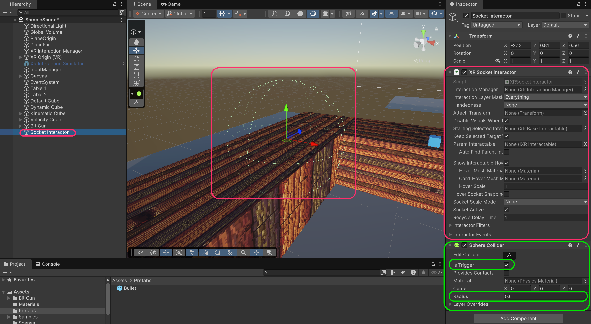
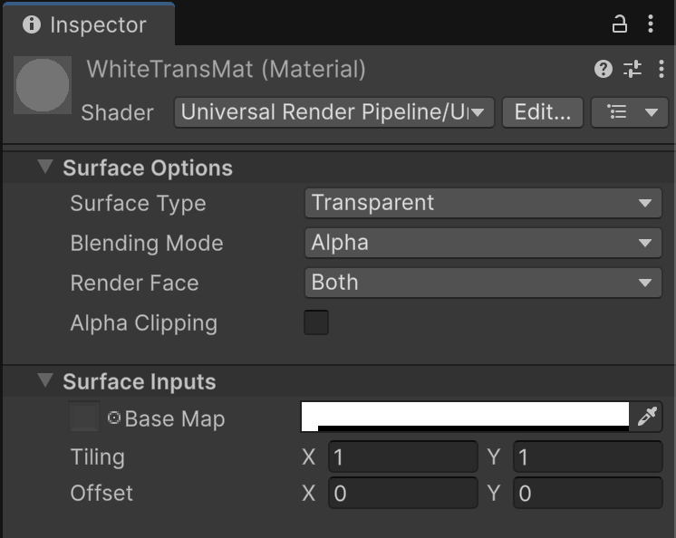
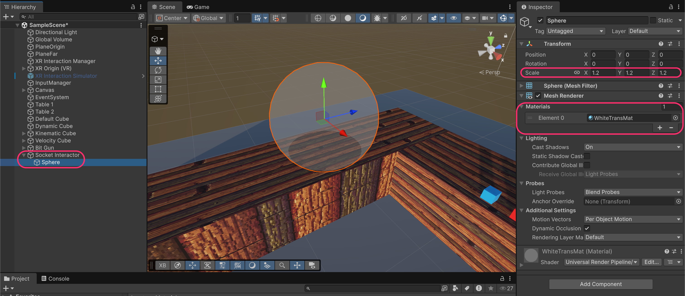

# Socket

Sockets are special interactors that **hold objects in a fixed position**. When you release an object near a socket, it snaps into place. This is useful for inventory systems, holsters, crafting stations, puzzle pieces, and more.

<figure><figcaption></figcaption></figure>

## Create a Socket Interactor

Create an empty GameObject called **Socket Interactor** and add these components:

* **`XRSocketInteractor`**
* **`SphereCollider`**

Configure the **Sphere Collider**:

* **Is Trigger**: Enabled
* **Radius**: 0.6 (defines the area you will drop-in the objects)

<figure><figcaption></figcaption></figure>


**What is an `XRSocketInteractor`?**&#x20;

Unlike `XRDirectInteractors` (which require button input to grab), `XRSocketInteractors` **automatically grab** any compatible interactable that enters their trigger volume.&#x20;

When you release an object inside the socket's range, it snaps into place.


<table><thead><tr><th width="281.2421875">Property</th><th>Description</th></tr></thead><tbody><tr><td><strong>Interaction Layer Mask</strong></td><td>Which interactables this socket can accept (use to filter object types)</td></tr><tr><td><strong>Socket Active</strong></td><td>Enable/disable the socket at runtime</td></tr><tr><td><strong>Recycle Delay Time</strong></td><td>Time before the socket can accept another object after one is removed</td></tr><tr><td><strong>Keep Selected Target Valid</strong></td><td>Keep holding the object even if it moves outside the socket range</td></tr></tbody></table>

### Create a transparent material

To help users see where objects can be placed, create a visual placeholder for the socket.

Create a new material with transparent settings:

* **Surface Type**: Transparent
* **Blending Mode**: Alpha
* **Base Map**: White (or any color with low alpha)

<figure><figcaption></figcaption></figure>

### Add a visual placeholder

Create a **Sphere** as a child of the Socket Interactor:

1. Scale it to match the socket detection area (e.g., 1.2, 1.2, 1.2)
2. Apply the transparent material
3. **Remove the `SphereCollider`** from this visual sphere (the parent already has the trigger collider)

<figure><figcaption></figcaption></figure>


**Visual vs Collider:**&#x20;

The transparent sphere is purely visual. It's used to shows users where to place objects.&#x20;

The actual detection is done by the `SphereCollider` on the parent Socket Interactor. Just make sure to remove the collider from the visual mesh.


### Test the socket

Run the project. When you release an object inside the socket's range, it snaps into position.

<figure><figcaption></figcaption></figure>

**Socket behavior:**

1. Grab an object with your hand
2. Move it near the socket (inside the trigger volume)
3. Release the grip button
4. The object snaps to the socket's position and stays there
5. Grab the object again to remove it from the socket

### Additional socket configuration

The `XRSocketInteractor` has several useful options for customization:

<table><thead><tr><th width="296.55078125">Property</th><th>Description</th></tr></thead><tbody><tr><td><strong>Attach Transform</strong></td><td>Define the exact position and orientation where objects snap to (like the gun's AttachTransform)</td></tr><tr><td><strong>Starting Selected Interactable</strong></td><td>Pre-populate the socket with an object when the scene starts</td></tr><tr><td><strong>Show Interactable Hover Meshes</strong></td><td>Show a preview of the object when hovering near the socket</td></tr><tr><td><strong>Hover Mesh Material</strong></td><td>Material used for the hover preview</td></tr><tr><td><strong>Can't Hover Mesh Material</strong></td><td>Material shown when the object can't be placed (e.g., wrong type)</td></tr></tbody></table>

***

## Socket use cases

<table><thead><tr><th width="201.171875">Use Case</th><th>Configuration</th></tr></thead><tbody><tr><td><strong>Inventory slot</strong></td><td>Small socket on player's belt/back, filter by Interaction Layer</td></tr><tr><td><strong>Gun holster</strong></td><td>Socket shaped for the gun, specific Attach Transform rotation</td></tr><tr><td><strong>Puzzle piece</strong></td><td>Socket accepts only specific tagged objects</td></tr><tr><td><strong>Crafting table</strong></td><td>Multiple sockets, trigger events when all filled</td></tr><tr><td><strong>Battery slot</strong></td><td>Socket with Starting Selected Interactable (pre-filled)</td></tr></tbody></table>

***

## Filtering socket interactables

You can control which objects a socket accepts using **Interaction Layer Masks** and **Interactor Filters**.

**Example: Weapon holster that only accepts guns**

1. Create a custom Interaction Layer called "Weapon"
2. Set the gun's **Interaction Layer Mask** to include "Weapon"
3. Set the holster socket's **Interaction Layer Mask** to only "Weapon"
4. Now only weapons can be placed in the holster

***

## Socket events

The XR Socket Interactor has events you can use to trigger game logic:

<table><thead><tr><th width="252.31640625">Event</th><th>When it fires</th></tr></thead><tbody><tr><td><strong>Select Entered</strong></td><td>Object placed in socket</td></tr><tr><td><strong>Select Exited</strong></td><td>Object removed from socket</td></tr><tr><td><strong>Hover Entered</strong></td><td>Object enters socket range (but not yet released)</td></tr><tr><td><strong>Hover Exited</strong></td><td>Object leaves socket range</td></tr></tbody></table>

**Example uses:**

* Play a "click" sound when object snaps in
* Enable a machine when a battery is inserted
* Check if puzzle is complete when all pieces are placed
* Unlock a door when the key is in the socket

***

## Socket hierarchy

```
Socket Interactor                 [XR Socket Interactor, Sphere Collider (Trigger)]
└── Sphere                        (visual placeholder, transparent material, no collider)
```

***

## Documentation

* [XR Socket Interactor Documentation](https://docs.unity3d.com/Packages/com.unity.xr.interaction.toolkit@3.3/manual/xr-socket-interactor.html)
* [Interaction Layers](https://docs.unity3d.com/Packages/com.unity.xr.interaction.toolkit@3.3/manual/interaction-layers.html)

