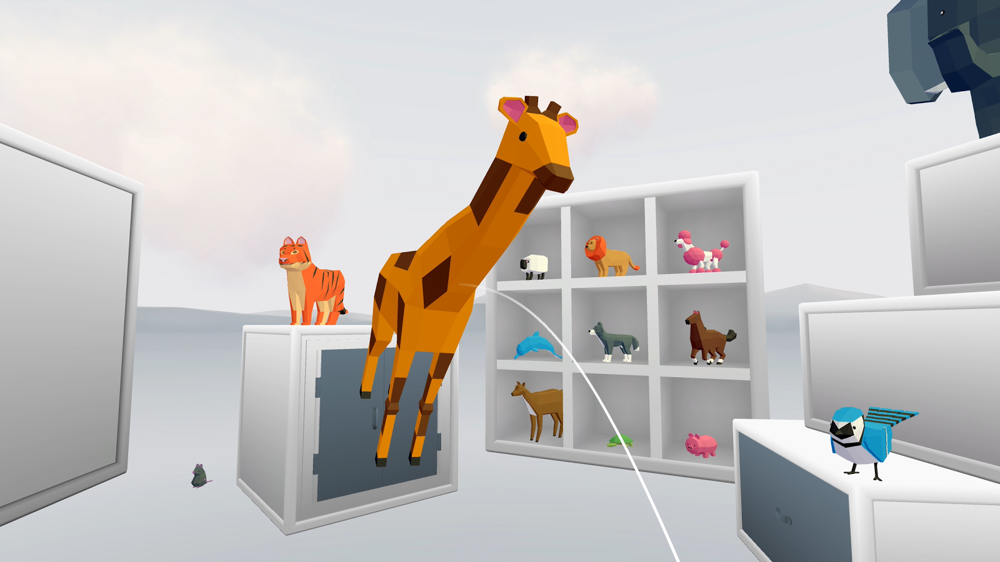
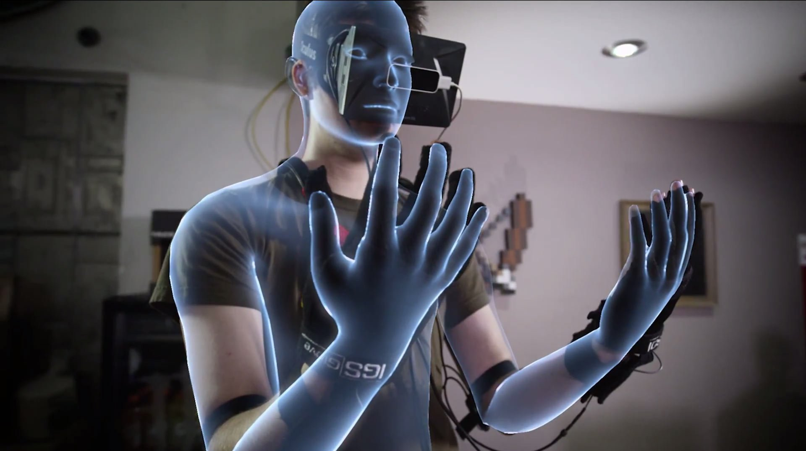

# Interaction

Without a mouse or touchscreen, VR needs **new input paradigms**.

The three primary interaction methods are:

<table><thead><tr><th width="180.1953125">Method</th><th>Input Device</th><th>Best For</th></tr></thead><tbody><tr><td><strong>Gaze</strong></td><td>Head movement</td><td>Simple selection, mobile VR</td></tr><tr><td><strong>Ray/Poke</strong></td><td>Controllers</td><td>Pointing at distant objects or touching them</td></tr><tr><td><strong>Hand tracking</strong></td><td>Cameras/gloves</td><td>Natural manipulation</td></tr></tbody></table>

***

## Gaze Interaction

The simplest method: the user **looks at** an object to interact with it.

<figure><figcaption></figcaption></figure>

Gaze interaction follows a state machine:

| State              | Description                                          |
| ------------------ | ---------------------------------------------------- |
| **No Interaction** | Gaze ray doesn't hit any interactable                |
| **On Start**       | Gaze enters an object — triggers hover state         |
| **On Stay**        | Gaze remains on object — can trigger timed selection |
| **On Stop**        | Gaze leaves the object — resets state                |

**Use cases**: Mobile VR (Google Cardboard), accessibility, hands-free interfaces.

**Limitation**: Low precision sin e everything the user looks at becomes a potential input.

***

## Ray interaction

The most common method in modern VR: a **laser pointer** extends from the controller.

<figure><figcaption></figcaption></figure>

How it works:

* A ray is cast from the controller into the scene
* Objects hit by the ray are **highlighted**
* Trigger button confirms **selection**
* Objects can be **grabbed** and manipulated at a distance

**Advantages**: Precise, works at any distance, familiar to users.

***

### Hand tracking

The most natural method: the user's **real hands** are tracked and mapped into VR.

<figure><figcaption></figcaption></figure>

Modern headsets use **inside-out cameras** or external sensors to track hand position, orientation, and individual finger poses.

Interactions include:

* **Pinch**: thumb and finger together to select
* **Grab**: close hand to pick up objects
* **Poke**: index finger to press buttons
* **Gestures**: custom poses for commands

**Advantages**: No controllers needed, highly immersive.

**Challenges**: Occlusion (hands out of view), precision, fatigue.

***

### Choosing an interaction method

| Method            | Precision | Immersion | Fatigue     | Hardware       |
| ----------------- | --------- | --------- | ----------- | -------------- |
| **Gaze**          | Low       | Medium    | Low         | Headset only   |
| **Ray**           | High      | Medium    | Low         | Controllers    |
| **Hand tracking** | Medium    | High      | Medium-High | Cameras/gloves |

> Most VR applications combine methods — for example, ray interaction for menus and hand tracking for object manipulation.
