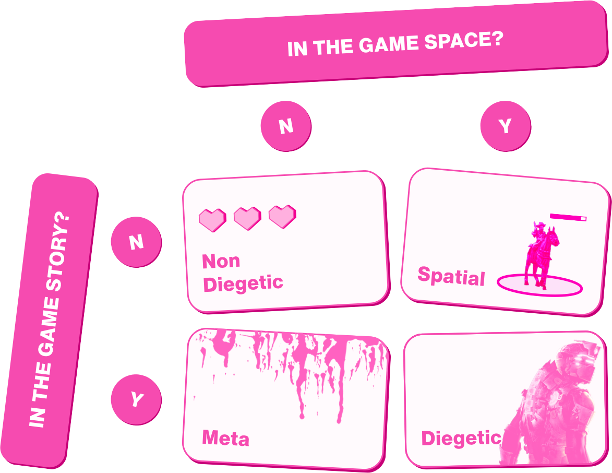
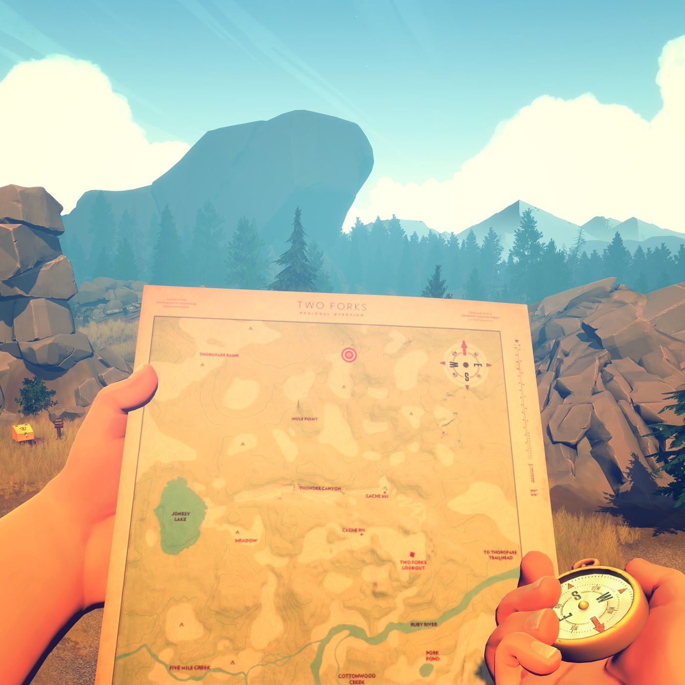
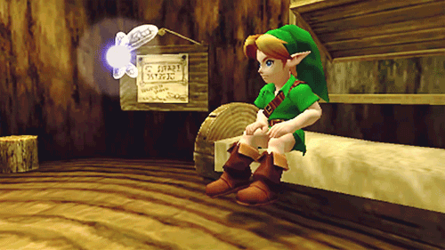
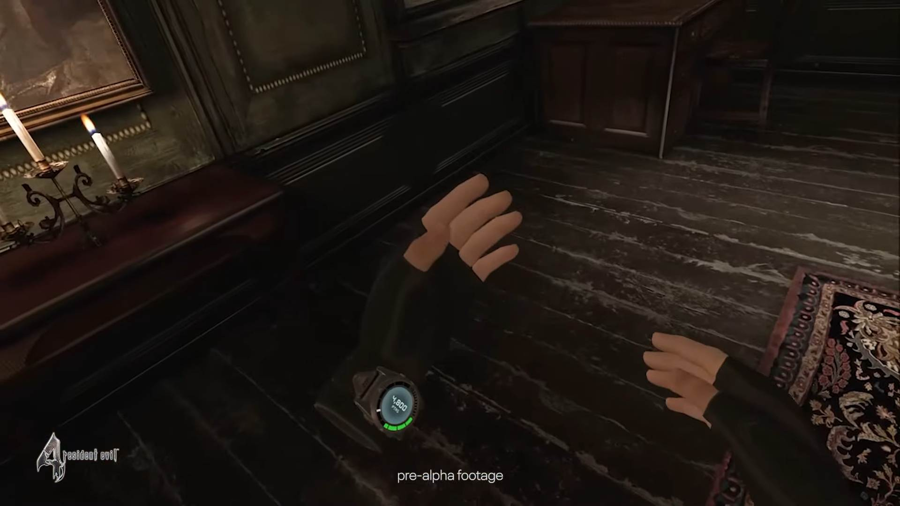
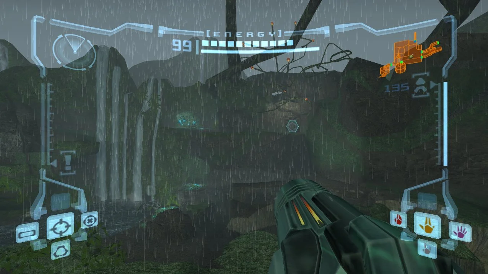
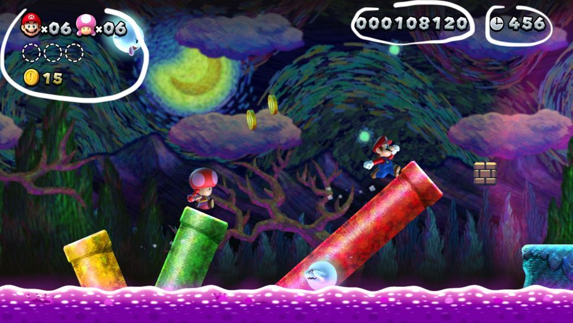
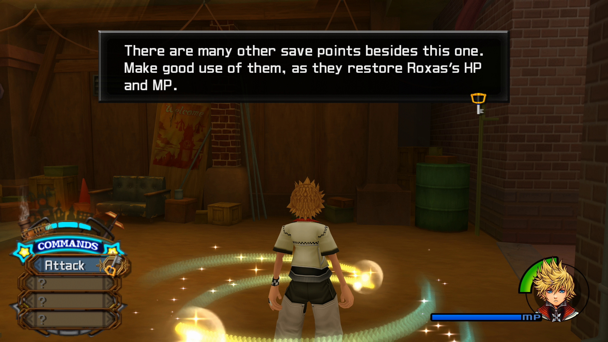
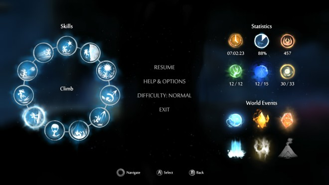
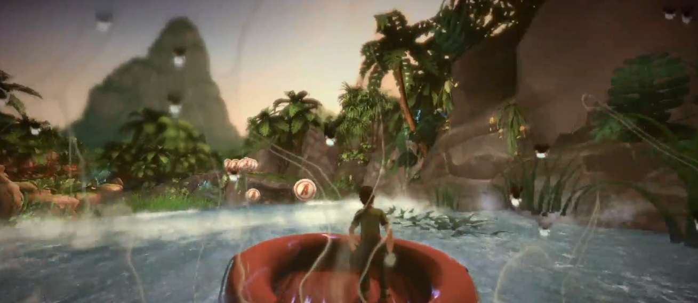

# Interface

Traditional 2D interfaces don't work well in VR:

* There's **no fixed screen** because the user can look anywhere
* Flat overlays feel **disconnected** from the 3D world
* UI elements too close cause **eye strain**

VR designers must rethink where and how to place information.

***

## UI classification framework

UI in games (and VR) can be classified along two axes:

<table><thead><tr><th width="233.76171875">Question</th><th>Meaning</th></tr></thead><tbody><tr><td><strong>In the game space?</strong></td><td>Does it exist in the 3D world?</td></tr><tr><td><strong>In the game story?</strong></td><td>Is it acknowledged by the characters?</td></tr></tbody></table>

<figure><figcaption></figcaption></figure>

This gives us **four categories**:

<figure><figcaption></figcaption></figure>

### Diegetic UI

> Exists in the game world **and** is acknowledged by characters.

The UI is a **physical object** the character can see and interact with.


**Why it works in VR**: Maintains immersion, since the UI is part of the world.


_**Firewatch**: The player holds a physical map and compass._

<figure><figcaption></figcaption></figure>

_**Zelda**: Navi is a character in the world providing guidance._

<figure><figcaption></figcaption></figure>

_**Resident Evil 4 VR**: Health and ammo displayed on a wristwatch._

<figure><figcaption></figcaption></figure>

_**Metroid Prime**: The entire UI is framed as the inside of Samus's helmet._

<figure><figcaption></figcaption></figure>

### Non-Diegetic UI

> **Not** in the game space and **not** in the game story.

Classic screen overlays where the character doesn't see them, only the player does.


**Why it does not work in VR**: Flat overlays break immersion and can cause discomfort if placed too close


_**Super Mario**: Lives, coins, and score floating on screen._

<figure><figcaption></figcaption></figure>

_**Kingdom Hearts**: HP bar, command menu, dialogue boxes._

<figure><figcaption></figcaption></figure>

_**Ori and the Blind Forest**: Pause menus exist entirely outside the game world._

<figure><figcaption></figcaption></figure>

### Spatial UI

> Exists **in the game space** but **not** in the story.

UI elements are placed in 3D space, but characters don't acknowledge them.


**Why it works in VR**: UI has depth and feels integrated, but doesn't require narrative justification.


_**Need for Speed**: Directional arrows exist in 3D space, guiding the player._

<figure><figcaption></figcaption></figure>

_**Tomb Raider I-III Remastered**: The environment shows an icon next to an interactable element, such as an item or a lever._

<figure><figcaption></figcaption></figure>

Other examples: health bars floating above enemies, interaction prompts on objects.

### Meta UI

> **Not** in the game space, but **is** in the story.

Effects applied to the screen that represent in-world events.


**In VR**: Can be effective for feedback (e.g., red vignette when hurt), but overuse can be disorienting.


<figure><figcaption></figcaption></figure>

_Blood splatters, screen blur when damaged, water droplets on the "camera"._

The character experiences these effects, but they're rendered as 2D screen overlays.

***

## UI recommendations for VR

<table><thead><tr><th width="185.01953125">UI Type</th><th width="193.89453125">VR Suitability</th><th>Notes</th></tr></thead><tbody><tr><td><strong>Diegetic</strong></td><td>✅ Best</td><td>Maintains immersion: watches, tablets, in-world displays</td></tr><tr><td><strong>Spatial</strong></td><td>✅ Good</td><td>Labels and prompts in 3D space work well</td></tr><tr><td><strong>Meta</strong></td><td>⚠️ Careful</td><td>Useful for feedback, but can be overwhelming</td></tr><tr><td><strong>Non-Diegetic</strong></td><td>❌ Avoid</td><td>Flat HUDs break presence, so use sparingly</td></tr></tbody></table>
