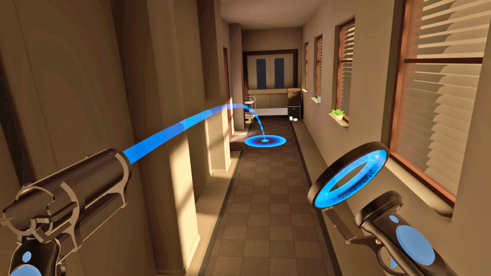
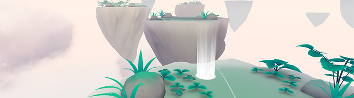
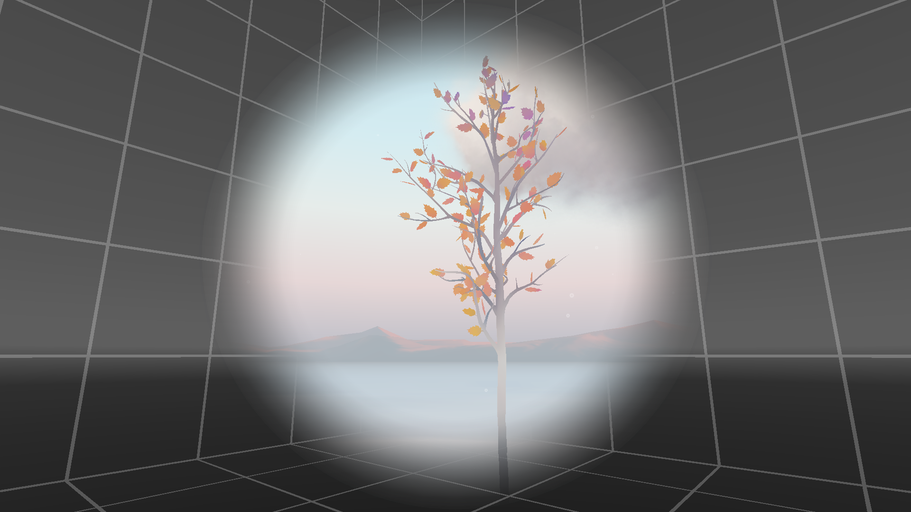
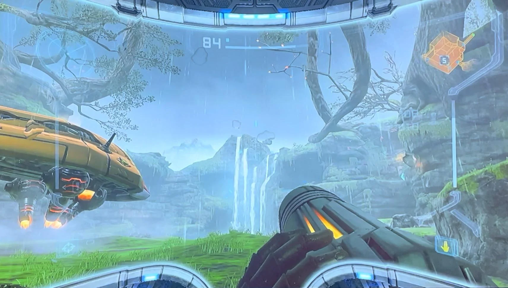
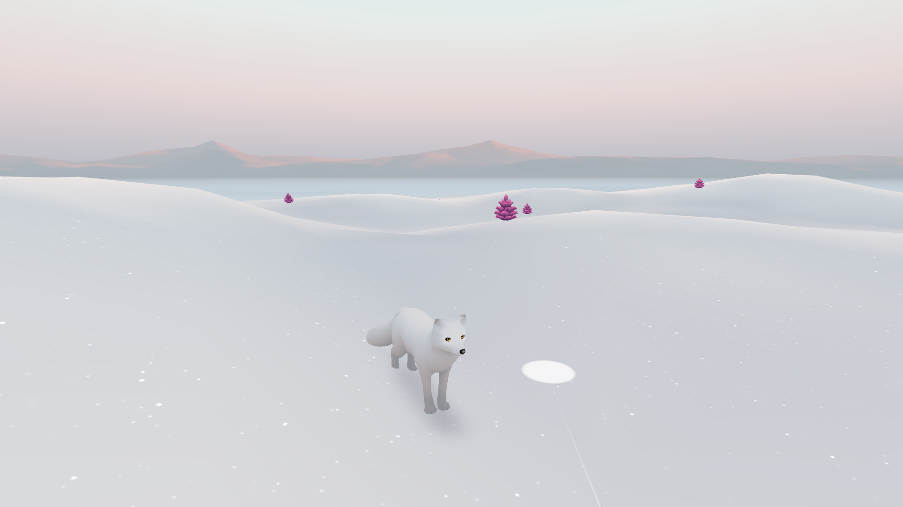

# Locomotion

## The Motion Sickness Problem

Moving in VR is challenging because of **vestibular mismatch**:

> Your eyes see movement, but your inner ear feels nothing.

This conflict causes **motion sickness** — one of VR's biggest UX challenges.

VR developers have created several techniques to minimize discomfort.

***

### Head and Body Tracking

The safest movement is **real movement**. VR headsets track head rotation across three or six axes:

<figure><figcaption></figcaption></figure>

<table><thead><tr><th width="129.890625" align="right">Type</th><th width="170.29296875">Movement</th><th>Description</th></tr></thead><tbody><tr><td align="right"><strong>Rotation</strong></td><td><em>Pitch</em></td><td>Looking up/down</td></tr><tr><td align="right"></td><td><em>Yaw</em></td><td>Looking left/right</td></tr><tr><td align="right"></td><td><em>Roll</em></td><td>Tilting head sideways</td></tr><tr><td align="right"><strong>Translation</strong></td><td><em>Elevating</em></td><td>Moving up/down (standing, crouching)</td></tr><tr><td align="right"></td><td><em>Strafing</em></td><td>Moving left/right (sidestepping)</td></tr><tr><td align="right"></td><td><em>Surging</em></td><td>Moving forward/backward (walking)</td></tr></tbody></table>


Head rotation rarely causes sickness; the problem is **translation** (moving through space without really moving).


***

### Teleportation

The most common solution: **skip the movement entirely**.

The user points to a destination and instantly appears there.

<figure><figcaption></figcaption></figure>

Typical implementation:

* Controller casts a **parabolic arc**
* Landing zone is highlighted
* On trigger release, user **teleports** instantly

<figure><figcaption></figcaption></figure>

**Pros**: Zero motion sickness

**Cons**: Breaks immersion, can feel unnatural

***

### Tunneling (Vignette)

For continuous movement, **tunneling** reduces peripheral vision during motion.

<figure><figcaption></figcaption></figure>

How it works:

* Peripheral vision is **darkened or masked**
* A grid or static reference frame appears at the edges
* Only the **center** shows the moving world

This reduces vestibular conflict by limiting motion cues to central vision.

<figure><figcaption></figcaption></figure>


Some games use **cockpits or vehicles** as a natural reference frame, because the static interior provides visual stability.


***

### Third-Person: Chasing camera

An alternative approach: **detach the camera from the player's head**.

<figure><figcaption></figcaption></figure>

The camera follows an avatar from behind, similar to traditional 3D games.



**Pros**: Familiar, reduces sickness for some users

**Cons**: Less immersive, loses the "presence" of first-person VR

***

### Choosing a locomotion method

<table><thead><tr><th width="176.44921875">Method</th><th width="153.2109375">Motion Sickness</th><th width="126.75">Immersion</th><th>Best For</th></tr></thead><tbody><tr><td><strong>Teleportation</strong></td><td>None</td><td>Low</td><td>Casual users, room-scale</td></tr><tr><td><strong>Tunneling</strong></td><td>Low</td><td>Medium</td><td>Exploration games</td></tr><tr><td><strong>Chasing Camera</strong></td><td>Low-Medium</td><td>Medium</td><td>Action games</td></tr><tr><td><strong>Free movement</strong></td><td>High</td><td>High</td><td>Experienced VR users only</td></tr></tbody></table>
