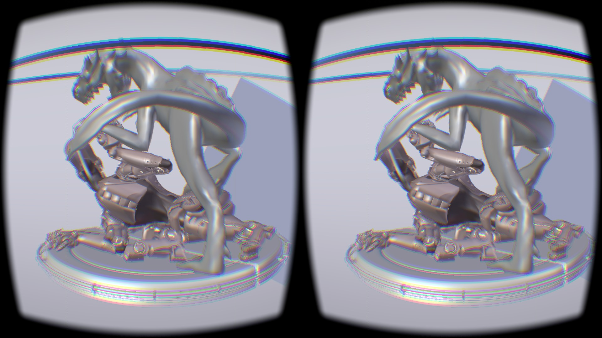
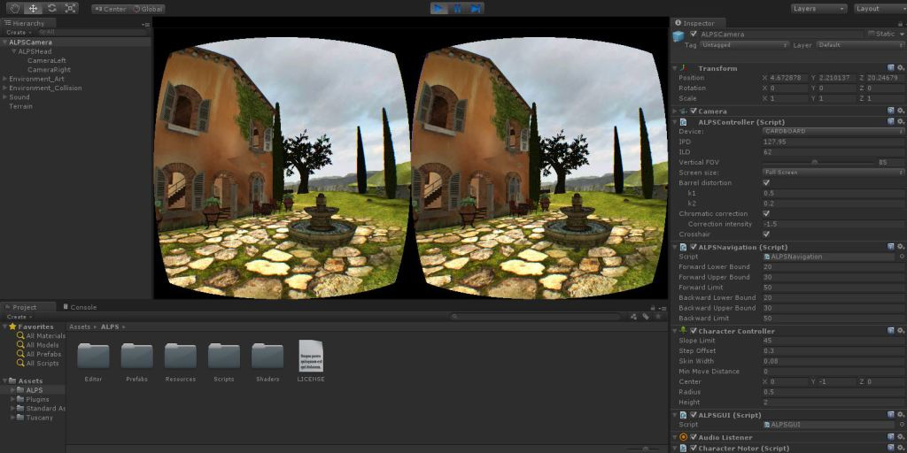

# Vision

## Stereoscopic vision

VR creates the illusion of depth by mimicking how **human eyes work**.

Each eye sees a slightly different image. The brain combines them to perceive **depth**.

<figure><figcaption></figcaption></figure>


In VR, we use **two cameras** separated by a distance called **IPD** (Interpupillary Distance).


## The role of lenses

A screen held close to the eyes would show a **tiny portion** of the image.

<figure><figcaption></figcaption></figure>

**Curved lenses** bend light to expand the **Field of View (FOV)**.

| Without Lenses                     | With Lenses              |
| ---------------------------------- | ------------------------ |
| Small FOV                          | Large FOV                |
| Most of the screen is "dead space" | Screen fills your vision |

## Lens distortion correction

Lenses expand FOV, but they also **distort the image**.

To compensate, VR applies **barrel distortion** to the rendered image, so it looks correct _after_ passing through the lenses.

<figure><figcaption></figcaption></figure>

## Stereoscopic rendering in Unity

Unity handles all of this automatically when using their own XR framework.

<figure><figcaption></figcaption></figure>


In older versions of Unity, IPD was simulated using 2 cameras slightly separated.

