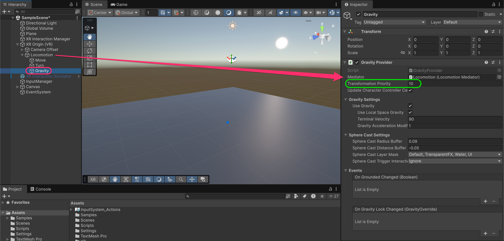
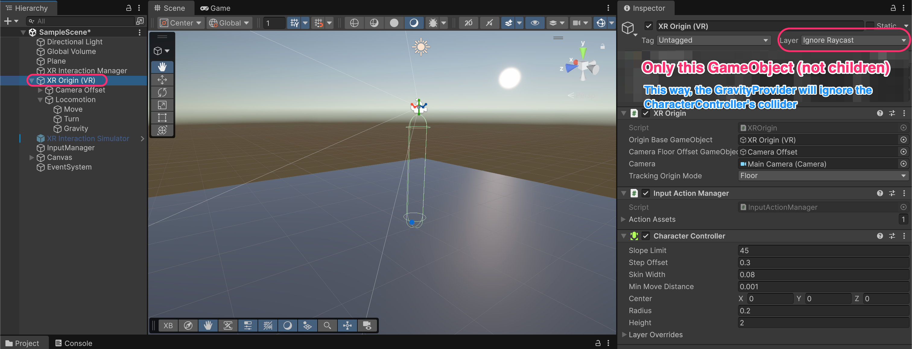
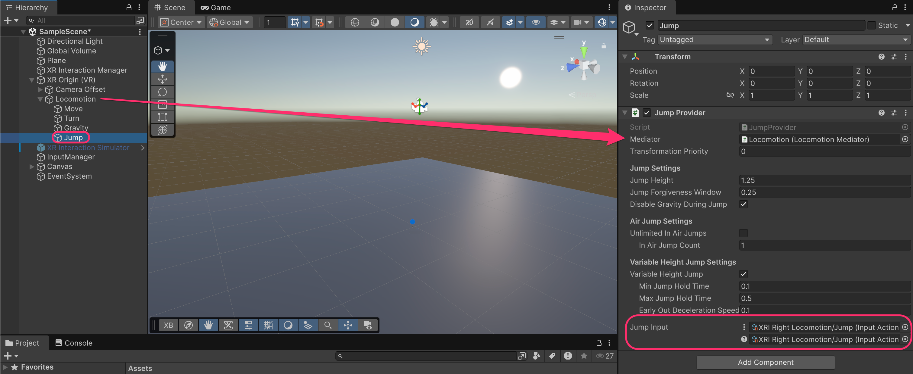
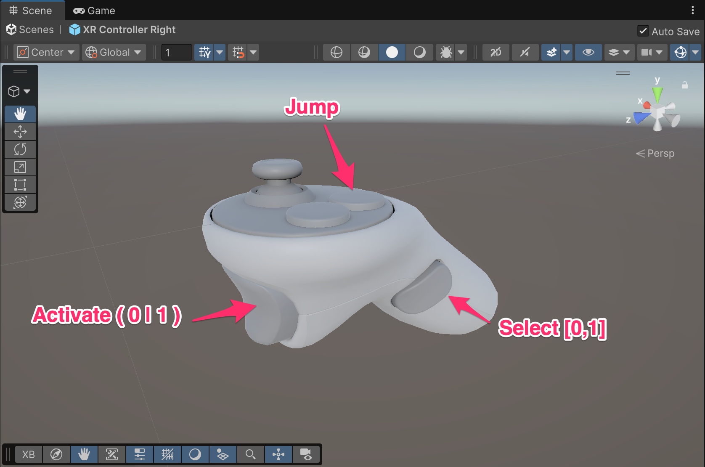
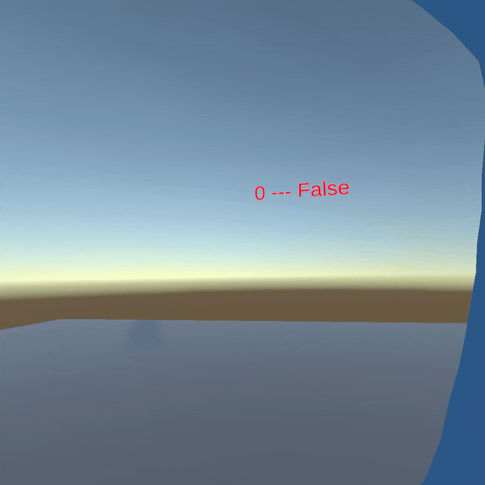

# Jumping

Jumping requires two additional providers: a **`GravityProvider`** to pull the player back down, and a **`JumpProvider`** to launch the player upward.

## Add Gravity Provider

Create a child GameObject under **Locomotion** called **Gravity**. Add a **Gravity Provider** component.

Configure it:

* **Mediator**: Reference the **Locomotion** GameObject
* **Transformation Priority**: Set to **10** (higher than other providers)

<figure><figcaption></figcaption></figure>


**Why Transformation Priority 10?**&#x20;

The priority determines which provider takes precedence when multiple providers want to transform the player.&#x20;

Gravity should have a higher priority than movement (default 0) so it's always applied because you don't want movement to cancel out falling.


<table><thead><tr><th width="265.68359375">Property</th><th>Description</th></tr></thead><tbody><tr><td><strong>Use Gravity</strong></td><td>Enable/disable gravity application</td></tr><tr><td><strong>Terminal Velocity</strong></td><td>Maximum falling speed (default: 90 m/s)</td></tr><tr><td><strong>Gravity Acceleration Modifier</strong></td><td>Multiplier for gravity strength</td></tr><tr><td><strong>Sphere Cast Layer Mask</strong></td><td>Which layers count as "ground" for grounded detection</td></tr></tbody></table>


**What does the `GravityProvider` do?**&#x20;

It continuously applies downward force to the XR Origin when the player is not grounded. It also provides a **grounded check** using sphere casts, which the `JumpProvider` uses to know if jumping is allowed.


***

## Configure Layer to avoid self-collision

The `GravityProvider` uses sphere casts to detect the ground. By default, it might detect the **`CharacterController's` own collider**, thinking the player is always grounded.

To fix this, set the **XR Origin (VR)** GameObject's **Layer** to **Ignore Raycast**.

<figure><figcaption></figcaption></figure>


Only change the layer on the **XR Origin (VR)** GameObject itself, **not its children**.&#x20;

The cameras and hands should remain on their default layers for interactions to work properly.

By putting the XR Origin on this layer, the sphere cast passes through the `CharacterController` and detects the actual floor beneath the player.


***

## Add Jump Provider

Create a child GameObject under **Locomotion** called **Jump**. Add a **`JumpProvider`** component.

Configure it:

* **Mediator**: Reference the **Locomotion** GameObject
* **Jump Input**: `XRI Right Locomotion/Jump`

<figure><figcaption></figcaption></figure>

<table><thead><tr><th width="258.0234375">Property (Jump Settings)</th><th>Description</th></tr></thead><tbody><tr><td><strong>Jump Height</strong></td><td>How high the player jumps in meters (default: 1.25)</td></tr><tr><td><strong>Jump Forgiveness Window</strong></td><td>Time after leaving ground where jump still works (coyote time)</td></tr><tr><td><strong>Disable Gravity During Jump</strong></td><td>Prevents gravity from fighting the upward motion</td></tr></tbody></table>

<table><thead><tr><th width="255.0625">Property (Air Jump Settings)</th><th>Description</th></tr></thead><tbody><tr><td><strong>Unlimited In Air Jumps</strong></td><td>Allow infinite double-jumps</td></tr><tr><td><strong>In Air Jump Count</strong></td><td>Number of jumps allowed while airborne (if not unlimited)</td></tr></tbody></table>

<table><thead><tr><th width="321.36328125">Property (Variable Height Jump Settings)</th><th>Description</th></tr></thead><tbody><tr><td><strong>Variable Height Jump</strong></td><td>Holding the button longer jumps higher</td></tr><tr><td><strong>Min Jump Hold Time</strong></td><td>Minimum time for a short jump</td></tr><tr><td><strong>Max Jump Hold Time</strong></td><td>Time held for maximum jump height</td></tr><tr><td><strong>Early Out Deceleration Speed</strong></td><td>How quickly to stop rising when button released</td></tr></tbody></table>


**What is Jump Forgiveness Window (Coyote Time)?**&#x20;

This is a game-feel improvement where the player can still jump for a short time after walking off a ledge. It makes platforming feel more responsive and forgiving. Named after the cartoon coyote who runs off cliffs and doesn't fall until he looks down!


<figure><figcaption></figcaption></figure>

***

### Jump Button Location

The **Jump** action is bound to the **A button press**.

<figure><figcaption></figcaption></figure>

**Default XRI button mapping for locomotion:**

<table><thead><tr><th width="256.48828125">Button</th><th>Action</th></tr></thead><tbody><tr><td>Left Thumbstick</td><td>Move</td></tr><tr><td>Right Thumbstick</td><td>Turn</td></tr><tr><td>Right A Press</td><td>Jump</td></tr></tbody></table>

***

## Test Jumping

Run the project and press the A button on the right controller to jump.

<figure><figcaption></figcaption></figure>


**If jumping doesn't work, check:**

1. The **`GravityProvider`** has a higher **Transformation Priority** than other providers
2. The **XR Origin (VR)** layer is set to **Ignore Raycast**
3. The **Jump Input** action is assigned correctly
4. There's a floor with a collider for the player to stand on


***

## Updated hierarchy

After adding Jump, your Locomotion hierarchy should look like this:

```
XR Origin (VR)                    [Layer: Ignore Raycast]
├── Camera Offset
│   ├── Main Camera
│   ├── Left Hand
│   └── Right Hand
└── Locomotion                    [XR Body Transformer, Locomotion Mediator]
    ├── Move                      [Continuous Move Provider]
    ├── Turn                      [Continuous Turn Provider, Snap Turn Provider]
    ├── Gravity                   [Gravity Provider - Priority 10]
    └── Jump                      [Jump Provider]
```
