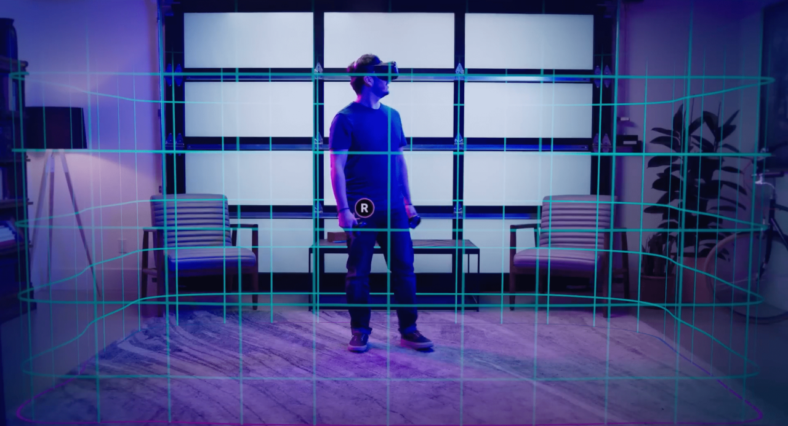
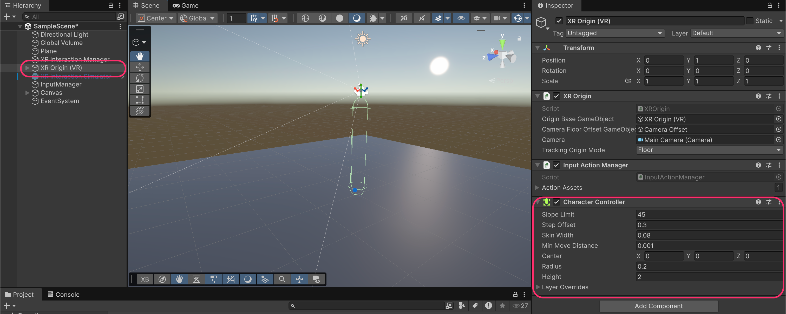
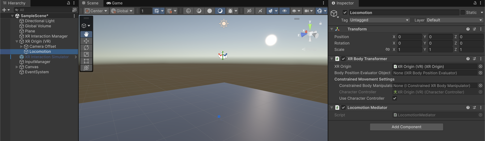
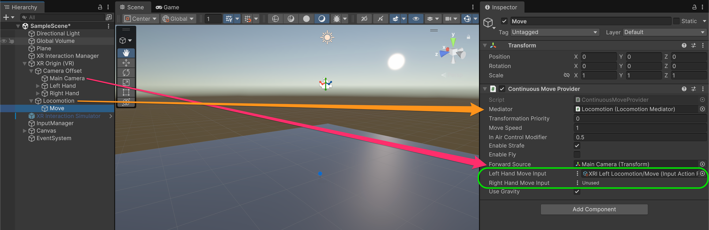
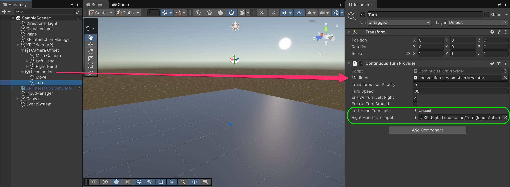
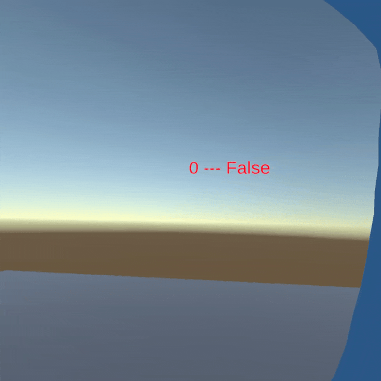
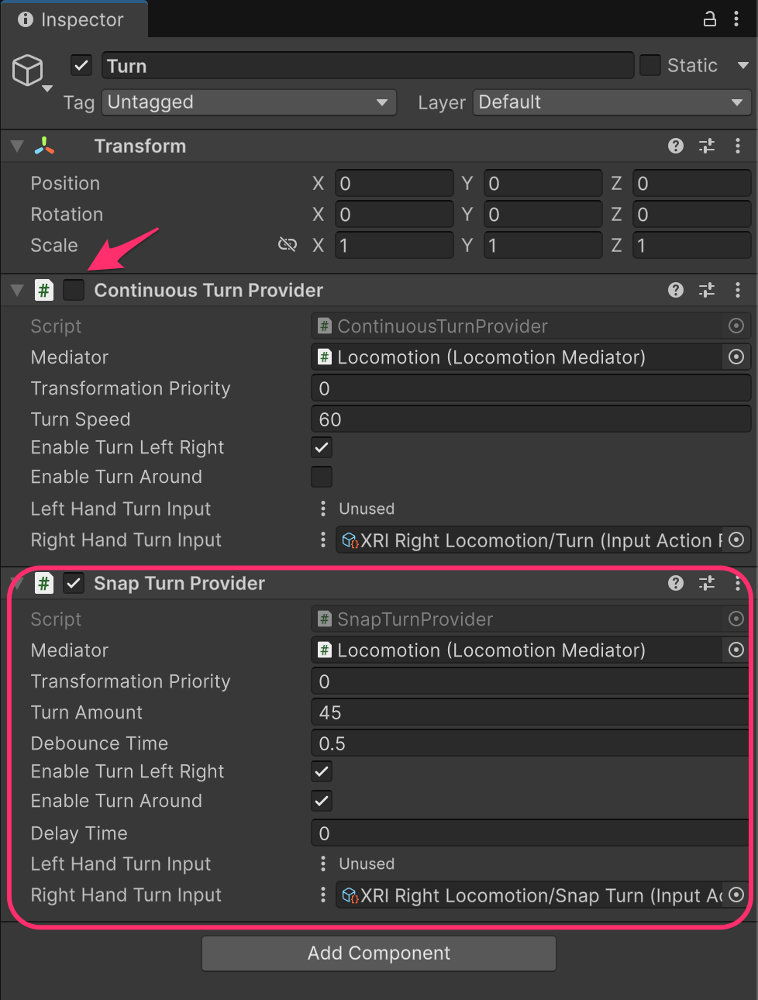
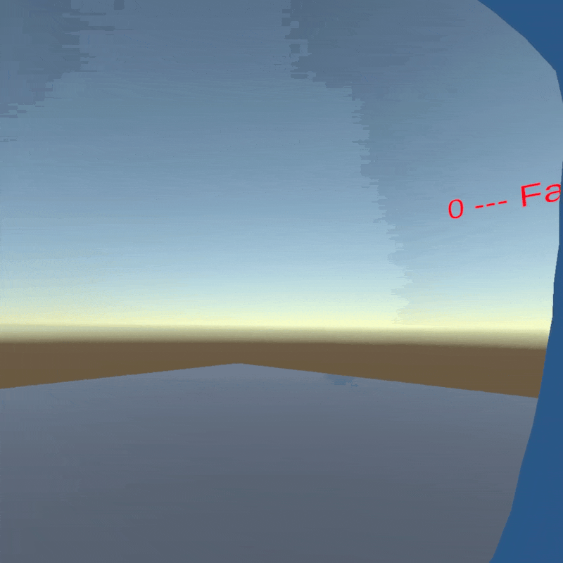

# Move and turn

<figure><figcaption></figcaption></figure>

## Moving and turning

### Add CharacterController

Select the **XR Origin (VR)** and add a **`CharacterController`** component.

<figure><figcaption></figcaption></figure>

<table><thead><tr><th width="179.80859375">Property</th><th width="198.98828125">Recommended Value</th><th>Description</th></tr></thead><tbody><tr><td><strong>Height</strong></td><td>1-2</td><td>Total height of the capsule collider</td></tr><tr><td><strong>Radius</strong></td><td>0.2</td><td>Width of the player's collision capsule</td></tr><tr><td><strong>Center</strong></td><td>(0, 0, 0)</td><td>Center of the capsule relative to the XR Origin</td></tr><tr><td><strong>Slope Limit</strong></td><td>45</td><td>Maximum angle of slopes the player can walk up</td></tr><tr><td><strong>Step Offset</strong></td><td>0.3</td><td>Maximum step height the player can climb</td></tr></tbody></table>


**Why `CharacterController` instead of `Rigidbody`?**&#x20;

`CharacterController` is designed for player movement, because it handles slopes, steps, and collisions without the unpredictable physics behavior of a `Rigidbody`.&#x20;

You don't want your player bouncing off walls or being pushed by objects.


### Create Locomotion GameObject

Create an empty GameObject as a child of **XR Origin (VR)** called **Locomotion**. Add these components:

* **`XRBodyTransformer`**
* **`LocomotionMediator`**

<figure><figcaption></figcaption></figure>

**XR Body Transformer settings:**

* **XR Origin**: Should auto-reference the parent XR Origin
* **Character Controller**: Reference the Character Controller you added in before
* **Use Character Controller**: Enabled to ensure movement respects collisions

<table><thead><tr><th width="255.4609375">Component</th><th>Purpose</th></tr></thead><tbody><tr><td><a href="https://docs.unity3d.com/Packages/com.unity.xr.interaction.toolkit@3.3/manual/xr-body-transformer.html"><strong><code>XRBodyTransformer</code></strong></a></td><td>Applies transformations to the XR Origin based on provider requests. References the <code>CharacterController</code> for physics.</td></tr><tr><td><a href="https://docs.unity3d.com/Packages/com.unity.xr.interaction.toolkit@3.3/manual/locomotion-mediator.html"><strong><code>LocomotionMediator</code></strong></a></td><td>Queues and coordinates transformation requests from multiple providers. Prevents conflicts between move, turn, and teleport.</td></tr></tbody></table>

### Add Move Provider

Create a child GameObject under **Locomotion** called **Move**. Add a **`ContinuousMoveProvider`** component and configure it:

* **Mediator**: Reference the **Locomotion** GameObject (with Locomotion Mediator)
* **Forward Source**: Main Camera, so that movement direction is based on where you're looking
* **Left Hand Move Input**: `XRI Left Locomotion/Move`
* **Right Hand Move Input**: Leave as "Unused" (or configure for your preference)

<figure><figcaption></figcaption></figure>



<table><thead><tr><th width="209.80078125">Property</th><th>Description</th></tr></thead><tbody><tr><td><strong>Move Speed</strong></td><td>Movement speed in meters per second (default: 1)</td></tr><tr><td><strong>Enable Strafe</strong></td><td>Allow sideways movement with thumbstick left/right</td></tr><tr><td><strong>Enable Fly</strong></td><td>Allow vertical movement (useful for development/debugging)</td></tr><tr><td><strong>Forward Source</strong></td><td>Transform that defines "forward" direction, usually the camera</td></tr><tr><td><strong>Use Gravity</strong></td><td>Apply gravity when not grounded</td></tr></tbody></table>

### Add Turn Provider

Create another child GameObject under **Locomotion** called **Turn**. Add a **`ContinuousTurnProvider`** component.

<figure><figcaption></figcaption></figure>



Configure it:

* **Mediator**: Reference the **Locomotion** GameObject
* **Left Hand Turn Input**: Leave as "Unused"
* **Right Hand Turn Input**: `XRI Right Locomotion/Turn`

<table><thead><tr><th width="209.73828125">Property</th><th>Description</th></tr></thead><tbody><tr><td><strong>Turn Speed</strong></td><td>Rotation speed in degrees per second (default: 60)</td></tr><tr><td><strong>Enable Turn Left Right</strong></td><td>Allow rotation with thumbstick left/right</td></tr><tr><td><strong>Enable Turn Around</strong></td><td>Allow 180° turn (usually with thumbstick down)</td></tr></tbody></table>

### Test Move and Turn

Run the project and use the thumbsticks to move and turn.

<figure><figcaption></figcaption></figure>

***

## Continuous Turn vs Snap Turn

**Continuous Turn** rotates smoothly based on thumbstick input, but it can cause **motion sickness** in some users because the visual rotation doesn't match physical head movement.

**Snap Turn** is an alternative that rotates instantly by a fixed amount (e.g., 45°), which many users find more comfortable.

### Adding Snap Turn

On the **Turn** GameObject, add a **`SnapTurnProvider`** component alongside (or instead of) the Continuous Turn Provider.



Configure it:

* **Mediator**: Reference the **Locomotion** GameObject
* **Turn Amount**: 45 (degrees per snap)
* **Debounce Time**: 0.5 (seconds before another snap can occur)
* **Right Hand Turn Input**: `XRI Right Locomotion/Snap Turn`

<figure><figcaption></figcaption></figure>

<table><thead><tr><th width="218.35546875">Property</th><th>Description</th></tr></thead><tbody><tr><td><strong>Turn Amount</strong></td><td>Degrees to rotate per snap (common values: 30, 45, 90)</td></tr><tr><td><strong>Debounce Time</strong></td><td>Cooldown between snaps to prevent multiple triggers</td></tr><tr><td><strong>Enable Turn Around</strong></td><td>Allow 180° instant turn (thumbstick down)</td></tr><tr><td><strong>Delay Time</strong></td><td>Optional delay before the snap occurs (can add a brief fade)</td></tr></tbody></table>

### Test Snap Turn

Run the project and push the right thumbstick left or right to snap turn.

<figure><figcaption></figcaption></figure>

***

## Hierarchy so far

After setting up Move and Turn, your hierarchy should look like this:

```
XR Origin (VR)
├── Camera Offset
│   ├── Main Camera
│   ├── Left Hand
│   └── Right Hand
└── Locomotion                    [XR Body Transformer, Locomotion Mediator]
    ├── Move                      [Continuous Move Provider]
    └── Turn                      [Continuous Turn Provider, Snap Turn Provider]
```

***

## Documentation

* [XRI Locomotion Documentation](https://docs.unity3d.com/Packages/com.unity.xr.interaction.toolkit@3.3/manual/locomotion.html)
* [Continuous Move Provider API](https://docs.unity3d.com/Packages/com.unity.xr.interaction.toolkit@3.3/api/UnityEngine.XR.Interaction.Toolkit.Locomotion.Movement.ContinuousMoveProvider.html)
* [Snap Turn Provider API](https://docs.unity3d.com/Packages/com.unity.xr.interaction.toolkit@3.3/api/UnityEngine.XR.Interaction.Toolkit.Locomotion.Turning.SnapTurnProvider.html)
* [VR Comfort Best Practices](https://developer.oculus.com/resources/bp-locomotion/)
