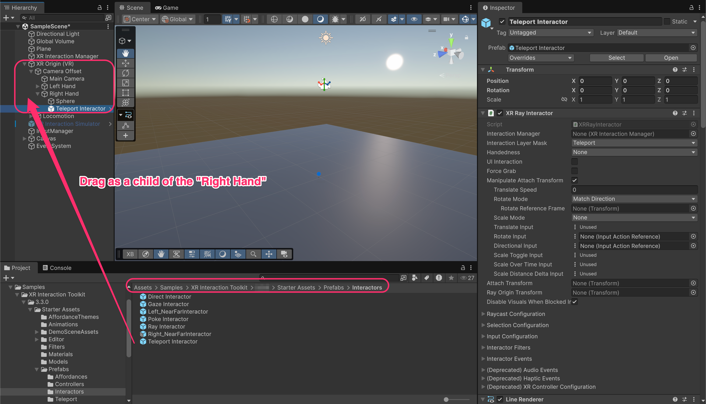
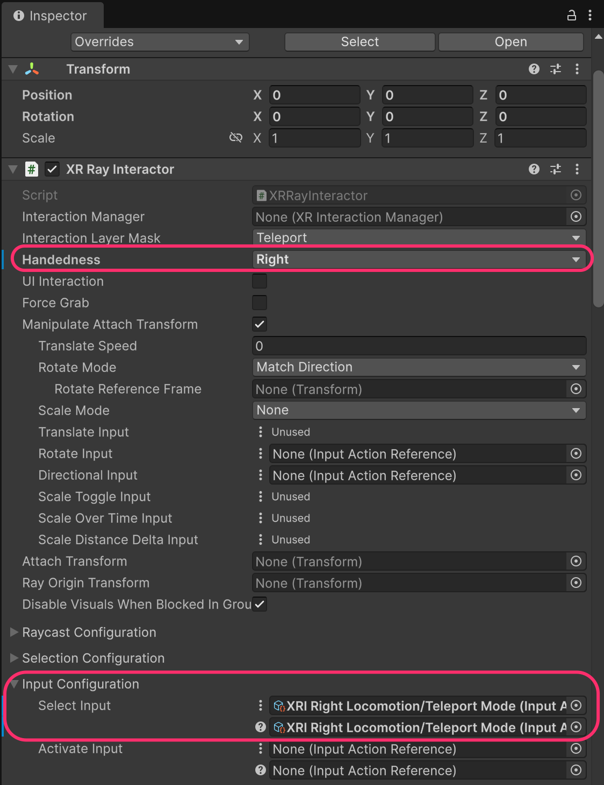
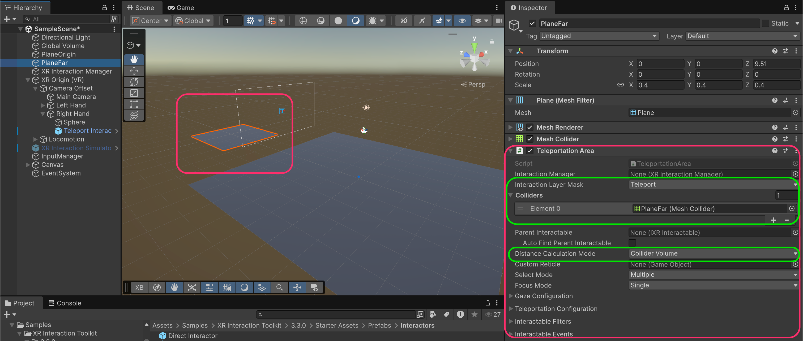
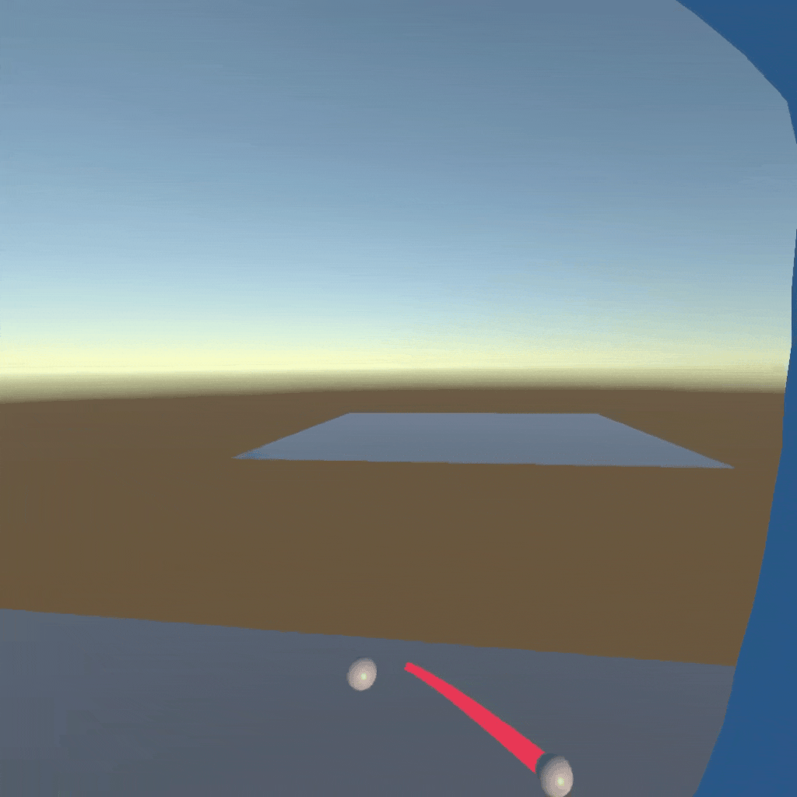
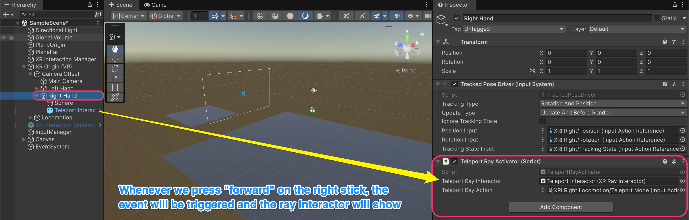
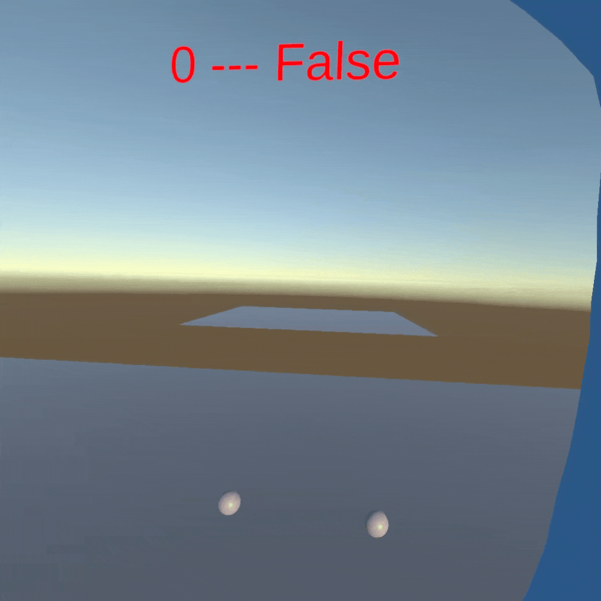

# Teleportation

<figure><figcaption></figcaption></figure>

Teleportation is a **comfort-friendly** locomotion method that instantly moves the player to a new location, avoiding the motion sickness that continuous movement can cause.

The teleportation system requires three parts:

1. **`TeleportationProvider`**: Handles the actual player movement
2. **`TeleportInteractor`**: The ray that aims at teleport destinations
3. **`TeleportationArea`**: Surfaces or points where the player can teleport

***

## Add Teleportation Provider

Create a child GameObject under **Locomotion** called **Teleportation**. Add a **`TeleportationProvider`** component and configure it:

<figure><figcaption></figcaption></figure>

* **Mediator**: Reference the **Locomotion** GameObject

<table><thead><tr><th width="265.53125">Property</th><th>Description</th></tr></thead><tbody><tr><td><strong>Delay Time</strong></td><td>Time to wait before teleporting (useful for fade transitions)</td></tr><tr><td><strong>Transformation Priority</strong></td><td>Priority relative to other providers (default: 0)</td></tr></tbody></table>


**How does teleportation work?**&#x20;

Unlike other locomotion providers that continuously transform the player, the `TeleportationProvider` waits for a teleport request from a `TeleportInteractor`.&#x20;

When the interactor selects a **valid teleport destination**, it sends the request to the provider, which then moves the XR Origin instantly.




***

## Add Teleport Interactor

The Starter Assets include a pre-configured **Teleport Interactor** prefab. Drag it as a **child of the hand** you want to use for teleportation.

Location: `Assets/Samples/XR Interaction Toolkit/[version]/Starter Assets/Prefabs/Interactors/`&#x20;

<figure><figcaption></figcaption></figure>


**Why as a child of the hand?**&#x20;

The **Teleport Interactor** is an **`XRRayInteractor`**, that is, it casts a ray from its position.&#x20;

By making it a child of the hand, the ray originates from the controller and points where you're aiming.


**Other Interactor prefabs** in Starter Asset&#x73;**:**

<table><thead><tr><th width="233.6328125">Prefab</th><th>Purpose</th></tr></thead><tbody><tr><td><strong>Teleport Interactor</strong></td><td>Ray for teleportation only</td></tr><tr><td><strong>Ray Interactor</strong></td><td>General-purpose ray for UI and distant interactions</td></tr><tr><td><strong>Direct Interactor</strong></td><td>For grabbing objects within reach</td></tr><tr><td><strong>Poke Interactor</strong></td><td>For poking/pressing UI and objects</td></tr></tbody></table>

***

## Configure the Teleport Interactor

Select the **Teleport Interactor** and configure:

* **Handedness**: Set to **Right** (or Left, depending on which hand it's attached to)
* **Interaction Layer Mask**: Should be **Teleport** (to only interact with teleport surfaces)
* **Select Input**: `XRI Right Locomotion/Teleport Mode`&#x20;

<figure><figcaption></figcaption></figure>


**What is Interaction Layer Mask?**&#x20;

XRI uses a separate layer system from Unity's physics layers.&#x20;

The **Teleport** interaction layer ensures this ray only interacts with teleportation surfaces, not grabbable objects or UI. This prevents accidentally selecting objects when trying to teleport.


***

## Create a Teleportation Area

To allow teleportation to a surface, add a **`TeleportationArea`** component to any GameObject with a collider.



Create a new Plane in your scene (or use an existing floor), then add the **`TeleportationArea`** component:

* **Interaction Layer Mask**: Set to **Teleport**
* **Colliders**: Assign the plane's collider
* **Distance Calculation Mode**: **Collider Volume**

<figure><figcaption></figcaption></figure>

**Teleportation Area vs Teleportation Anchor:**

<table><thead><tr><th width="278.63671875">Component</th><th>Behavior</th></tr></thead><tbody><tr><td><strong><code>TeleportationArea</code></strong></td><td>Teleport anywhere on the surface.</td></tr><tr><td><strong><code>TeleportationAnchor</code></strong></td><td>Teleport to a specific point.</td></tr></tbody></table>


**Distance Calculation Mode**:&#x20;

Determines how the interactor calculates distance to this interactable:

* **Collider Volume**: Uses the collider's shape (most accurate for floors)
* **Collider Position**: Uses the collider's center point
* **Transform Position**: Uses the GameObject's transform



**Important:** Both the `TeleportInteractor` and `TeleportationArea` must have matching **Interaction Layer Masks** (both set to "Teleport").&#x20;

If they don't match, the ray won't detect the surface.


***

## Test Basic Teleportation

Run the project. **Push the thumbstick** **forward** to activate the teleport ray, **aim at the teleportation** area, and **release** to teleport.

<figure><figcaption></figcaption></figure>

### Show Ray Only When Needed (Optional)

By default, the teleport ray might always be visible or conflict with other interactions. A common UX pattern is to **only show the teleport ray when the player activates teleport mode**.

Create a script called `TeleportRayActivator`:

```csharp
using UnityEngine;
using UnityEngine.InputSystem;
using UnityEngine.XR.Interaction.Toolkit.Interactors;

public class TeleportRayActivator : MonoBehaviour
{
    /// <summary>
    /// Reference to the XR Ray Interactor used for teleportation.
    /// This is enabled/disabled dynamically at runtime.
    /// </summary>
    [SerializeField]
    private XRRayInteractor teleportRayInteractor;
    
    /// <summary>
    /// Input action that triggers teleport mode.
    /// Mapped to pressing "FORWARD" on a button.
    /// </summary>
    [SerializeField]
    private InputActionProperty teleportRayAction;

    private void OnEnable()
    {
        // Subscribe to the input action's "performed" event.
        // This event is triggered when the input action is activated (e.g., button pressed).
        teleportRayAction.action.performed += OnTeleportActionPerformed;
    }

    private void OnDisable()
    {
        // Unsubscribe from the input action event to prevent memory leaks or duplicate event calls.
        teleportRayAction.action.performed -= OnTeleportActionPerformed;
    }

    private void Start()
    {
        // This prevents the ray from being visible or usable by default.
        teleportRayInteractor.gameObject.SetActive(false);
    }

    private void Update()
    {
        // Check if the input action was released during this frame.
        // When the user releases the teleport input, we disable the ray.
        if (teleportRayAction.action.WasReleasedThisFrame())
        {
            teleportRayInteractor.gameObject.SetActive(false);
        }
    }
    
    private void OnTeleportActionPerformed(InputAction.CallbackContext obj)
    {
        // Enable the teleport ray so the user can aim and select a teleport destination.
        teleportRayInteractor.gameObject.SetActive(true);
    }
}
```

**How this script works:**

1. On **`Start`**, the teleport ray is disabled (hidden)
2. When the player pushes the thumbstick forward (**`performed`** event), the ray is enabled
3. When the player releases the thumbstick (**`WasReleasedThisFrame`**), the ray is disabled again

#### Configure the Teleport Ray Activator

Add the `TeleportRayActivator` script to the **Right Hand** GameObject and configure it:

* **Teleport Ray Interactor**: Reference the **Teleport Interactor** child object
* **Teleport Ray Action**: `XRI Right Locomotion/Teleport Mode`&#x20;

<figure><figcaption></figcaption></figure>

Run the project. The teleport ray should now only appear when you push the thumbstick forward.

<figure><figcaption></figcaption></figure>

***

## Updated hierarchy

After completing all locomotion setup, your hierarchy should look like this:

```
XR Origin (VR)                    [Layer: Ignore Raycast, Character Controller]
├── Camera Offset
│   ├── Main Camera
│   ├── Left Hand                 [Tracked Pose Driver]
│   │   └── Sphere
│   └── Right Hand                [Tracked Pose Driver, TeleportRayActivator]
│       ├── Sphere
│       └── Teleport Interactor   [XR Ray Interactor]
└── Locomotion                    [XR Body Transformer, Locomotion Mediator]
    ├── Move                      [Continuous Move Provider]
    ├── Turn                      [Continuous Turn Provider, Snap Turn Provider]
    ├── Gravity                   [Gravity Provider - Priority 10]
    ├── Jump                      [Jump Provider]
    └── Teleportation             [Teleportation Provider]
```

***

## Documentation

* [XRI Teleportation Documentation](https://docs.unity3d.com/Packages/com.unity.xr.interaction.toolkit@3.0/manual/teleportation.html)
* [VR Locomotion Design Guidelines](https://developer.oculus.com/resources/bp-locomotion/)
