# Project setup

### Create a new project

Open **Unity Hub** and create a new project using:

* **Editor version**: Unity 6 (6000.3.0f1 or later)
* **Template**: Universal 3D (URP)

<figure>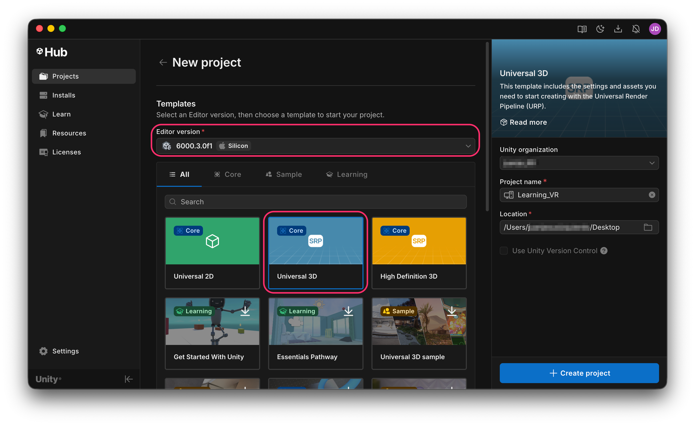<figcaption></figcaption></figure>

> 💡 **Why URP?** The Universal Render Pipeline offers better performance on standalone VR headsets like Meta Quest 3.

***

### Install XR Plugin Management

Navigate to **Edit → Project Settings... → XR Plug-in Management** and click **Install XR Plugin Management**.

<figure>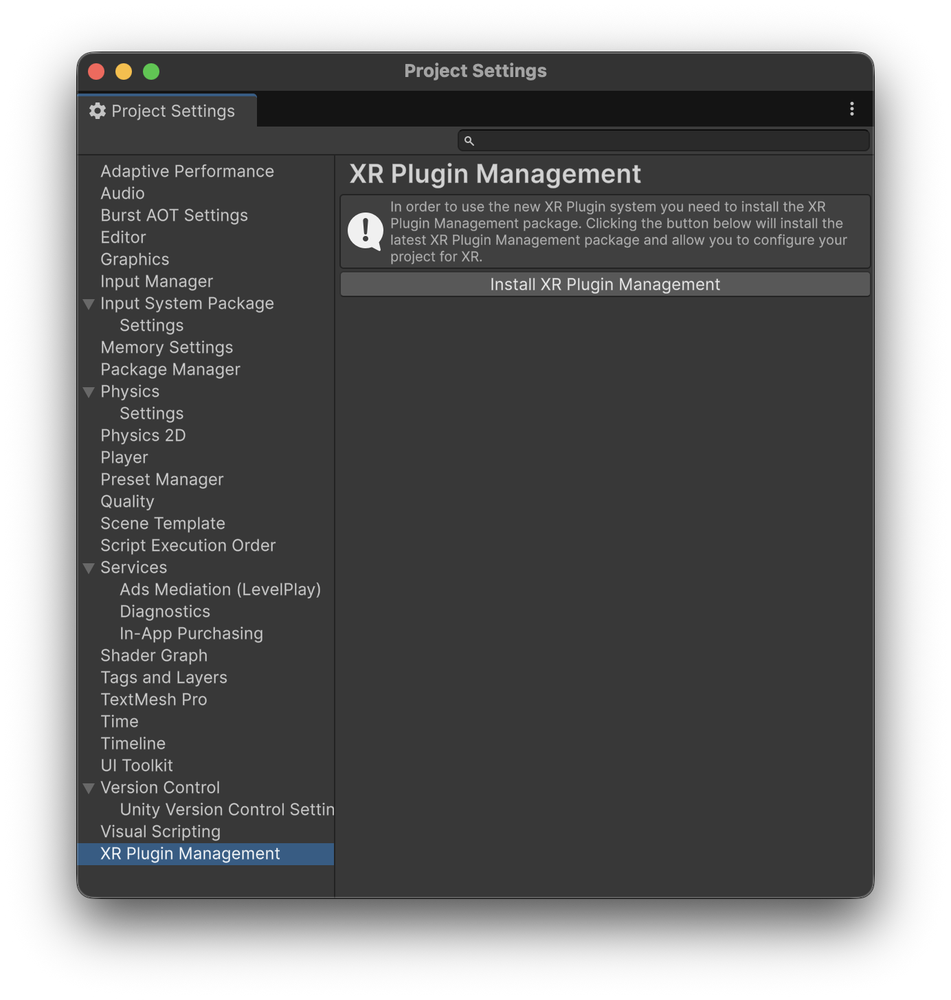<figcaption></figcaption></figure>

***

### Enable OpenXR

In **XR Plug-in Management**, check **OpenXR** as your plug-in provider.

<figure>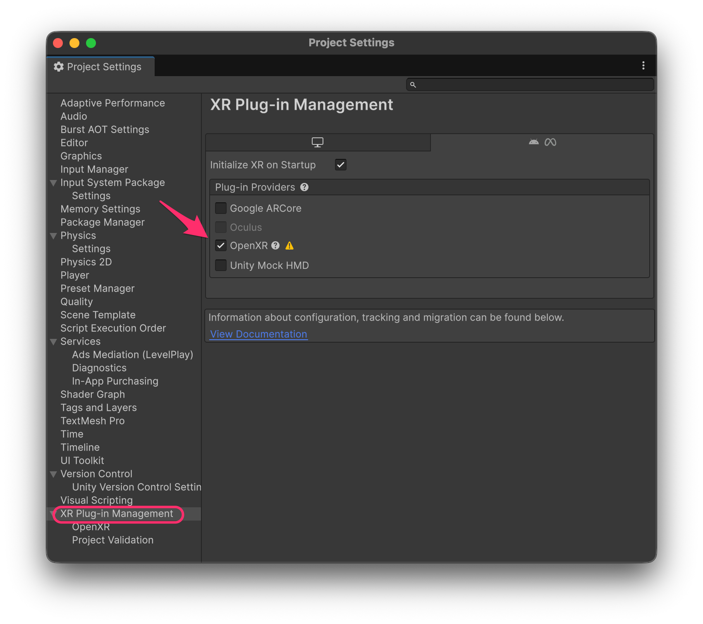<figcaption></figcaption></figure>


**Why OpenXR instead of Oculus?**&#x20;

OpenXR is an open standard supported by Meta, Valve, Microsoft, and others.&#x20;

This means your project can target multiple headsets (Quest, Vive, Index, WMR) with minimal changes.


***

### Configure Interaction Profiles

Select the **Android tab** in XR Plug-in Management, then go to **OpenXR** settings:

1. Add the **Interaction Profiles** for your target controllers (Oculus Touch, Meta Quest Touch Pro, Hand Interaction, etc.) or just select them all
2. Enable **Meta Quest Support** under _OpenXR Feature Groups_

<figure>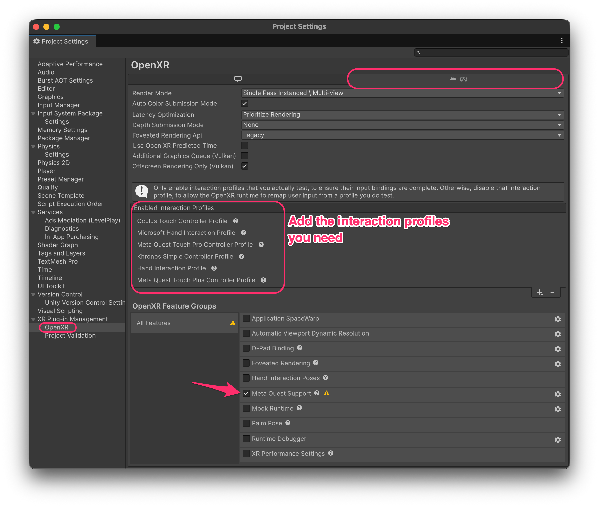<figcaption></figcaption></figure>


**What are Interaction Profiles?**

They define how physical controller buttons and inputs map to your application. Each controller type (Oculus Touch, Valve Index, HP Reverb) has a different profile. By adding multiple profiles, your app can work with different controllers automatically.


***

### Fix Project Validation issues

Go to **Project Validation** under XR Plug-in Management and click **Fix All** to resolve any configuration issues.

<figure>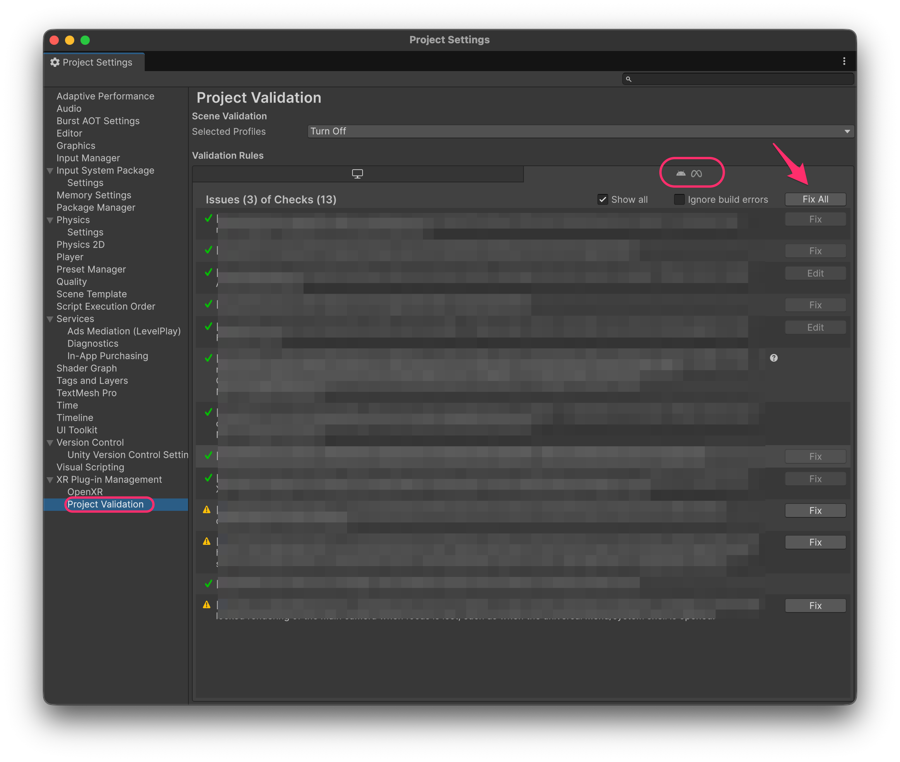<figcaption></figcaption></figure>


**What does Project Validation check?**&#x20;

It verifies settings like graphics API (Vulkan vs OpenGL), texture compression format, minimum Android API level, and other platform-specific requirements.&#x20;

Fixing these early prevents build failures and runtime issues later.


***

### Basic camera tracking (manual approach)

For a minimal VR setup, add a **`TrackedPoseDriver`** component to the **Main Camera**:

* **Device**: Generic XR Device
* **Pose Source**: Center Eye - HMD Reference
* **Tracking Type**: Rotation And Position


**Why show this manual approach?**&#x20;

Understanding what Tracked Pose Driver does helps you debug issues and customize behavior later. The XR Origin prefab we'll use next includes this automatically, but it's valuable to know what's happening under the hood.


<figure>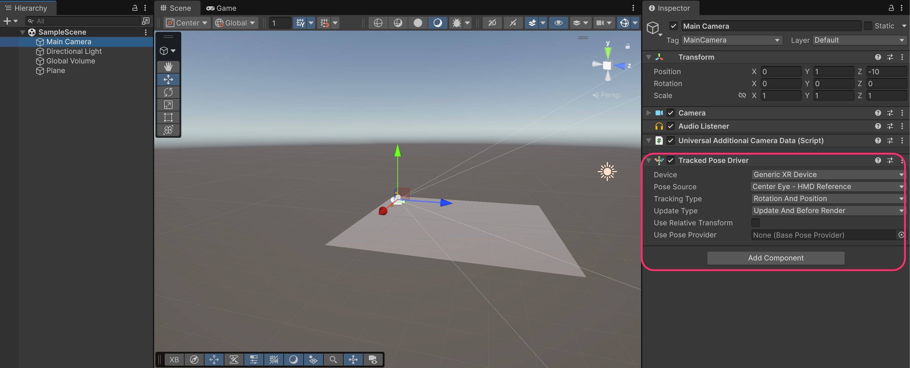<figcaption></figcaption></figure>


**What is a `TrackedPoseDriver` ?**&#x20;

It's a component that takes tracking data from an XR device (headset, controller, hand) and applies it to a GameObject's transform. The "pose" includes both position and rotation in 3D space.




***

### Install XR Interaction Toolkit

Open **Window → Package Manager**, select **Unity Registry**, and install **XR Interaction Toolkit**.

<figure>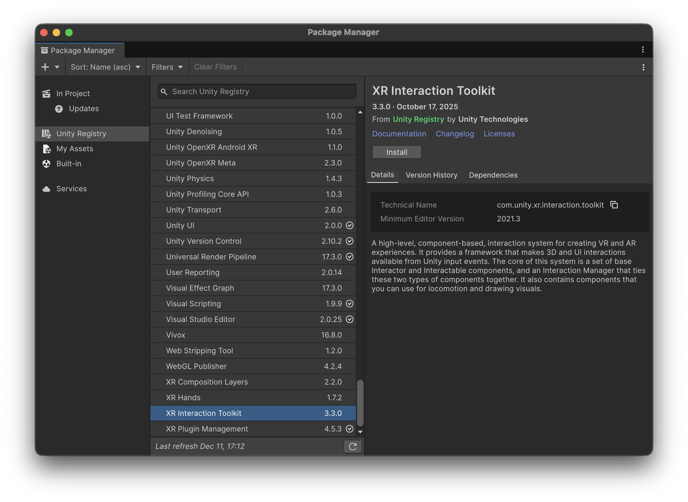<figcaption></figcaption></figure>


**What is the XR Interaction Toolkit?**&#x20;

It's Unity's official high-level framework for building VR and AR interactions. It provides a component-based architecture with three main concepts:&#x20;

* **Interactors**: Objects that can perform interactions (hands, controllers, ray pointers)&#x20;
* **Interactables**: Objects that can receive interactions (grabbable objects, buttons, levers, doors)
* **Interaction Manager**: The mediator that connects interactors with interactables




***

### Import Starter Assets

After installation, go to the **Samples** tab and import **Starter Assets**.

<figure>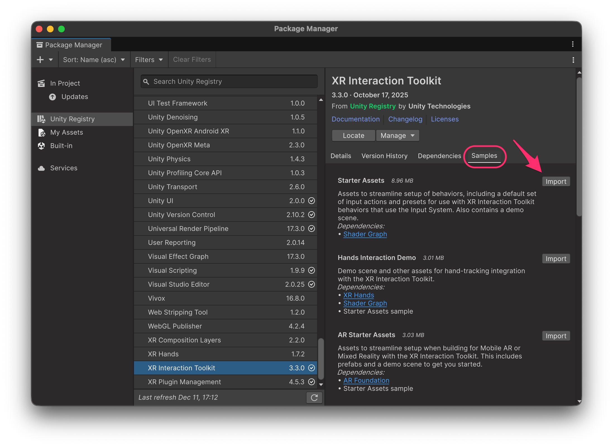<figcaption></figcaption></figure>


**What are Starter Assets?** They include:

* **Input Action Maps**: Pre-configured mappings from controller buttons to game actions (grab, teleport, activate, UI click)
* **Presets**: Default configurations for common components
* **Demo Scenes**: A working example for reference


***

### Switch build platform to Meta Quest

Open **File → Build Profiles**, select **Meta Quest**, and click **Switch Platform**.

<figure>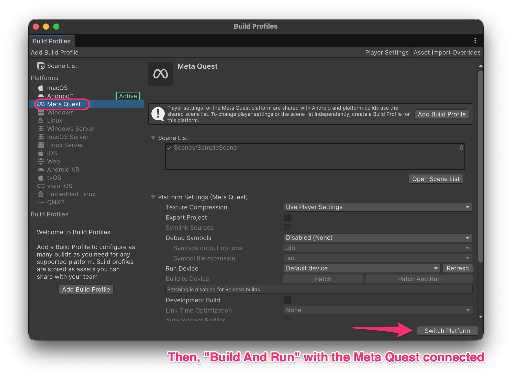<figcaption></figcaption></figure>


**USB Debugging**

Make sure your Quest has Developer Mode enabled and USB debugging authorized. The first time you connect, the headset may ask you to trust the computer.


***

### Add XR Origin

<mark style="background-color:$warning;">Delete</mark> the default **Main Camera** and add an **XR Origin (VR)**:

<figure>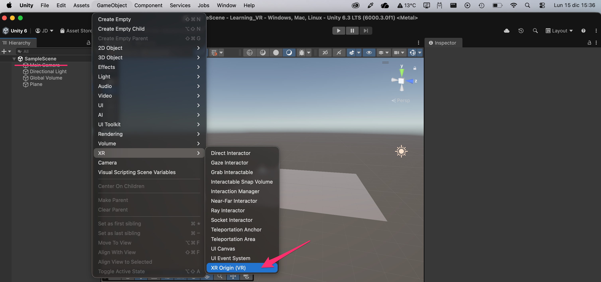<figcaption></figcaption></figure>


**What is XR Origin?**&#x20;

It's the "player rig" for VR, a hierarchy that represents the user's position in the virtual world that contains:

* **`XROrigin`**: The root transform that defines where Y=0 is (floor level)
* _**CameraOffset**_: A parent for the camera that handles height offsets
* _**MainCamera**_: The actual VR camera with `TrackedPoseDriver` already configured

When the user physically moves in their play space, the camera moves within this hierarchy. When you teleport the player, you move the XR Origin root.


***

### Configure Tracking Origin Mode

Select the **XR Origin** and set **Tracking Origin Mode** to **Floor**.

<figure>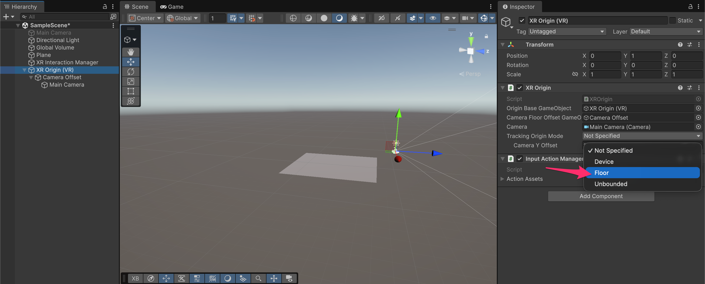<figcaption></figcaption></figure>

| Mode              | Y=0 Position                         | User Height | Use Case                            |
| ----------------- | ------------------------------------ | ----------- | ----------------------------------- |
| **Floor**         | Physical floor (from guardian setup) | Real height | Room-scale VR, standing experiences |
| **Device**        | Headset position at startup          | Always \~0  | Seated experiences, simulators      |
| **Not Specified** | Runtime decides                      | Varies      | Let the platform choose             |


For Meta Quest with guardian/boundary configured, **Floor** mode uses the floor level you set during guardian setup. This means a 1.8m tall user will have their camera at Y=1.8, and a 1.6m user at Y=1.6.


***

### Create hand tracking objects

Under **XR Origin → Camera Offset**, create two empty GameObjects:

* **Left Hand**
* **Right Hand**

Add a **`TrackedPoseDriver (Input System)`** component to each.

<figure>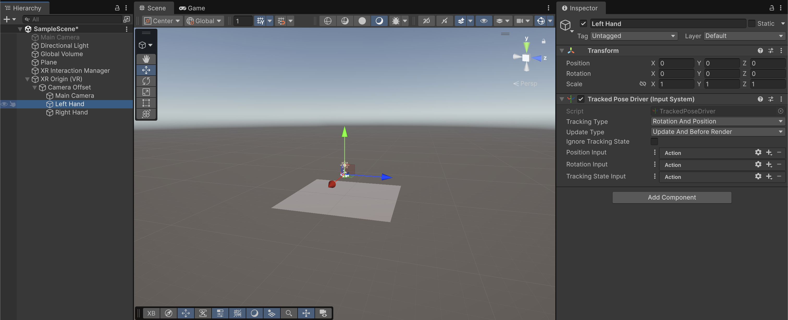<figcaption></figcaption></figure>

***

### Configure left hand input

In the **`TrackedPoseDriver`** on **Left Hand**, assign the _XRI Left_ input actions:

<figure>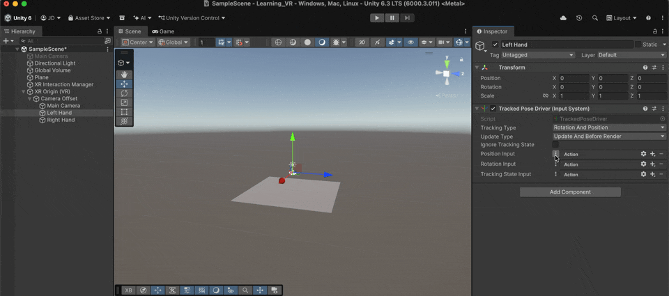<figcaption></figcaption></figure>

Final configuration for Left Hand:

* **Position Input**: _XRI Left/Position_
* **Rotation Input**: _XRI Left/Rotation_
* **Tracking State Input**: _XRI Left/Tracking State_

<figure>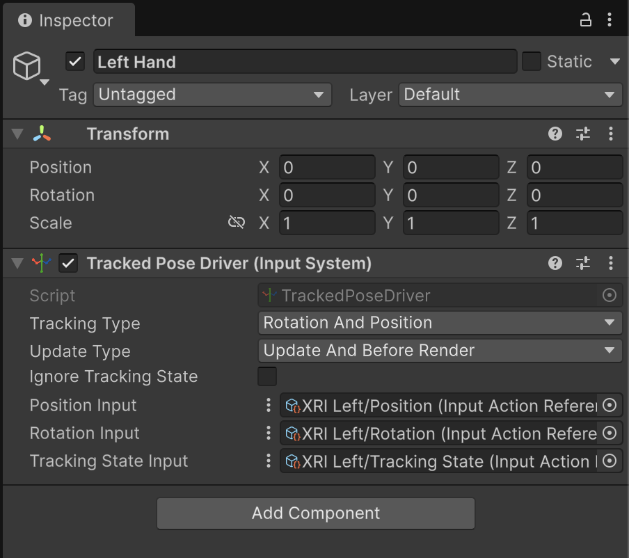<figcaption></figcaption></figure>

<table><thead><tr><th width="213">Input</th><th width="172.07421875">Data Type</th><th>Description</th></tr></thead><tbody><tr><td><strong>XRI Left/Position</strong></td><td><code>Vector3</code></td><td>The 3D position of the left controller in tracking space (X, Y, Z coordinates in meters relative to the play area origin)</td></tr><tr><td><strong>XRI Left/Rotation</strong></td><td><code>Quaternion</code></td><td>The orientation of the left controller as a quaternion (which way the controller is pointing and how it's tilted)</td></tr><tr><td><strong>XRI Left/Tracking State</strong></td><td><code>Integer</code> (flags)</td><td>Bitmask indicating tracking quality: whether position and/or rotation are currently valid</td></tr></tbody></table>


**Why use Input Actions instead of direct device access?**&#x20;

The Input System's action-based approach provides abstraction. The action "XRI Left/Position" could come from an Oculus Touch controller, a Valve Index controller, or even a hand tracking system, so that your code doesn't need to know which device is providing the data. This makes your project portable across different hardware.


***

### Configure right hand input

Apply the same configuration to **Right Hand** using XRI Right actions:

* **Position Input**: _XRI Right/Position_
* **Rotation Input**: _XRI Right/Rotation_
* **Tracking State Input**: _XRI Right/Tracking State_

<figure>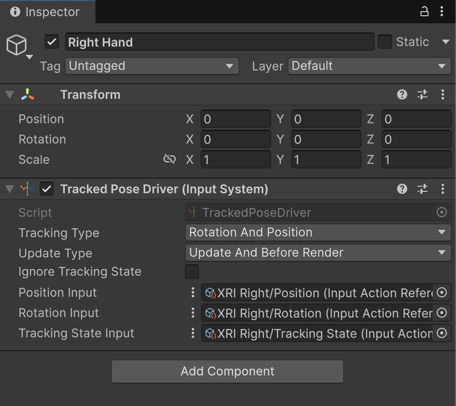<figcaption></figcaption></figure>


**Left vs Right actions**:&#x20;

The Input Action Asset defines separate action maps for left and right controllers. This separation is important because:

* Each controller has its own tracking data
* Button mappings might differ (e.g., menu button only on left controller)
* You might want different behaviors per hand (dominant hand for tools, off-hand for shields)


***

### Add visual representation for hands

Add a **Sphere** as a child of each hand to visualize controller positions:

1. Right-click on **Left Hand** → **3D Object → Sphere**
2. Scale it down (e.g., 0.03, 0.03, 0.03)
3. **Remove the `SphereCollider`** component
4. Repeat for **Right Hand**

<figure><figcaption></figcaption></figure>


Remove the collider to prevent unintended physics interactions.


***

### Install XR Interaction Simulator

To test without a VR headset, import the **XR Interaction Simulator** sample from Package Manager.

<figure>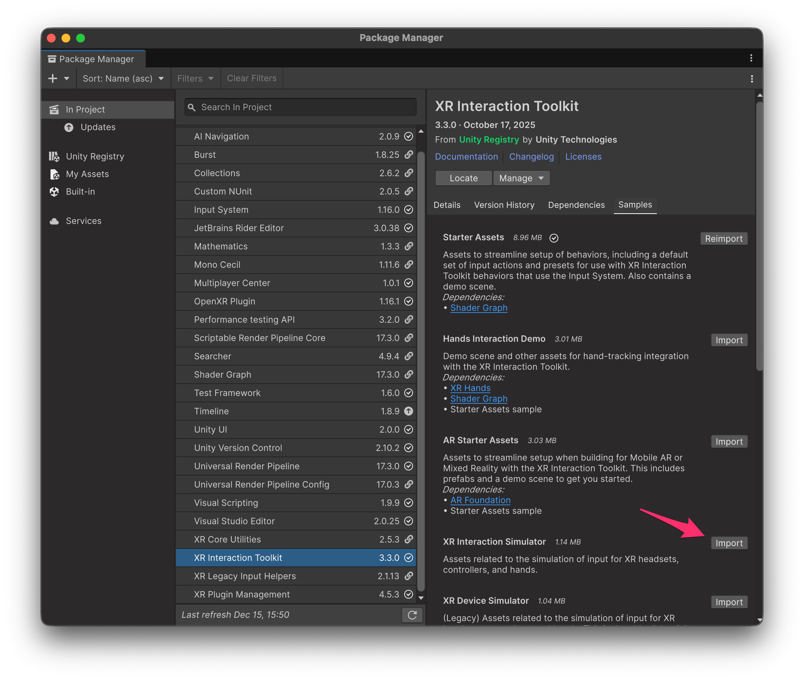<figcaption></figcaption></figure>


**Why use a simulator?**&#x20;

Putting on and taking off a headset constantly during development is slow and tiring. The simulator lets you quickly test interactions, iterate on designs, and debug issues using keyboard and mouse.


***

### Add Simulator to the scene

Drag the **XR Interaction Simulator** prefab into your scene hierarchy.

Location: `Assets/Samples/XR Interaction Toolkit/[version]/XR Interaction Simulator/`&#x20;

<figure>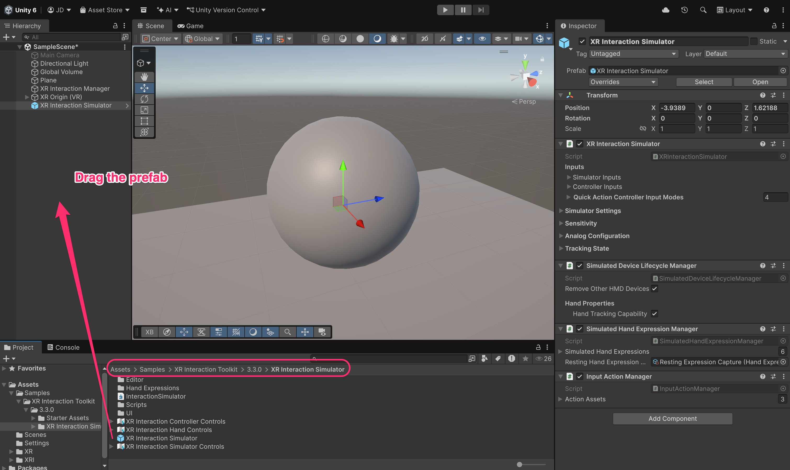<figcaption></figcaption></figure>

**Simulator Controls:**

* **WASD**: Move headset
* **Arrow keys**: Look around
* **\[**: Toggle control to left controller
* **]**: Toggle control to right controller
* **\[** + **]**: Move both controllers together
* **G**: Trigger (e.g., grab things)
* **T**: Activate (e.g., shoot while grabbing)
* **1**: A button (e.g., Jump)


**Remember to remove or disable the simulator before building for the headset.**


***

### Documentation

* [XR Interaction Toolkit Documentation](https://docs.unity3d.com/Packages/com.unity.xr.interaction.toolkit@3.0/manual/index.html)
* [OpenXR Plugin Documentation](https://docs.unity3d.com/Packages/com.unity.xr.openxr@1.8/manual/index.html)
* [Meta Quest Developer Setup](https://developer.oculus.com/documentation/unity/unity-gs-overview/)
