# Ray and Poke interaction

Ray and Poke are two essential interaction methods for VR user interfaces. **Ray interaction** allows users to point at UI elements from a distance, while **Poke interaction** enables direct touch-based input, similar to pressing physical buttons.

<figure><figcaption></figcaption></figure>

## Ray Interaction with UI

Ray interaction is ideal for interacting with UI panels that are out of arm's reach. The user points a ray at buttons, sliders, or other UI elements and uses the trigger to interact.

### Create a UI Canvas

Create a standard Unity UI Canvas with some interactive elements like buttons and sliders. Right-click in the Hierarchy and select **UI > Canvas**, then add child elements such as Panel, Text, Button, and Slider.



**Standard Unity UI**:&#x20;

The XR Interaction Toolkit works with Unity's built-in UI system (uGUI). You don't need special VR-specific UI components, just configure the Canvas correctly.


### Convert Canvas to World Space

By default, Canvas uses **Screen Space - Overlay** mode, which renders UI flat on the screen. For VR, we need **World Space** so the UI exists as a physical object in the 3D environment.

Select the **Canvas** and configure:

* **Render Mode**: World Space
* **Event Camera**: Main Camera
* **Scale**: 0.001 for X, Y, and Z (to convert pixel units to meters)

Position the Canvas in your scene where you want it to appear.

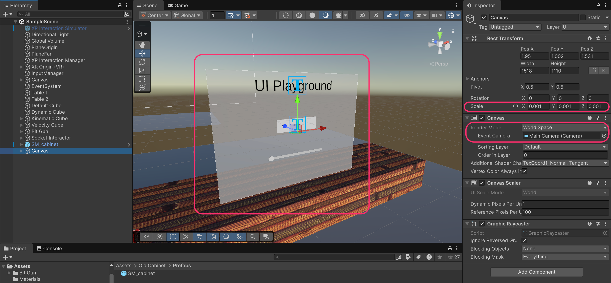


**Why Scale 0.001?**&#x20;

Unity UI uses pixel coordinates (e.g., 1920×1080). At scale 1, your Canvas would be 1920 meters wide! Scaling by 0.001 converts pixels to millimeters, making a 1000px wide panel roughly 1 meter in VR.


### Add Ray Interactor to Right Hand

Navigate to **Assets > Samples > XR Interaction Toolkit > \[version] > Starter Assets > Prefabs > Interactors** and drag the **Ray Interactor** prefab as a child of **Right Hand**.

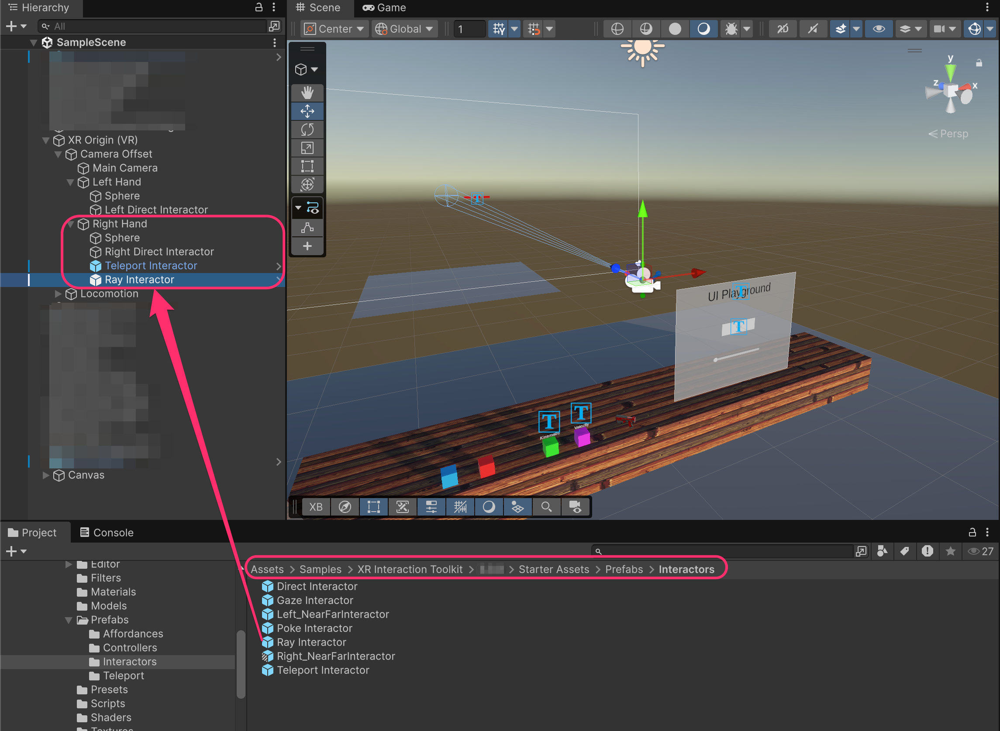

> 💡 **Starter Assets Prefabs**: The XR Interaction Toolkit samples include pre-configured interactor prefabs. These save significant setup time and follow best practices.

### Configure the Ray Interactor

Select the **Ray Interactor** and configure:

* **Position**: Reset to 0, 0, 0 (so the ray originates from the hand)
* **Handedness**: Right
* **UI Interaction**: Enabled
* **UI Press Input**: `XRI Right Interaction/UI Press` and `XRI Right Interaction/UI Press Value`
* **UI Scroll Input**: `XRI Right Interaction/UI Scroll`

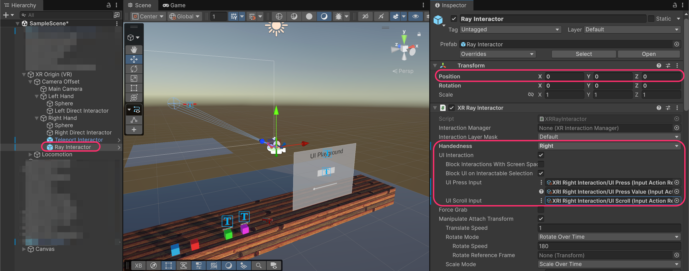


**UI Interaction checkbox**:&#x20;

This enables the ray to interact with Unity UI elements. Without this, the ray would only work with 3D interactables.


### Replace Input Module on EventSystem

The default **`InputSystemUIInputModule`** on the EventSystem GameObject doesn't understand XR input, so we need to replace it with the **`XRUIInputModule`**.

Select the **EventSystem** GameObject and **remove** the Input System UI Input Module component.

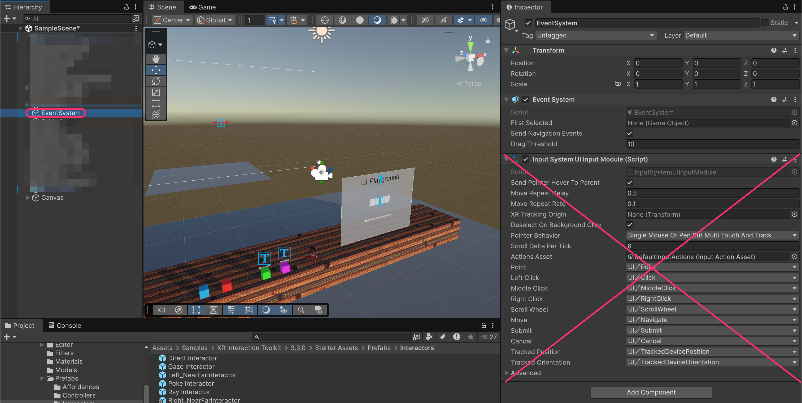


**EventSystem**:&#x20;

This GameObject manages all UI input in Unity. Every scene with UI needs one. When you create a Canvas, Unity automatically creates an EventSystem if one doesn't exist.


### Add XR UI Input Module

With the **EventSystem** still selected, add the **`XRUIInputModule`** component.



**XR UI Input Module**:&#x20;

This component translates XR controller input (rays, pokes) into UI events that Unity's EventSystem understands. It's the bridge between VR controllers and uGUI.


### Apply the XRI Preset

Click the **Preset selector** (icon in the top-right of the component) and select the **XRI Default XR UI Input Module** preset from the Starter Assets.

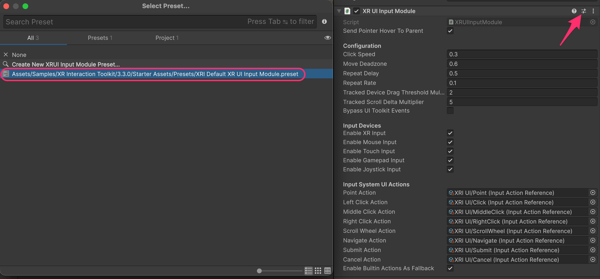


**Presets**:&#x20;

These pre-configure all the input action references automatically. Without the preset, you'd need to manually assign each action (Point, Click, Scroll, etc.).


### Add Tracked Device Graphic Raycaster to the Canvas

Select your **Canvas** and add the **`TrackedDeviceGraphicRaycaster`** component.

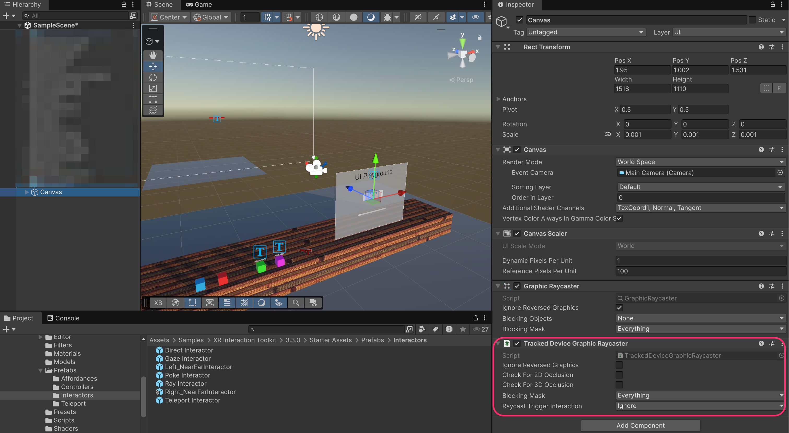




**`TrackedDeviceGraphicRaycaster` component**:&#x20;

This component allows XR rays to interact with the Canvas. It replaces the standard Graphic Raycaster which only works with mouse/touch input.


### Hide Ray When Not Pointing at UI (Optional)

To hide the ray when it's not hovering over any valid target, you can configure the **`XRInteractorLineVisual`** component on the **Ray Interactor**:

* **Invalid Color Gradient**: Set alpha to 0 (fully transparent)

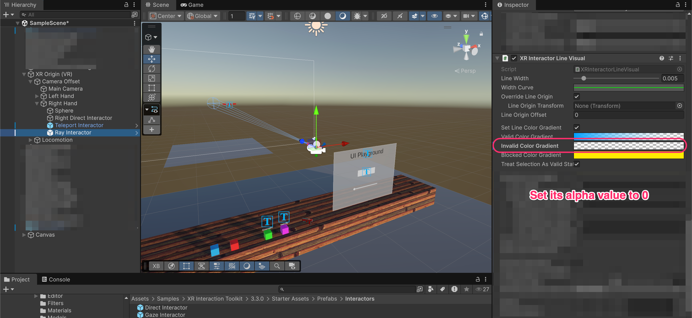

<table><thead><tr><th width="231.19921875">State</th><th>Description</th></tr></thead><tbody><tr><td><strong>Valid Color</strong></td><td>Ray is hovering over an interactable target</td></tr><tr><td><strong>Invalid Color</strong></td><td>Ray is not pointing at anything interactable</td></tr><tr><td><strong>Blocked Color</strong></td><td>Ray is blocked by an object before reaching the target</td></tr></tbody></table>

Run the project and point the ray at the UI. Press the trigger to interact with buttons and sliders.


***

## Enabling Object Grabbing with Ray

With the current configuration, the ray can only interact with UI, and cannot grab 3D objects. Let's fix that.

Currently, pointing at grabbable objects does nothing. The ray only responds to UI elements.


### Configure Select Input for Grabbing

Select the **Ray Interactor** and scroll to the **Input Configuration** section. Configure:

* **Select Input**: `XRI Right Interaction/Select` and `XRI Right Interaction/Select Value`
* **Activate Input**: `XRI Right Interaction/Activate` and `XRI Right Interaction/Activate Value`

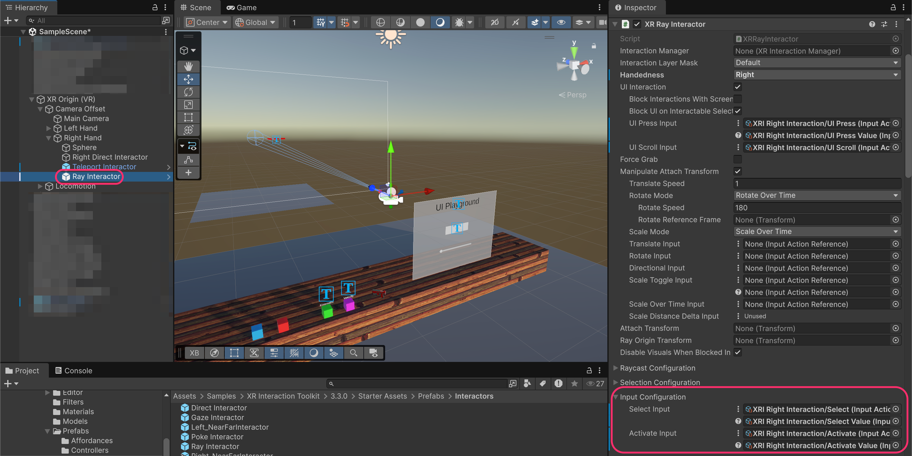

<table><thead><tr><th width="221.34765625">Input</th><th width="221.10546875">Action</th><th>Use</th></tr></thead><tbody><tr><td><strong>UI Press</strong> (Trigger)</td><td>Click UI elements</td><td>Buttons, sliders</td></tr><tr><td><strong>Select</strong> (Grip)</td><td>Grab 3D objects</td><td>Pick up items at distance</td></tr></tbody></table>

### Test Ray Grabbing

Run the project. You can now point at grabbable objects and use the grip button to grab them at a distance.



**Ray grabbing use cases**:&#x20;

Ray grabbing is useful for picking up objects that are far away or in hard-to-reach places. However, direct grabbing (with hands) usually feels more natural for nearby objects.


***

## XR Interaction Group

When you have multiple interactors on the same hand (Direct Interactor, Ray Interactor, Teleport Interactor), you may want to prevent them from being active simultaneously.

### Add XR Interaction Group

Add an **`XRInteractionGroup`** component to the **Right Hand** GameObject. Configure the **Starting Group Members** with all interactors on that hand:

1. Right Direct Interactor
2. Teleport Interactor
3. Ray Interactor

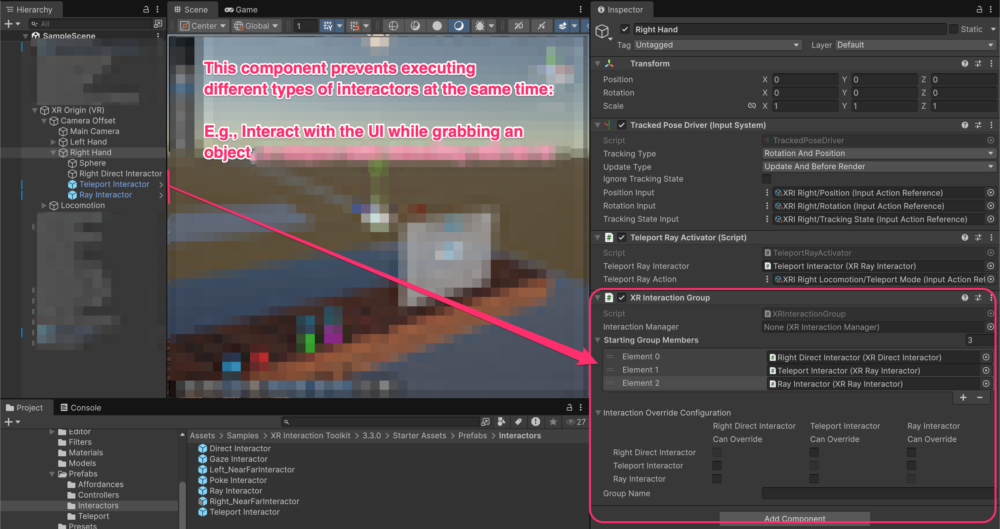


**What does `XRInteractionGroup` do?**&#x20;

It prevents multiple interactors from selecting objects at the same time. For example, you can't accidentally grab an object with your hand while also trying to interact with UI via ray. Only one interactor in the group can be active at a time.

The matrix at the bottom lets you control which interactors can interrupt others. By default, all interactors can override each other.




***

## Poke Interaction

Poke interaction allows users to physically press UI buttons with their **fingers**, like touching a real touchscreen. This creates a more immersive and intuitive experience for nearby UI panels.

### Prepare the Canvas for Poke

For poke interaction, the Canvas should be set up the same way as for ray interaction (World Space, Tracked Device Graphic Raycaster, etc.). Make sure your Canvas has interactive elements like buttons.

You can duplicate the existing canvas an place the new one somewhere **closer to the user**.

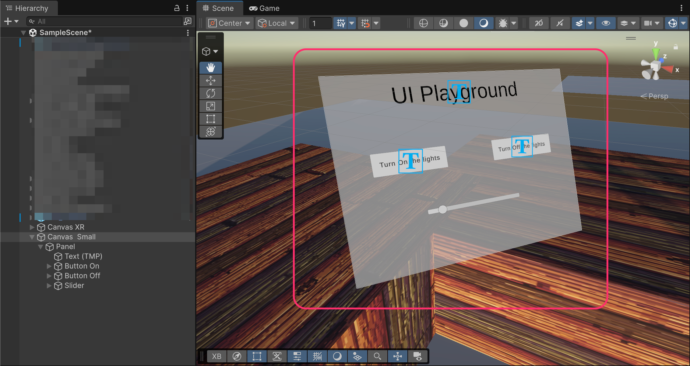

### Add Poke Interactor to Left Hand

Navigate to **Assets > Samples > XR Interaction Toolkit > \[version] > Starter Assets > Prefabs > Interactors** and drag the **Poke Interactor** prefab as a child of **Left Hand**.

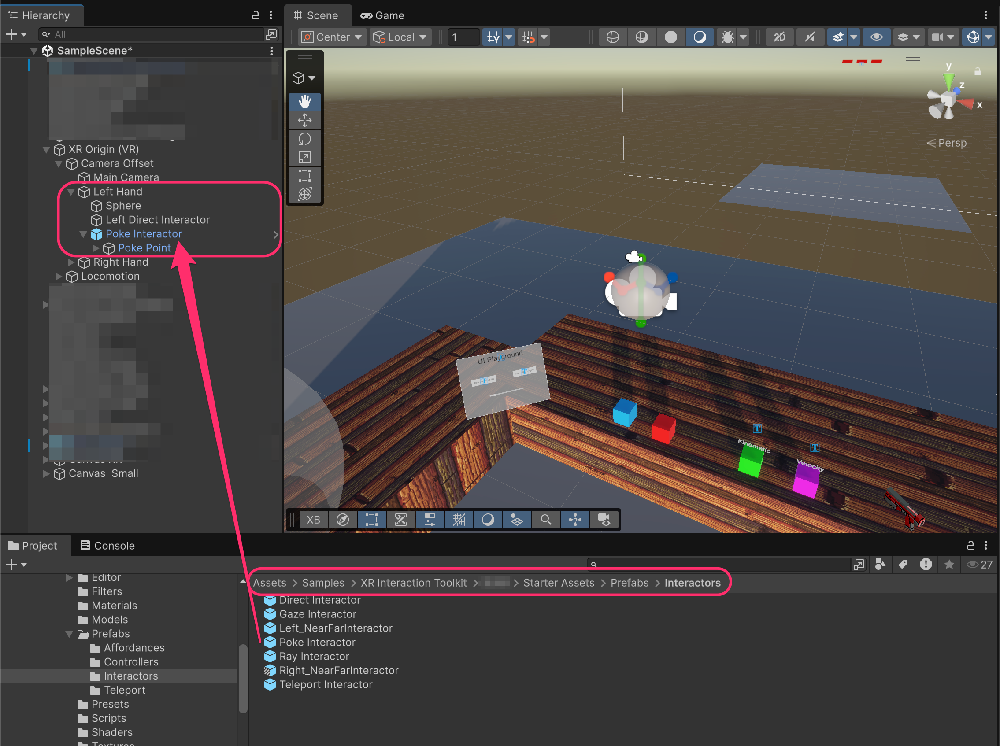


In this setup, we're using the right hand for ray/grab interactions and the left hand for poke.


### Configure the Poke Interactor

Select the **Poke Interactor** and configure:

* **Handedness**: Left
* **UI Interaction**: Enabled

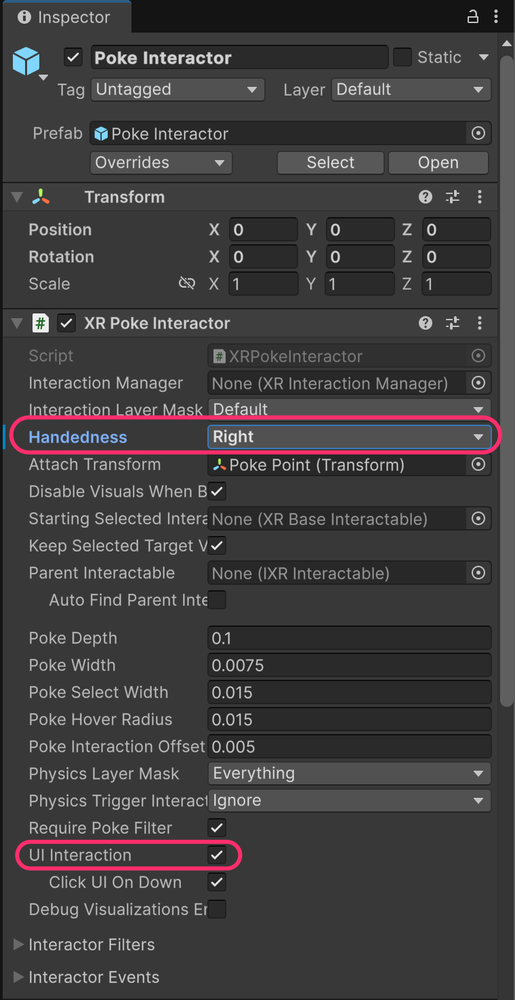

<table><thead><tr><th width="231.5">Property</th><th>Description</th></tr></thead><tbody><tr><td><strong>Poke Depth</strong></td><td>How far the finger must push to trigger a press</td></tr><tr><td><strong>Poke Width</strong></td><td>Width of the poke detection area</td></tr><tr><td><strong>UI Interaction</strong></td><td>Enable to interact with Canvas UI elements</td></tr><tr><td><strong>Click UI On Down</strong></td><td>Trigger click immediately on contact (vs. on release)</td></tr></tbody></table>


**Poke Point child**:&#x20;

The Poke Interactor prefab includes a **Poke Point** child Transform. This defines exactly where the "fingertip" is for poke detection. Position it at your hand model's index finger tip for accurate poking.


### Test Poke Interaction

Run the project and move your left hand toward the UI. Touch buttons with your finger to press them.



**Poke vs Ray**:&#x20;

Both interaction methods can coexist. Use poke for nearby panels (menus attached to your wrist, control panels) and ray for distant UI elements.


***

## Interaction final hierarchy

After setting up ray and poke interactions, your hand hierarchy should look like this (locomotion not included in this diagram):

```
Camera Offset
├── Main Camera                   [Tracked Pose Driver]
├── Left Hand                     [Tracked Pose Driver]
│   ├── Sphere                    (visual)
│   ├── Left Direct Interactor    [XR Direct Interactor, Sphere Collider]
│   └── Poke Interactor           [XR Poke Interactor...]
│       └── Poke Point            (fingertip position)
└── Right Hand                    [Tracked Pose Driver, Teleport Ray Activator, XR Interaction Group]
    ├── Sphere                    (visual)
    ├── Right Direct Interactor   [XR Direct Interactor, Sphere Collider]
    ├── Teleport Interactor       [XR Ray Interactor...]
    └── Ray Interactor            [XR Ray Interactor...]
```

***

## Documentation

* [XR Ray Interactor Documentation](https://docs.unity3d.com/Packages/com.unity.xr.interaction.toolkit@3.3/manual/xr-ray-interactor.html)
* [XR Poke Interactor Documentation](https://docs.unity3d.com/Packages/com.unity.xr.interaction.toolkit@3.3/manual/xr-poke-interactor.html)
* [XR UI Input Module Documentation](https://docs.unity3d.com/Packages/com.unity.xr.interaction.toolkit@3.3/manual/xr-ui-input-module.html)
* [Tracked Device Graphic Raycaster](https://docs.unity3d.com/Packages/com.unity.xr.interaction.toolkit@3.3/manual/tracked-device-graphic-raycaster.html)
* [XR Interaction Group](https://docs.unity3d.com/Packages/com.unity.xr.interaction.toolkit@3.3/manual/xr-interaction-group.html)
